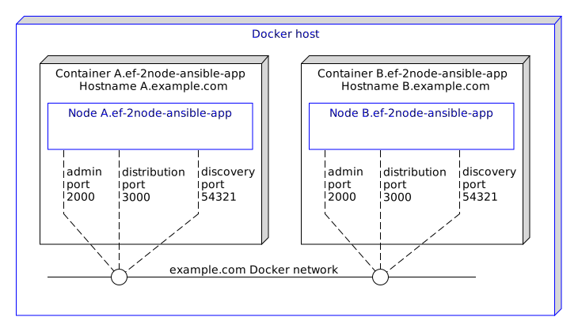
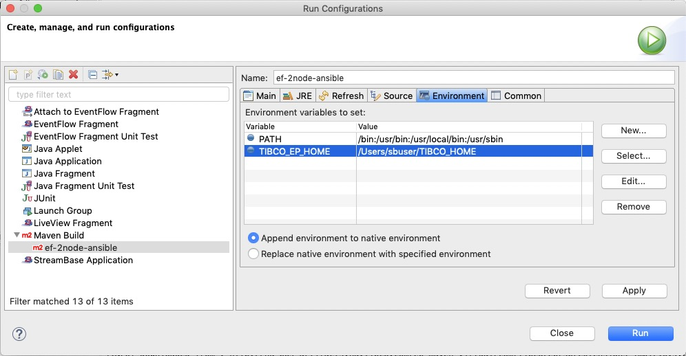

# Ansible-Docker: 2-node EventFlow

This sample describes how to deploy an application archive containing an EventFlow fragment to Docker managed by Ansible.

* [Prerequisites](#prerequisites)
* [Loading this sample in TIBCO StreamBase&reg; Studio](#loading-this-sample-in-tibco-streambase-studio-trade)
* [Ansible part of this project](#ansible-part-of-this-project)
* [Containers and nodes](#containers-and-nodes)
* [Changes to the default pom.xml file - profiles](#changes-to-the-default-pom-file-profiles)
* [Building and running from TIBCO StreamBase&reg; Studio](#building-and-running-from-tibco-streambase-studio-trade)
* [Example of Ansible task and maven plugin configuration](#example-of-ansible-task-and-maven-plugin-configuration)
* [Building this sample from the command line and running the integration test cases](#building-this-sample-from-the-command-line-and-running-the-integration-test-cases)
* [Additional Ansible playbooks](#additional-ansible-playbooks)

See also [Docker section in TIBCO&reg; Streaming documentation](https://docs.tibco.com/pub/str/latest/doc/html/admin/part-docker.html).

<a name="prerequisites"></a>

## Prerequisites

Docker needs to be running for this project. For more information on how to install and configure a docker please refer to this [Docker: ef-2node EventFlow](https://github.com/TIBCOSoftware/tibco-streaming-samples/blob/master/docker/ef-2node/ef-2node-app/src/site/markdown/index.md) sample.

Ansible managament server must be installed - see https://docs.ansible.com/ansible/latest/installation_guide/intro_installation.html for further details. Playbook from this sample was built and tested on a localhost with Ansible 2.8.1 on MacOS and RHEL/Almalinux.

Ansible cannot run on a Windows host natively. Please see more information under 
[Ansile documentation website](https://docs.ansible.com/ansible/latest/user_guide/windows_faq.html).

All Ansible playbooks are executed based on configuration file and inventory file. Both files are included in the project. Please see more detailed description in [Ansible part of this project paragraph](#ansible-part-of-this-project) below. 

<a name="loading-this-sample-in-tibco-streambase-studio-trade"></a>

## Loading this sample in TIBCO StreamBase&reg; Studio

To be able to run this sample in TIBCO StreamBase Studio™ please refer to [Using TIBCO Streambase Studio GitHub page](https://github.com/TIBCOSoftware/tibco-streaming-samples/blob/master/docs/studio.md).

Below you can find a list of files this project is based on:

* An Ansible [playbook file](../../main/ansible/project-playbook.yml) with set of tasks divided in three groups: build docker images, test docker images and application, clean (remove docker images build in this playbook).
* A [base Dockerfile](../../main/docker/base/Dockerfile) to build a base image containing Linux, utilities and the TIBCO Streaming Runtime
* A [start-node](../../main/docker/base/start-node) script to start a node
* An [application Dockerfile](../../main/docker/application/Dockerfile) to build an application image containing the application archive - this is based on the base image
* [Trusted hosts HOCON configuration](../../main/configurations/security.conf) so that each container can run epadmin commands on the cluster
* [Application definition configuration](../../main/configurations/app.conf) that defines nodeType docker to use System V shared memory
* [Node deployment configuration](../../main/configurations/defaultnode.conf) that uses the above nodeType

Note that whilst this project will create a simple Docker image, changes to the project may be required for additional behaviours. 

<a name="ansible-part-of-this-project"></a>

## Ansible part of this project

In this sample we have one playbook with set of tasks.
When executing entire playbook, tasks in first section will build the work directory and build docker images. Followed by a test section where environment will be set up, start a container instance with the application nodes, run tests case and power off entire environment. The last part will remove docker images created during this playbook execution.
If you prefer to skip the second and third part of this playbook please check skipTests box under SB Studio or when in the project folder execute **mvn -DskipTests=true install** in command line.

In this project, all Ansible files are located in ../src/main/ansible folder.
```shell
.
├── additional-playbooks
│   ├── 1-start_cluster.yml
│   ├── 2-validate_cluster.yml
│   └── 3-stop_cluster.yml
├── ansible.cfg
├── ansible-docker-test-playbook.yml
├── inventory
└── project-playbook.yml
```
Files: 
- [ansible.cfg](../../main/ansible/ansible.cfg) - contains basic ansible configuration for this project to run locally
- [inventory](../../main/ansible/inventory) - contains only one - localhost - as a target for all playbook tasks 
- [project-playbook.yml](../../main/ansible/project-playbook.yml) - is the main playbook file with all tasks
- [ansible-docker-test-playbook.yml](../../main/ansible/ansible-docker-test-playbook.yml) - this is a one task playbook file. This task will pull Almalinux docker container to your host and can be used to test if your Ansible and docker installation is correct.
- [additional-playbooks](../../main/ansible/additional-playbooks/) folder - contains few short playbooks to execute from command line. Please see description below.

The one task ansible playbook can be executed from the current directory via command listed below :
```shell
$ ansible-playbook ansible-docker-test-playbook.yml 
```
To complete the prerequisites steps, please copy ansible.cfg and inventory files to /etc/ansible/ folder on your host created during the ansible installation.

Check [playbook tasks](../../site/markdown/playbook-tasks.md) to see a selected Ansible tasks with brief description.

<a name="containers-and-nodes"></a>

## Containers and nodes

In this sample we name the docker container as **A.ef-2node-ansible-app**,  which hosts the StreamBase node **A.ef-2node-ansible-app**, and **B.ef-2node-ansible-app**, which hosts the StreamBase node **B.ef-2node-ansible-app**.  A Docker network **example.com** connects the nodes together :



The two containers have network access to each other, but not to the docker host.

<a name="changes-to-the-default-pom-file-profiles"></a>

## Changes to the default pom.xml file - profiles

In this sample we still want to build the application archive if Ansible is not
installed, hence the maven [pom.xml](../../../pom.xml) file is updated to detect if ansible is installed :

```xml
    <properties>
        <dockerDomain>example.com</dockerDomain>
        <skipApplicationDocker>false</skipApplicationDocker>
        <skipStreamBaseDockerBase>false</skipStreamBaseDockerBase>
        <skipDockerTests>false</skipDockerTests>
        <skipTests>false</skipTests>
    </properties>
    ...
       <!-- if Ansible is available, run playbook and build docker images -->
    <profiles>
	<profile>
	    <id>Ansible-OSX</id>
	    <activation>
		<file>
		    <exists>/usr/local/bin/ansible</exists>
		</file>
	    </activation>
	    <modules>
    		<module>ef-2node-ansible-ef</module>
    		<module>ef-2node-ansible-app</module>
	    </modules>
	</profile>

	<profile>
	    <id>Ansible-Linux</id>
	    <activation>
		<file>
		    <exists>/usr/bin/ansible</exists>
		</file>
	    </activation>
	    <modules>
    		<module>ef-2node-ansible-ef</module>
    		<module>ef-2node-ansible-app</module>
	    </modules>
	</profile>
    </profiles>
``` 

<a name="building-and-running-from-tibco-streambase-studio-trade"></a>

## Building and running from TIBCO StreamBase&reg; Studio

Use the **Run As -> Maven install** menu option to build from TIBCO StreamBase&reg; Studio or Run As shortcut.  Tests can
be skipped if required by ticking the **Skip tests**. It is important to add **PATH** variable under Environment tab with value: **/bin:/usr/bin:/usr/local/bin:/usr/sbin**. 



Tasks info from ansible playbook will show up on a console tab.


<a name="example-of-ansible-task-and-maven-plugin-configuration"></a>

## Example of Ansible task and maven plugin configuration.

Ansible tasks starting docker container A with options :
```
- name: Start container A.{{ projectId }}
  docker_container:
      name: A.{{ projectId }}
      image: docker/{{ projectId }}:{{ projectId_ver }}
      hostname: A.example.com
      networks: 
        - name: example.com
          aliases: 
            - A.example.com
      env:
        STREAMING_NODENAME: A.{{ projectId }}
      state: started
``` 
Variables and values from above task are passed by maven plugin to ansible playbook under the plugin configuration in pom.xml - see below.

```xml
   <plugin>
        <groupId>co.escapeideas.maven</groupId>
        <artifactId>ansible-maven-plugin</artifactId>
        <version>1.3.0</version>
        <executions>
             <execution>
               <id>ansible-playbook</id>
                   <goals>
                       <goal>playbook</goal>
                   </goals>
                   <configuration>
                        <playbook>${project.basedir}/src/main/ansible/project-playbook.yml</playbook> 
                        <promoteDebugAsInfo>true</promoteDebugAsInfo> 
                        <failOnAnsibleError>true</failOnAnsibleError>
                        <extraVars>
                           <variable>platform=platform_linuxx86_64</variable>
                           <variable>sbrt_ver=${sbrt.version}</variable>   
                           <variable>projectId=${project.artifactId}</variable> 
                           <variable>projectId_ver=${project.version}</variable>
                           <variable>project_basedir=${project.basedir}</variable>
                           <variable>project_build_directory=${project.build.directory}</variable>
                           <variable>skipTests=${skipTests}</variable>
                        </extraVars>
                   </configuration>
             </execution>
          </executions>
    </plugin>
```

<a name="building-this-sample-from-the-command-line-and-running-the-integration-test-cases"></a>

## Building this sample from the command line and running the integration test cases

Use the [maven commands](https://maven.apache.org) to build from the command line or Continuous Integration system:

- `mvn -PactiveAnsible clean` - it will clean the directories and files created by previous project
- `mvn -PactiveAnsible install` - it will run an ansible playbook, below is the example of the console output: Play and tasks

```ansible
...
[INFO] PLAY [StreamBase create base and application docker image based on Almalinux] ****
[INFO] 
[INFO] TASK [Gathering Facts] *********************************************************
[INFO] ok: [127.0.0.1]
[INFO] 
[INFO] TASK [Create work directory for base image] ************************************
[INFO] changed: [127.0.0.1]
[INFO] 
[INFO] TASK [Copy platform.zip file into work directory] ******************************
[INFO] changed: [127.0.0.1]
[INFO] 
[INFO] TASK [Copy start-node script to base image work directory] *********************
[INFO] changed: [127.0.0.1]
[INFO] 
[INFO] TASK [Update dockerfile before building base image] ****************************
[INFO] changed: [127.0.0.1] => (item={u'search': u'(^LABEL build-image=)(.*)$', u'replace': 
       u'LABEL build-image=1.0.0'})
[INFO] ok: [127.0.0.1] => (item={u'search': u'(^###Note:\\s)(.*)$', u'replace': u'###Note: 
       LABEL statement build by Ansible playbook'})
[INFO] 
[INFO] TASK [Remove docker image if exist from previous build] ************************
[INFO] ok: [127.0.0.1]
[INFO] 
[INFO] TASK [Building SB base image - sbrt-base] **************************************
[INFO] changed: [127.0.0.1]
[INFO] 
[INFO] TASK [Clean up work directory for base image] **********************************
[INFO] changed: [127.0.0.1]
[INFO] 
[INFO] TASK [Remove intermediate image with LABEL build-image=1.0.0] *******************
[INFO] changed: [127.0.0.1]
[INFO] 
[INFO] TASK [Create source directory for app image] ***********************************
[INFO] changed: [127.0.0.1]
[INFO] 
[INFO] TASK [Create a copy of platform zip file into application docker image work directory] ***
[INFO] changed: [127.0.0.1]
[INFO] 
[INFO] TASK [Update dockerfile before building app image] *****************************
[INFO] ok: [127.0.0.1] => (item={u'search': u'(^FROM\\s)(.*)$', u'replace': 
       u'FROM sbrt-base:11.0.0-SNAPSHOT'})
[INFO] changed: [127.0.0.1] => (item={u'search': u'(^###Note:\\s)(.*)$', u'replace': 
       u'###Note: FROM statement build by Ansible playbook'})
[INFO] changed: [127.0.0.1] => (item={u'search': u'(^LABEL build-image=)(.*)$', u'replace': 
       u'LABEL build-image=1.0.0'})
[INFO] changed: [127.0.0.1] => (item={u'search': u'(^###Note:\\s)(.*)$', u'replace': 
       u'###Note: LABEL statement build by Ansible playbook'})
[INFO] 
[INFO] TASK [Remove docker image if exist from previous build] ************************
[INFO] ok: [127.0.0.1]
[INFO] 
[INFO] TASK [Building StreamBase application image] ***********************************
[INFO] changed: [127.0.0.1]
[INFO] 
[INFO] TASK [Clean up work directory for application image] ***************************
[INFO] changed: [127.0.0.1]
[INFO] 
[INFO] TASK [Create example.com network] **********************************************
[INFO] changed: [127.0.0.1]
[INFO] 
[INFO] TASK [Start container A.ef-2node-ansible-app] **********************************
[INFO] changed: [127.0.0.1]
[INFO] 
[INFO] TASK [Waiting for Node A to start] *********************************************
[INFO] changed: [127.0.0.1]
[INFO] 
[INFO] TASK [Start container B.ef-2node-ansible-app] **********************************
[INFO] changed: [127.0.0.1]
[INFO] 
[INFO] TASK [Waiting for Node B to start] *********************************************
[INFO] changed: [127.0.0.1]
[INFO] 
[INFO] TASK [Run epadmin command on Node A] *******************************************
[INFO] changed: [127.0.0.1]
[INFO] 
[INFO] TASK [Node A] ******************************************************************
[INFO] ok: [127.0.0.1] => 
[INFO]   NodeAresults.stdout_lines:
[INFO]   - '[A.ef-2node-ansible-app] Node Name = B.ef-2node-ansible-app'
[INFO]   - '[A.ef-2node-ansible-app] Network Address = IPv4:B.example.com:5558,IPv4:B.example.com:5557'
[INFO]   - '[A.ef-2node-ansible-app] Current State = Up'
[INFO]   - '[A.ef-2node-ansible-app] Last State Change = 2019-08-02 14:38:37'
[INFO]   - '[A.ef-2node-ansible-app] Number of Connections = 3'
[INFO]   - '[A.ef-2node-ansible-app] Number of Queued PDUs = 0'
[INFO]   - '[A.ef-2node-ansible-app] Discovered = Dynamic'
[INFO]   - '[A.ef-2node-ansible-app] Location Code = 7382436235611343951'
[INFO]   - '[B.ef-2node-ansible-app] Node Name = A.ef-2node-ansible-app'
[INFO]   - '[B.ef-2node-ansible-app] Network Address = IPv4:A.example.com:5558,IPv4:A.example.com:5557'
[INFO]   - '[B.ef-2node-ansible-app] Current State = Up'
[INFO]   - '[B.ef-2node-ansible-app] Last State Change = 2019-08-02 14:38:37'
[INFO]   - '[B.ef-2node-ansible-app] Number of Connections = 3'
[INFO]   - '[B.ef-2node-ansible-app] Number of Queued PDUs = 0'
[INFO]   - '[B.ef-2node-ansible-app] Discovered = Dynamic'
[INFO]   - '[B.ef-2node-ansible-app] Location Code = 11636435185532938412'
[INFO] 
[INFO] TASK [Run epadmin command on Node B] *******************************************
[INFO] changed: [127.0.0.1]
[INFO] 
[INFO] TASK [Node B] ******************************************************************
[INFO] ok: [127.0.0.1] => 
[INFO]   NodeBresults.stdout_lines:
[INFO]   - '[B.ef-2node-ansible-app] Node Name = A.ef-2node-ansible-app'
[INFO]   - '[B.ef-2node-ansible-app] Network Address = IPv4:A.example.com:5558,IPv4:A.example.com:5557'
[INFO]   - '[B.ef-2node-ansible-app] Current State = Up'
[INFO]   - '[B.ef-2node-ansible-app] Last State Change = 2019-08-02 14:38:37'
[INFO]   - '[B.ef-2node-ansible-app] Number of Connections = 3'
[INFO]   - '[B.ef-2node-ansible-app] Number of Queued PDUs = 0'
[INFO]   - '[B.ef-2node-ansible-app] Discovered = Dynamic'
[INFO]   - '[B.ef-2node-ansible-app] Location Code = 11636435185532938412'
[INFO]   - '[A.ef-2node-ansible-app] Node Name = B.ef-2node-ansible-app'
[INFO]   - '[A.ef-2node-ansible-app] Network Address = IPv4:B.example.com:5558,IPv4:B.example.com:5557'
[INFO]   - '[A.ef-2node-ansible-app] Current State = Up'
[INFO]   - '[A.ef-2node-ansible-app] Last State Change = 2019-08-02 14:38:37'
[INFO]   - '[A.ef-2node-ansible-app] Number of Connections = 3'
[INFO]   - '[A.ef-2node-ansible-app] Number of Queued PDUs = 0'
[INFO]   - '[A.ef-2node-ansible-app] Discovered = Dynamic'
[INFO]   - '[A.ef-2node-ansible-app] Location Code = 7382436235611343951'
[INFO] 
[INFO] TASK [Stop and remove container A] *********************************************
[INFO] changed: [127.0.0.1]
[INFO] 
[INFO] TASK [Stop and remove container B] *********************************************
[INFO] changed: [127.0.0.1]
[INFO] 
[INFO] TASK [Remove example.com network] **********************************************
[INFO] changed: [127.0.0.1]
[INFO] 
[INFO] TASK [Platform check] **********************************************************
[INFO] changed: [127.0.0.1]
[INFO] 
[INFO] TASK [Remove Docker images [Linux]] ********************************************
[INFO] skipping: [127.0.0.1]
[INFO] 
[INFO] TASK [Remove Docker images] ****************************************************
[INFO] changed: [127.0.0.1]
[INFO] 
[INFO] PLAY RECAP *********************************************************************
[INFO] 127.0.0.1 : ok=29  changed=24  unreachable=0  failed=0  skipped=1  rescued=0  ignored=0
...
```

<a name="additional-ansible-playbooks"></a>

## Additional Ansible playbooks.

When you execute this project with _-DskipTest=true_ option you will have only docker images build (base and application). To test those images and start nodes, you can run ansible playbooks located in aditional-playbooks folder.

Those additional ansible playbooks are divided in three groups and contain only few tasks. For best results run them in order starting from #1.

* [Start cluster](../../main/ansible/additional-playbooks/1-start_cluster.yml) playbook.
```shell
	$ ansible-playbook 1-start_cluster.yml 
```
```ansible
PLAY [Start Cluster] *************************************************************************

TASK [Gathering Facts] ***********************************************************************
ok: [127.0.0.1]

TASK [Include global variables] **************************************************************
ok: [127.0.0.1]

TASK [Create network example.com] ************************************************************
changed: [127.0.0.1]

TASK [Start container A.ef-2node-ansible-app] ************************************************
changed: [127.0.0.1]

TASK [Waiting for Node A to start] ***********************************************************
changed: [127.0.0.1]

TASK [Start container B.ef-2node-ansible-app] ************************************************
changed: [127.0.0.1]

TASK [Waiting for Node B to start] ***********************************************************
changed: [127.0.0.1]

PLAY RECAP ***********************************************************************************
127.0.0.1    : ok=5   changed=3   unreachable=0   failed=0   skipped=0   rescued=0   ignored=0 
```
This playbook has three main tasks: create a network example.com, start container with node named: A.ef-2nod-e-ansible-app and start container with node named: B.ef-2nod-e-ansible-app. 

* [Validate cluster](../../main/ansible/additional-playbooks/2-validate_cluster.yml) playbook.
```shell
	$ ansible-playbook 2-validate_cluster.yml
```
```ansible
PLAY [Validate Cluster] **********************************************************************

TASK [Gathering Facts] ***********************************************************************
ok: [127.0.0.1]

TASK [include global variables] **************************************************************
ok: [127.0.0.1]

TASK [Run epadmin command on Node A] *********************************************************

TASK [Node A] ********************************************************************************
ok: [127.0.0.1] => 
  NodeAresults.stdout_lines:
  - '[A.ef-2node-ansible-app] Node Name = B.ef-2node-ansible-app'
  - '[A.ef-2node-ansible-app] Network Address = IPv4:B.example.com:5558,IPv4:B.example.com:5557'
  - '[A.ef-2node-ansible-app] Current State = Up'
  - '[A.ef-2node-ansible-app] Last State Change = 2019-08-12 14:07:21'
  - '[A.ef-2node-ansible-app] Number of Connections = 5'
  - '[A.ef-2node-ansible-app] Number of Queued PDUs = 0'
  - '[A.ef-2node-ansible-app] Discovered = Dynamic'
  - '[A.ef-2node-ansible-app] Location Code = 7382436235611343951'
  - '[B.ef-2node-ansible-app] Node Name = A.ef-2node-ansible-app'
  - '[B.ef-2node-ansible-app] Network Address = IPv4:A.example.com:5558,IPv4:A.example.com:5557'
  - '[B.ef-2node-ansible-app] Current State = Up'
  - '[B.ef-2node-ansible-app] Last State Change = 2019-08-12 14:07:21'
  - '[B.ef-2node-ansible-app] Number of Connections = 4'
  - '[B.ef-2node-ansible-app] Number of Queued PDUs = 0'
  - '[B.ef-2node-ansible-app] Discovered = Dynamic'
  - '[B.ef-2node-ansible-app] Location Code = 11636435185532938412'

TASK [Run epadmin command on Node B] *********************************************************
changed: [127.0.0.1]

TASK [Node B] ********************************************************************************
ok: [127.0.0.1] => 
  NodeBresults.stdout_lines:
  - '[B.ef-2node-ansible-app] Node Name = A.ef-2node-ansible-app'
  - '[B.ef-2node-ansible-app] Network Address = IPv4:A.example.com:5558,IPv4:A.example.com:5557'
  - '[B.ef-2node-ansible-app] Current State = Up'
  - '[B.ef-2node-ansible-app] Last State Change = 2019-08-12 14:07:21'
  - '[B.ef-2node-ansible-app] Number of Connections = 4'
  - '[B.ef-2node-ansible-app] Number of Queued PDUs = 0'
  - '[B.ef-2node-ansible-app] Discovered = Dynamic'
  - '[B.ef-2node-ansible-app] Location Code = 11636435185532938412'
  - '[A.ef-2node-ansible-app] Node Name = B.ef-2node-ansible-app'
  - '[A.ef-2node-ansible-app] Network Address = IPv4:B.example.com:5558,IPv4:B.example.com:5557'
  - '[A.ef-2node-ansible-app] Current State = Up'
  - '[A.ef-2node-ansible-app] Last State Change = 2019-08-12 14:07:21'
  - '[A.ef-2node-ansible-app] Number of Connections = 5'
  - '[A.ef-2node-ansible-app] Number of Queued PDUs = 0'
  - '[A.ef-2node-ansible-app] Discovered = Dynamic'
  - '[A.ef-2node-ansible-app] Location Code = 7382436235611343951'

PLAY RECAP ***********************************************************************************
127.0.0.1     : ok=6   changed=2   unreachable=0   failed=0   skipped=0   rescued=0  ignored=0
```
This playbook has two main tasks: run epadmin command on both clusters.

* [Stop cluster](../../main/ansible/additional-playbooks/3-stop_cluster.yml) playbook.
```shell
	$ ansible-playbook 3-stop_cluster.yml
```
```ansible
PLAY [Stop Cluster] **************************************************************************

TASK [Gathering Facts] ***********************************************************************
ok: [127.0.0.1]

TASK [include global variables] **************************************************************
ok: [127.0.0.1]

TASK [Stop and remove container A] ***********************************************************
changed: [127.0.0.1]

TASK [Stop and remove container B] ***********************************************************
changed: [127.0.0.1]

TASK [Remove example.com network] ************************************************************
changed: [127.0.0.1]

PLAY RECAP ***********************************************************************************
127.0.0.1     : ok=5   changed=3   unreachable=0   failed=0   skipped=0   rescued=0  ignored=0  
```
This playbook has two main tasks: stop and remove both containers. Also it will remove the example.com network.


---
Copyright (c) 2018-2023 Cloud Software Group, Inc.

Redistribution and use in source and binary forms, with or without
modification, are permitted provided that the following conditions are met:

* Redistributions of source code must retain the above copyright notice, this
  list of conditions and the following disclaimer.

* Redistributions in binary form must reproduce the above copyright notice,
  this list of conditions and the following disclaimer in the documentation
  and/or other materials provided with the distribution.

* Neither the name of the copyright holder nor the names of its
  contributors may be used to endorse or promote products derived from
  this software without specific prior written permission.

THIS SOFTWARE IS PROVIDED BY THE COPYRIGHT HOLDERS AND CONTRIBUTORS "AS IS"
AND ANY EXPRESS OR IMPLIED WARRANTIES, INCLUDING, BUT NOT LIMITED TO, THE
IMPLIED WARRANTIES OF MERCHANTABILITY AND FITNESS FOR A PARTICULAR PURPOSE ARE
DISCLAIMED. IN NO EVENT SHALL THE COPYRIGHT HOLDER OR CONTRIBUTORS BE LIABLE
FOR ANY DIRECT, INDIRECT, INCIDENTAL, SPECIAL, EXEMPLARY, OR CONSEQUENTIAL
DAMAGES (INCLUDING, BUT NOT LIMITED TO, PROCUREMENT OF SUBSTITUTE GOODS OR
SERVICES; LOSS OF USE, DATA, OR PROFITS; OR BUSINESS INTERRUPTION) HOWEVER
CAUSED AND ON ANY THEORY OF LIABILITY, WHETHER IN CONTRACT, STRICT LIABILITY,
OR TORT (INCLUDING NEGLIGENCE OR OTHERWISE) ARISING IN ANY WAY OUT OF THE USE
OF THIS SOFTWARE, EVEN IF ADVISED OF THE POSSIBILITY OF SUCH DAMAGE.
