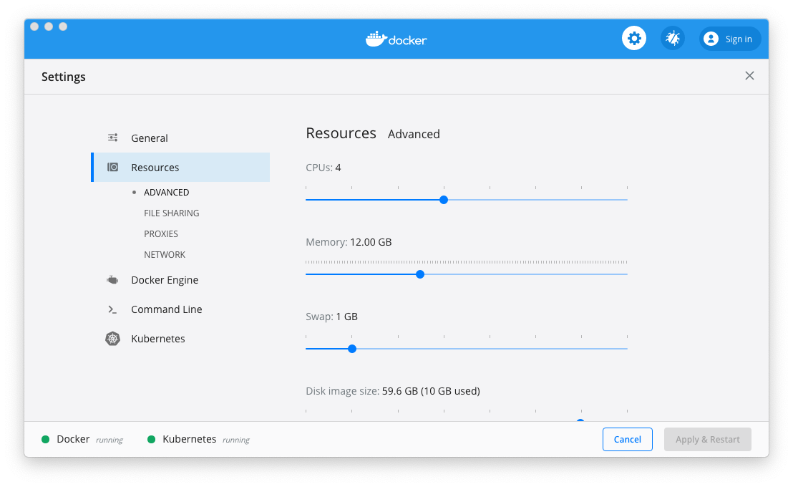
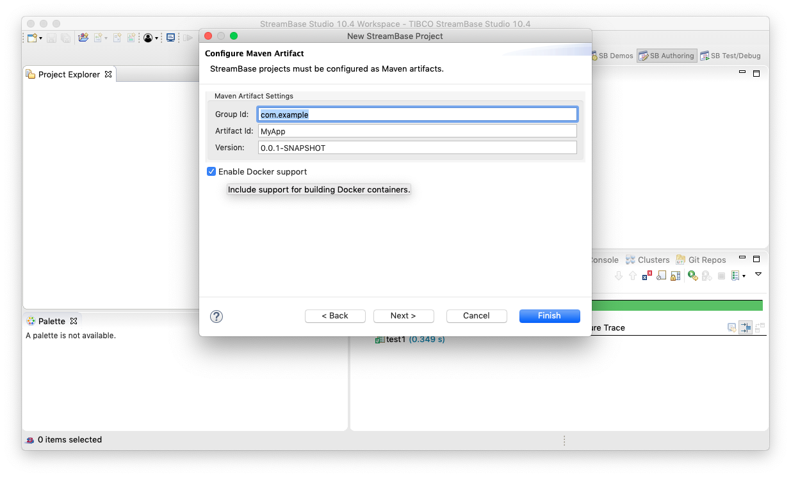

# Docker : 2-node EventFlow

This sample describes how to deploy an application archive containing an EventFlow fragment to Docker.

* [Prerequisites](#prerequisites)
* [Creating an application archive project for Docker from TIBCO StreamBase Studio&trade;](#creating-an-application-archive-project-for-docker-from-tibco-streambase-studio-trade)
* [Containers and nodes](#containers-and-nodes)
* [Changes to the default docker configurations](#changes-to-the-default-docker-configurations)
* [Building and running from TIBCO StreamBase Studio&trade;](#building-and-running-from-tibco-streambase-studio-trade)
* [Building this sample from the command line and running the integration test cases](#building-this-sample-from-the-command-line-and-running-the-integration-test-cases)
* [Example docker commands](#example-docker-commands)

See also [Docker section in TIBCO&reg; Streaming documentation](https://docs.tibco.com/pub/str/10.4.0/doc/html/admin/part-docker.html).

<a name="prerequisites"></a>

## Prerequisites

Docker must first be downloaded and installed - see https://www.docker.com/ for further details.  Any 
recent version of docker should suffice, but testing was initially with docker 2.0.0.0-mac78 on
MacOS 10.14.1.

On MacOS, the resources available to docker may need to be increased beyond the default - see
CPUs and Memory settings on the Advanced tab of Docker preferences.



<a name="creating-an-application-archive-project-for-docker-from-tibco-streambase-studio-trade"></a>

## Creating an application archive project for Docker from TIBCO StreamBase Studio&trade;

TIBCO StreamBase Studio&trade; can generate a project containing the necessary files to build and 
test a Docker image by selecting **Enable Docker support** when creating an application archive project :



Such a project includes :

* A [base Dockerfile](../../main/docker/base/Dockerfile) to build a base image containing Linux, utilities and the TIBCO StreamBase runtime
* A [start-node](../../main/docker/base/start-node) script to start a node
* An [application Dockerfile](../../main/docker/application/Dockerfile) to build an application image containing the application archive - this is based on the base image
* Steps in [pom.xml](../../../pom.xml) that uses [fabric8io/docker-maven-plugin](http://dmp.fabric8.io/) to build the Docker image and start Docker containers for basic testing
* [Trusted hosts HOCON configuration](../../main/configurations/security.conf) so that each container can run epadmin commands on the cluster
* [Application definition configuration](../../main/configurations/app.conf) that defines nodeType docker to use System V shared memory
* [Node deployment configuration](../../main/configurations/defaultnode.conf) that uses the above nodeType

Note that whilst this project will create a simple Docker image, changes to the project may be required for additional behaviours. 

<a name="containers-and-nodes"></a>

## Containers and nodes

In this sample we name the docker container as **A.ef-2node-app**,  which hosts the StreamBase node **A.ef-2node-app**, and **B.ef-2node-app**, which hosts the StreamBase node **B.ef-2node-app**.  A Docker network **example.com** connects the nodes together :


The two containers have network access to each other, but not to the docker host.

<a name="changes-to-the-default-docker-configurations"></a>

## Changes to the default docker configurations

In this sample we still want to build the application archive if Docker is not
installed, hence the maven [pom.xml](../../../pom.xml) file is updated to detect if docker is installed :

```xml
    <properties>
        <dockerDomain>example.com</dockerDomain>
        <skipApplicationDocker>true</skipApplicationDocker>
        <skipStreamBaseDockerBase>true</skipStreamBaseDockerBase>
        <skipDockerTests>true</skipDockerTests>
    </properties>
    ...
    <!-- if docker is available, build docker projects -->
    <profile>
        <id>Docker in local</id>
        <activation>
            <file>
                <exists>/usr/local/bin/docker</exists>
            </file>
        </activation>
        <properties>
            <skipApplicationDocker>false</skipApplicationDocker>
            <skipStreamBaseDockerBase>false</skipStreamBaseDockerBase>
            <skipDockerTests>${skipTests}</skipDockerTests>
        </properties>
    </profile>
    <profile>
        <id>Docker in bin</id>
        <activation>
            <file>
                <exists>/usr/bin/docker</exists>
            </file>
        </activation>
        <properties>
            <skipApplicationDocker>false</skipApplicationDocker>
            <skipStreamBaseDockerBase>false</skipStreamBaseDockerBase>
            <skipDockerTests>${skipTests}</skipDockerTests>
        </properties>
    </profile>
    <profile>
        <id>Docker in C:</id>
        <activation>
            <file>
                <exists>C:\Program Files\Docker\Docker\resources\bin\docker.exe</exists>
            </file>
        </activation>
        <properties>
            <skipApplicationDocker>false</skipApplicationDocker>
            <skipStreamBaseDockerBase>false</skipStreamBaseDockerBase>
            <skipDockerTests>${skipTests}</skipDockerTests>
        </properties>
    </profile>
``` 

and include running **epadmin display cluster** when the nodes are started - this shows if the nodes are connected to each other :

```xml
    <exec>
        <postStart>epadmin servicename=A.${project.artifactId} display cluster</postStart>
    </exec>
```

<a name="building-and-running-from-tibco-streambase-studio-trade"></a>

## Building and running from TIBCO StreamBase Studio&trade;

Use the **Run As -> Maven install** menu option to build from TIBCO StreamBase Studio&trade; or Run As shortcut.  Tests can
be skipped if required by ticking the **Skip tests** :


The [Docker tooling](https://marketplace.eclipse.org/content/eclipse-docker-tooling) eclipse plugin
( requires [TM Terminal](https://marketplace.eclipse.org/content/tm-terminal) ) can be used to start and
manage containers :


<a name="building-this-sample-from-the-command-line-and-running-the-integration-test-cases"></a>

## Building this sample from the command line and running the integration test cases

Use the [maven](https://maven.apache.org) as **mvn install** to build from the command line or Continuous Integration system :


<a name="example-docker-commands"></a>

## Example docker commands

### Create the docker network

Use the [docker network](https://docs.docker.com/engine/reference/commandline/network_create/) command :

```
$ docker network create example.com
03961870a96df30e7e20cf54a3c339b6d7a1e0b344d0833f4c7f88dfaba76138
```

### Start the containers

Use the [docker run](https://docs.docker.com/engine/reference/run/) command.  In this case the following options are used :

* **--detach** - run in the background
* **--hostname=A.example.com --network-alias=A.example.com --network=example.com** - set the container hostname and network name. This must match the docker network name and the [Trusted hosts HOCON configuration](../../main/configurations/security.conf)
* **--name=A.ef-2node-app** - container name
* **--env=NODENAME=A.ef-2node-app** - node name
* **docker/ef-2node-app:1.0.0** - Docker image name

```shell
$ docker run --detach --hostname=A.example.com --network-alias=A.example.com --name=A.ef-2node-app --network=example.com --env=NODENAME=A.ef-2node-app docker/ef-2node-app:1.0.0
d8d73429fa8097d313b95b64f96aaf5c09a8bae385429d84858c1aeaa2753e05
$ docker run --detach --hostname=B.example.com --network-alias=B.example.com --name=B.ef-2node-app --network=example.com --env=NODENAME=B.ef-2node-app docker/ef-2node-app:1.0.0
6f3053e69eeeda61ae48c98bbcd037aae60e7555570cf810e7de856d550d66bc
```

### View the running containers

Use the [docker ps](https://docs.docker.com/engine/reference/commandline/ps/) command :

```shell
$ docker ps
CONTAINER ID        IMAGE                       COMMAND                  CREATED             STATUS              PORTS               NAMES
6f3053e69eee        docker/ef-2node-app:1.0.0   "/bin/sh -c ${PRODUC…"   5 minutes ago       Up 4 minutes                            B.ef-2node-app
d8d73429fa80        docker/ef-2node-app:1.0.0   "/bin/sh -c ${PRODUC…"   5 minutes ago       Up 5 minutes                            A.ef-2node-app
```

### View the container console logs

Use the [docker logs](https://docs.docker.com/engine/reference/commandline/logs/) command :

```shell
$ docker logs A.ef-2node-app
[A.ef-2node-app] 	Installing node
[A.ef-2node-app] 		PRODUCTION executables
[A.ef-2node-app] 		Memory shared memory
[A.ef-2node-app] 		4 concurrent allocation segments
[A.ef-2node-app] 		Host name A.example.com
[A.ef-2node-app] 		Container tibco/sb
[A.ef-2node-app] 		Starting container services
[A.ef-2node-app] 		Loading node configuration
[A.ef-2node-app] 		Auditing node security
[A.ef-2node-app] 		Deploying application
[A.ef-2node-app] 			Engine default-engine-for-com.tibco.ep.samples.docker.ef-2node-ef
[A.ef-2node-app] 		Application deployed
[A.ef-2node-app] 		Administration port is 2000
[A.ef-2node-app] 		Discovery Service running on port 54321
[A.ef-2node-app] 		Service name is A.ef-2node-app
[A.ef-2node-app] 	Node installed
[A.ef-2node-app] 	Starting node
[A.ef-2node-app] 		Engine application::default-engine-for-com.tibco.ep.samples.docker.ef-2node-ef started
[A.ef-2node-app] 		Loading node configuration
[A.ef-2node-app] 		Auditing node security
[A.ef-2node-app] 		Host name A.example.com
[A.ef-2node-app] 		Administration port is 2000
[A.ef-2node-app] 		Discovery Service running on port 54321
[A.ef-2node-app] 		Service name is A.ef-2node-app
[A.ef-2node-app] 	Node started
COMMAND FINISHED
```


### Include application logs to the container logs

To include the application logs to the container console logs, add the following file as **src/main/resources/logback.xml** in the application maven module :

```xml
<configuration>
    <appender name="Console" class="ch.qos.logback.core.ConsoleAppender">
        <encoder>
            <pattern>%d{HH:mm:ss.SSS} %10.10thread %-5level %20.20logger{5} : %msg%n</pattern>
        </encoder>
    </appender>
    <root level="INFO">
        <appender-ref ref="Console" />
    </root>
</configuration>
```

and add the **--tty** option when starting the container :

```shell
$ docker run --tty --detach --hostname=A.example.com --network-alias=A.example.com --name=A.ef-2node-app --network=example.com --env=NODENAME=A.ef-2node-app docker/ef-2node-app:1.0.0
d8d73429fa8097d313b95b64f96aaf5c09a8bae385429d84858c1aeaa2753e05
$ docker run --tty --detach --hostname=B.example.com --network-alias=B.example.com --name=B.ef-2node-app --network=example.com --env=NODENAME=B.ef-2node-app docker/ef-2node-app:1.0.0
6f3053e69eeeda61ae48c98bbcd037aae60e7555570cf810e7de856d550d66bc
```

```shell
$ docker logs A.ef-2node-app
...
14:26:29.000        222 INFO  t.e.d.h.distribution : Node B.ef-2node-app has new interface: 'IPv4:B.example.com:38290,IPv4:B.example.com:38289, old interface: 'IPv4:B.example.com:38289'.
14:26:33.188 adPool - 1 INFO  StreamBaseHTTPServer : sbd at A.example.com:10000; pid=165; version=10.4.0_e8c1cd91cb86ef9bc5f543e75582ef26f4ea36ca; Listening
```

### Run epadmin commands

Use the [docker exec](https://docs.docker.com/engine/reference/commandline/exec/) command on one of the containers :

```shell
$ docker exec A.ef-2node-app epadmin --servicename=ef-2node-app display cluster
[A.ef-2node-app] Node Name = B.ef-2node-app
[A.ef-2node-app] Network Address = IPv4:B.example.com:62155,IPv4:B.example.com:62154
[A.ef-2node-app] Current State = Up
[A.ef-2node-app] Last State Change = 2018-10-25 15:49:39
[A.ef-2node-app] Number of Connections = 4
[A.ef-2node-app] Number of Queued PDUs = 0
[A.ef-2node-app] Discovered = Dynamic
[A.ef-2node-app] Location Code = 14691765683598364398
[B.ef-2node-app] Node Name = A.ef-2node-app
[B.ef-2node-app] Network Address = IPv4:A.example.com:25580,IPv4:A.example.com:25579
[B.ef-2node-app] Current State = Up
[B.ef-2node-app] Last State Change = 2018-10-25 15:49:39
[B.ef-2node-app] Number of Connections = 3
[B.ef-2node-app] Number of Queued PDUs = 0
[B.ef-2node-app] Discovered = Dynamic
[B.ef-2node-app] Location Code = 7338854036213519437
```

### Log in to the container to check node logs

Use the [docker exec](https://docs.docker.com/engine/reference/commandline/exec/) command to run bash :

```shell
$ docker exec -it A.ef-2node-app bash
[tibco@A /]$ cd /var/opt/tibco/streambase/node/A.ef-2node-app/logs/
[tibco@A logs]$ ls
System_administration.log  System_swcoordadmin.log  audit.log  bootstrap  deadlock.log  default-engine-for-com.tibco.ep.samples.docker.ef-2node-ef.log
```

Alternatively, use the [docker exec](https://docs.docker.com/engine/reference/commandline/exec/) command to run tail :

```shell
$ docker exec A.ef-2node-app tail -f /var/opt/tibco/streambase/node/A.ef-2node-app/logs/default-engine-for-com.tibco.ep.samples.docker.ef-2node-app.log
2018-10-26 07:46:34.542000+0000 [171:main] INFO  com.tibco.ep.dtm.lifecycle: No user-defined Logback configuration, using product default configuration
...
```

### Stop and remove the containers

Use the [docker stop](https://docs.docker.com/engine/reference/commandline/stop/) and [docker rm](https://docs.docker.com/engine/reference/commandline/rm/) commands :

```shell
$ docker stop A.ef-2node-app
$ docker rm A.ef-2node-app
$ docker stop B.ef-2node-app
$ docker rm B.ef-2node-app
```
