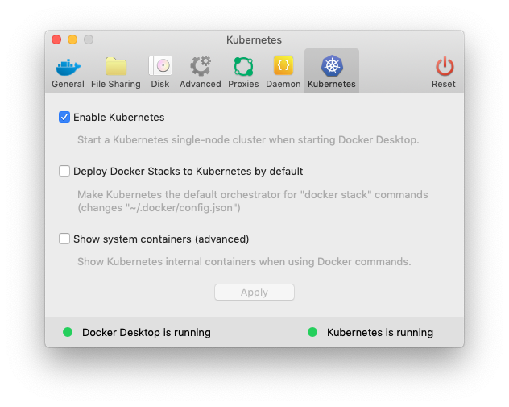
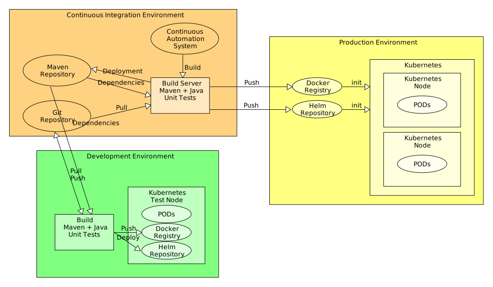
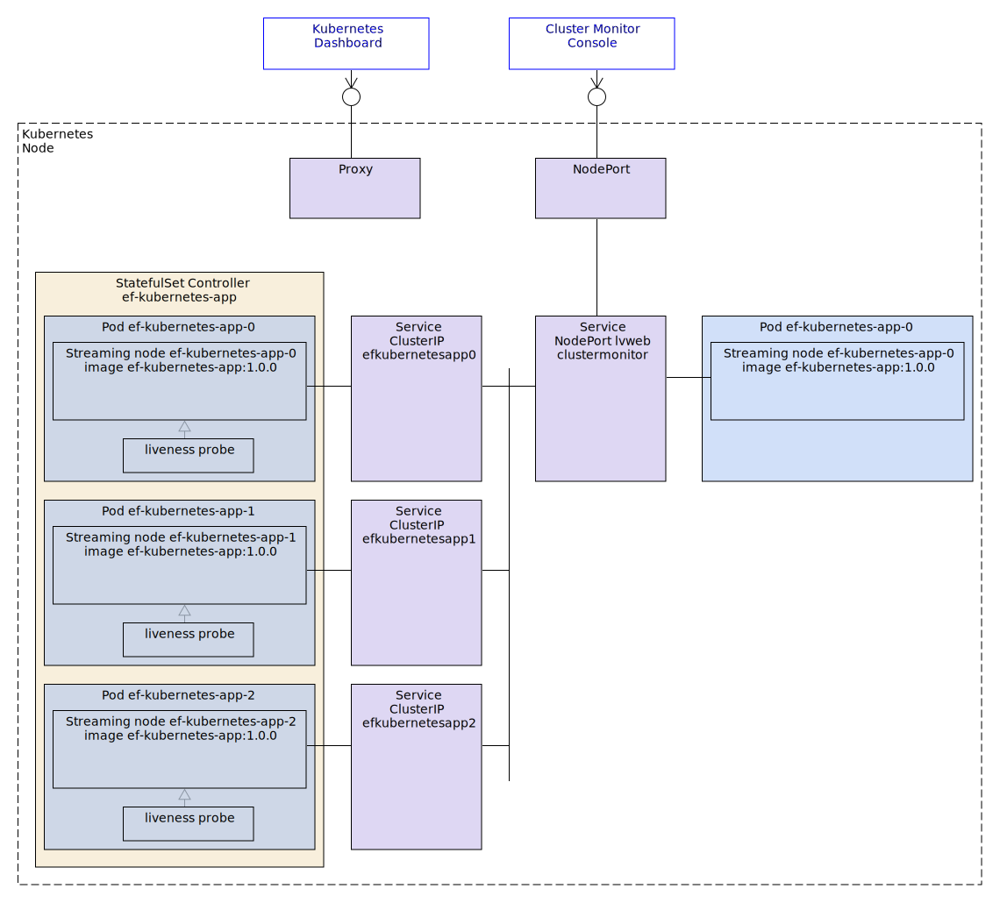
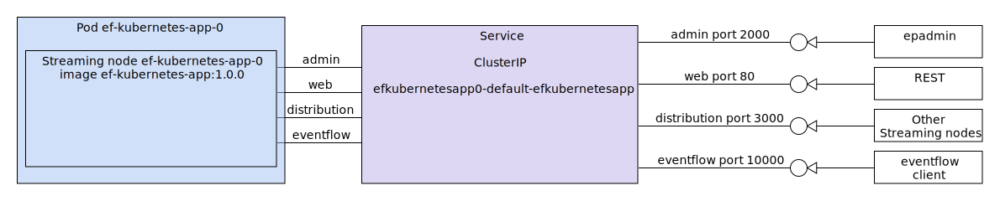
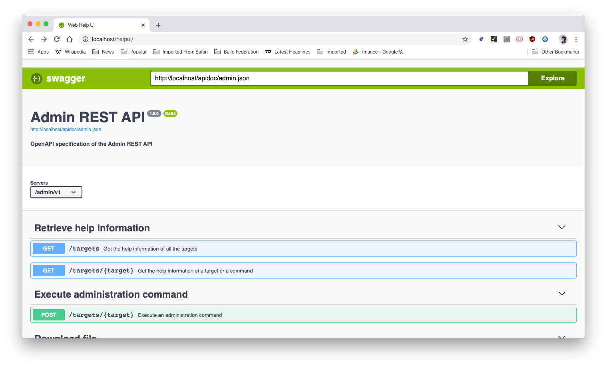
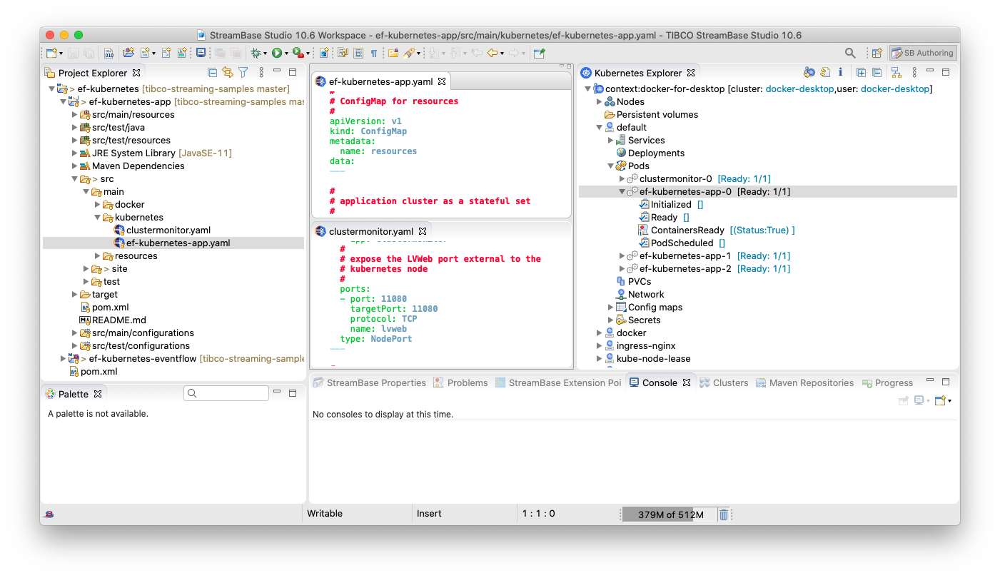
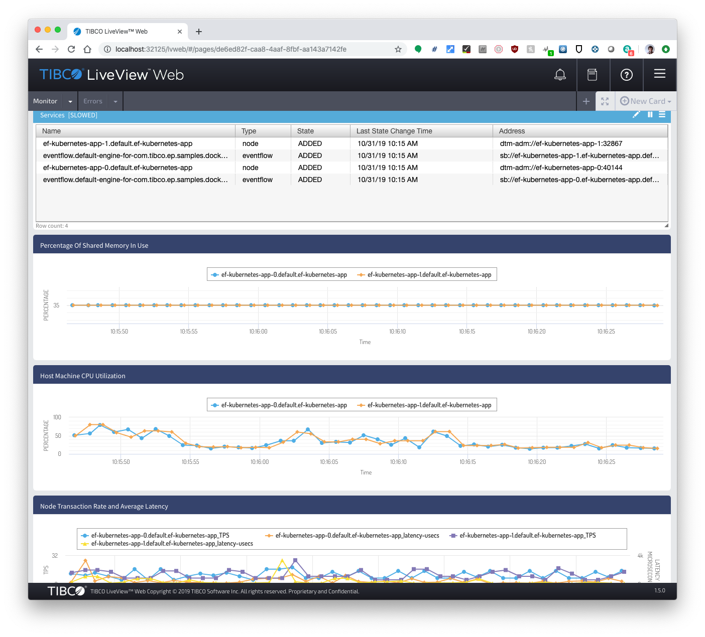
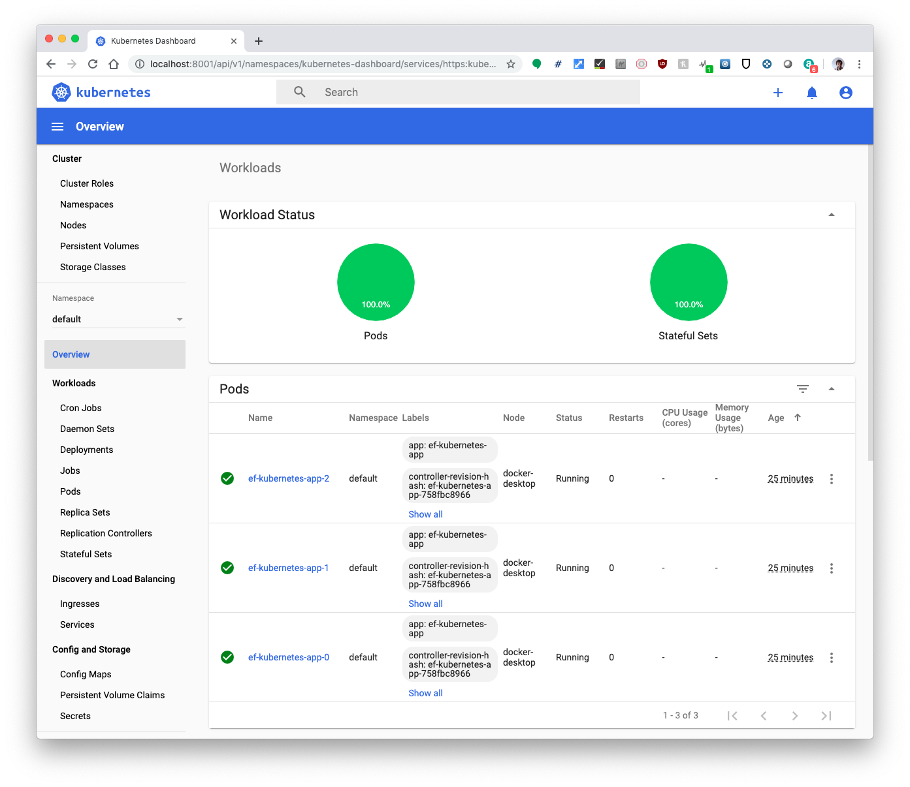
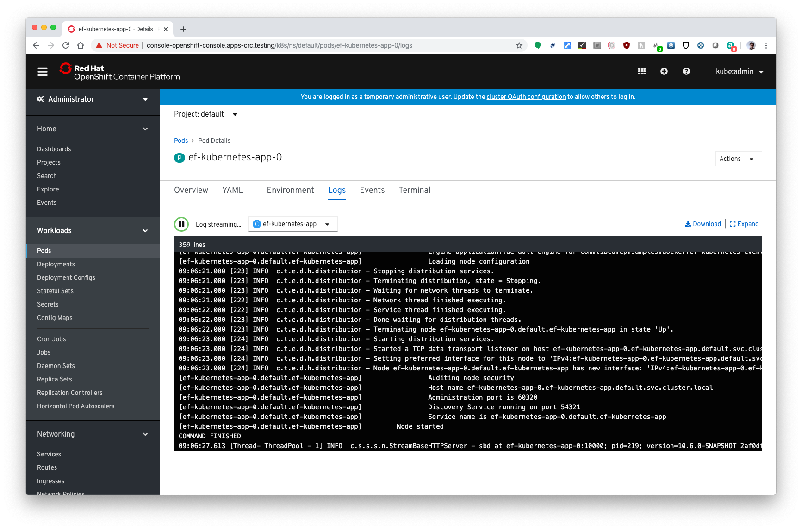

# Docker : Kubernetes EventFlow

This sample describes how to deploy an application archive containing a Streaming fragment to Docker using 
Kubernetes.  The primary focus is desktop development, i.e. testing of application images in a desktop Kubernetes 
node.

* [Terminology](#terminology)
* [Overview](#overview)
* [Quick runthrough](#quick-runthrough)
* [Prerequisites](#prerequisites)
* [Clound native development lifecycle](#cloud-native-development-lifecycle)
* [Creating an application archive project for Kubernetes from TIBCO Streaming Studio&trade;](#creating-an-application-archive-project-for-kubernetes-from-tibco-streaming-studio-trade)
* [Cluster monitor](#cluster-monitor)
* [Containers and nodes](#containers-and-nodes)
* [Service discovery](#service-discovery)
* [Exposing REST endpoints via web port](#exposing-rest-endpoints-via-web-port)
* [Exposing REST endpoints via ingress](#exposing-rest-endpoints-via-ingress)
* [Building and running from TIBCO Streaming Studio&trade;](#building-and-running-from-tibco-streaming-studio-trade)
* [Building this sample from the command line and running the integration test cases](#building-this-sample-from-the-command-line-and-running-the-integration-test-cases)
* [Deployment](#deployment)
* [Runtime settings](#runtime-settings)
* [Further Kubernetes commands](#further-kubernetes-commands)
* [Alternative Kubernetes Implementations](#alternative-kubernetes-implementations)

<a name="terminology"></a>

## Terminology

In this sample we are using various technologies with terminology that overlap at times. Here are some key terms for clarification:

* **Kubernetes**
    * **[Kubernetes Node](https://kubernetes.io/docs/concepts/architecture/nodes/)** -  A worker machine
    * **[Kubernetes Cluster](https://kubernetes.io/docs/concepts/)** - A set of machines, called nodes, that run containerized applications managed by Kubernetes. A cluster has at least one worker node and at least one master node.
    * **[Kubernetes Master Node](https://kubernetes.io/docs/concepts/#kubernetes-master)** - A specific Kubernetes Node with responsibility for maintaining the state of the cluster
    * **[K8s](https://kubernetes.io/)** - Abbreviation of Kubernetes
    * **[POD](https://kubernetes.io/docs/concepts/workloads/pods/pod-overview/)** - Smallest deployable unit of computing that can be created and managed in Kubernetes
    * **[StatefulSets](https://kubernetes.io/docs/concepts/workloads/controllers/statefulset/)** - Manages the deployment and scaling of a set of Pods, and provides guarantees about the ordering and uniqueness of these Pods
    * **[Service](https://kubernetes.io/docs/concepts/services-networking/service/)** - An abstract way to expose an application running on a set of Pods as a network service
    * **[Ingress](https://kubernetes.io/docs/concepts/services-networking/ingress/)** - An API object that manages external access to the services in a cluster, typically HTTP
    * **[Kubectl Proxy](https://kubernetes.io/docs/concepts/cluster-administration/proxies/)** - Usually runs on users desktop and proxies localhost address to the kubernetes apiserver
* **Tibco**
    * **[Streaming Machine](http://devzone.tibco.com/sites/streambase/latest/sb/sb-product/documentation/architectsguide/ch03s01.html)** - An execution context for a node
    * **[Streaming Application](http://devzone.tibco.com/sites/streambase/latest/sb/sb-product/documentation/architectsguide/ch03s01.html)** - Business specific functionality
    * **[Streaming Fragment](http://devzone.tibco.com/sites/streambase/latest/sb/sb-product/documentation/architectsguide/ch03s01.html)** - An executable part of an application
    * **[Streaming Cluster](http://devzone.tibco.com/sites/streambase/latest/sb/sb-product/documentation/architectsguide/ch03s01.html)** - A logical grouping of Streaming nodes that communicate to support an application
    * **[Streaming Node](http://devzone.tibco.com/sites/streambase/latest/sb/sb-product/documentation/architectsguide/ch03s01.html)** - A Streaming container for engines
    * **[Streaming Engine](http://devzone.tibco.com/sites/streambase/latest/sb/sb-product/documentation/architectsguide/ch03s01.html)** - Executable context for a fragment

<a name="overview"></a>

## Overview

This sample consists of a basic eventflow fragment contained in an application archive.  Additional files are included to support deploying
in a Kubernetes environment.  The sample shows how to build, deploy and use TIBCO Streaming applications in Kubernetes.

<a name="quick_runthrough"></a>

## Quick runthrough

1. Install Docker and Kubernetes.  
  See [Prerequisites](#prerequisites).
2. Build this project to create Docker images.  
  See [Building and running from TIBCO Streaming Studio&trade;](#building-and-running-from-tibco-streaming-studio-trade) and 
  [Building this sample from the command line and running the integration test cases](#building-this-sample-from-the-command-line-and-running-the-integration-test-cases)
3. Use *kubectl apply* to grant permissions (if required )
4. Use *kubectl apply* to start the Streaming Nodes in the Kubernetes cluster
5. Use *kubectl get pod* to see what PODs were started
6. Use *kubectl logs* to view the Streaming Node logs
7. Use *kubectl delete* to stop the Streaming Nodes and remove the PODs

```shell
# deploy application which triggers starting the pods

$ kubectl apply -f ./ef-kubernetes-app/src/main/kubernetes/ef-kubernetes-app.yaml
configmap/configuration created
configmap/resources created
statefulset.apps/ef-kubernetes-app created

# get the status of the pods

$ kubectl get pod
NAME                  READY   STATUS    RESTARTS   AGE
ef-kubernetes-app-0   0/1     Running   0          11s
ef-kubernetes-app-1   0/1     Running   0          11s
ef-kubernetes-app-2   0/1     Running   0          11s

# view streaming node logs

$ kubectl logs ef-kubernetes-app-0
...
[ef-kubernetes-app-0.default.ef-kubernetes-app]     Node started
COMMAND FINISHED
08:50:26.000 [334] WARN  c.t.e.d.runtime - (osdisp.cpp:146) findEvent: object reference = 2111918189:1720523304:40121159345600:45
08:50:26.627 [Thread- ThreadPool - 1] INFO  c.s.s.s.n.StreamBaseHTTPServer - sbd at ef-kubernetes-app-0.ef-kubernetes-app.default.svc.cluster.local:10000; pid=216; version=10.6.0-SNAPSHOT_2af0df501f80b68677b966f66006f5aa3a61c17b; Listening

# delete application which stops and removes the pods

$ kubectl delete -f ./ef-kubernetes-app/src/main/kubernetes/ef-kubernetes-app.yaml
service "ef-kubernetes-app" deleted
configmap "configuration" deleted
configmap "resources" deleted
statefulset.apps "ef-kubernetes-app" deleted
```

<a name="prerequisites"></a>

## Prerequisites

In addition to Docker (see [main Docker sample](../../../../../ef-2node/ef-2node-app/src/site/markdown/index.md) ), 
Kubernetes is also required to be installed and configured.  In this sample we use **docker-for-desktop**, but
see [Alternative Kubernetes Implementations](#alternative-kubernetes-implementations) for others.

When using Docker desktop, this can most easily be achieved by enabling Kubernetes :



Validate that **docker-for-desktop** is the current context :

```shell
$ kubectl config current-context
docker-for-desktop
```

Docker for desktop only supports a single Kubernetes Node.

<a name="cloud-native-development-lifecycle"></a>

## Cloud native development lifecycle

The cloud native development lifecycle is :

* All source in git
* Images and packages are built from source by maven
    * Studio calls maven for builds
    * Continuous integration system calls maven for builds 
* Testing and development can be performed on a desktop running Docker and Kubernetes
* Deployment of images and packages to a repository is by maven
    * Continuous integration system calls maven for deployment
* Production deployment uses containers stored in a Docker registry



Hence its useful to make use of maven settings.xml ( desktop or continuous automation ) to avoid
hard-coding addresses in git.

Maven lifecycle mapping is :

* **mvn compile** - compile any java source in a Streaming Fragment to classes
* **mvn test** - run any junit test cases on the Streaming Fragment
* **mvn package** - build Streaming Fragment archive, Streaming Application archive and docker images
* **mvn pre-integration-phase** - start Docker container(s)
* **mvn integration-phase** - run any system test cases
* **mvn post-integration-phase** - stop Docker container(s)
* **mvn deploy** - push Docker images to registry

The [TIBCO Streaming maven plugin](https://github.com/TIBCOSoftware/tibco-streaming-maven-plugin) provides the lifecycle.

<a name="creating-an-application-archive-project-for-kubernetes-from-tibco-streaming-studio-trade"></a>

## Creating an application archive project for Kubernetes from TIBCO Streaming Studio&trade;

Create a new Streaming Project, select StreamBase Application and enable both Docker and Kubernetes :


The resulting project contains maven rules for building a Docker image containing the application and 
the necessary Kubernetes configurations for deployment.

The Kubernetes configurations include -

* [ef-kubernetes-app.yaml](../../../src/main/kubernetes/ef-kubernetes-app.yaml) - Kubernetes definition for a scaling cluster
* [security.conf](../../../src/main/configurations/security.conf) - Trusted hosts names need to match Kubernetes DNS names
* [start-node](../../../src/main/docker/base/start-node) - Script to start the Streaming node

<a name="cluster-monitor"></a>

## Cluster monitor

In this sample the generated project is enhanced by adding a [Cluster Monitor](http://devzone.tibco.com/sites/streambase/latest/sb/sb-product/clustermonitor.html)
docker image.  To support this an additional maven execution step is needed in pom.xml :

```xml
                    <!-- cluster monitor image -->
                    <execution>
                        <id>build clustermonitor image</id>
                        <phase>package</phase>
                        <goals>
                            <goal>build</goal>
                        </goals>
                        <configuration>
                            <images>
                                <image>
                                    <name>clustermonitor:%l</name>
                                    <build>
                                        <dockerFileDir>${project.basedir}/src/main/docker/clustermonitor</dockerFileDir>
                                        <optimise>true</optimise>
                                        <assembly>
                                            <inline>
                                                <files>
                                                    <file>
                                                        <source>${project.basedir}/src/main/docker/clustermonitor/start-cluster-monitor</source>
                                                        <outputDirectory></outputDirectory>
                                                        <lineEnding>unix</lineEnding>
                                                    </file>
                                                </files>
                                            </inline>
                                        </assembly>
                                    </build>
                                </image>
                            </images>
                        </configuration>
                    </execution>
                    <execution>
                        <id>push clustermonitor image</id>
                        <phase>deploy</phase>
                        <goals>
                            <goal>push</goal>
                        </goals>
                        <configuration>
                            <images>
                                <image>
                                    <name>clustermonitor:%l</name>
                                    <build/>
                                </image>
                            </images>
                        </configuration>
                    </execution>
```

The trusted hosts configuration needs to include the cluster monitor host(s) :

```scala
configuration = {
    TrustedHosts = {
        hosts = [ "${DEFAULT_ROUTE:-10.1.0.1}", "*.ef-kubernetes-app.${POD_NAMESPACE:-default}.svc.cluster.local", "*.clustermonitor.${POD_NAMESPACE:-default}.svc.cluster.local" ]
    }
}
```

*DEFAULT_ROUTE* is set in the container startup script and contains the source address of internal administration requests via the discovery services.  We also allow 
administration requests directly from other pods in the streaming cluster and from the cluster monitor.

Along with additional files :

* [start-cluster-monitor](../../../src/main/docker/clustermonitor/start-cluster-monitor)
* [Dockerfile](../../../src/main/docker/clustermonitor/Dockerfile)
* [clustermonitor.yaml](../../../src/main/kubernetes/clustermonitor.yaml)

<a name="containers-and-nodes"></a>

## Containers and nodes

We use the Kubernetes *statefulset* controller to support good networking 
( hostname, nodename and DNS working together ), logical scaling ( pods are
started and stopped in order ) and natural pod naming.

The goal of this sample is to construct the deployment shown below :



<a name="building-and-running-from-tibco-Streaming-studio-trade"></a>

1. One POD contains one Streaming node and liveness probe
2. A StatefulSet controls the set of PODs that forms the application cluster
3. Each streaming node creates a service object for [service discovery](#service-discovery)
4. The Cluster Monitor is controlled by a second StatefuleSet and the lvweb console exposed via a NodePort
5. The Kubernetes Dashboard is exposed via a proxy service

<a name="service-discovery"></a>

## Service discovery

The TIBCO streaming node detects that its deployed in kubernetes and autmatically switches to kubernetes based discovery.

Each TIBCO Streaming node creates an kubernetes service object and populates with service discovery data.  Other TIBCO Streaming nodes
will detect these service objects to support discovery of remote TIBCO Streaming nodes.

Regardless of the ports used by the POD, the ports exposed to other pods via the service object are fixed :



Administration is available on host **efkubernetesapp0-default-efkubernetesapp** port **2000**.

The service objects can be inspected with *kubectl get service* :

```shell
$ kubectl get service
NAME                                       TYPE        CLUSTER-IP      EXTERNAL-IP   PORT(S)                                                                                                                                                                                               AGE
efkubernetesapp0-default-efkubernetesapp   ClusterIP   10.106.48.118   <none>        2000/TCP,80/TCP,3000/TCP,3001/TCP,3002/TCP,3003/TCP,3004/TCP   56s
efkubernetesapp1-default-efkubernetesapp   ClusterIP   10.99.247.71    <none>        2000/TCP,80/TCP,3000/TCP,3001/TCP,3002/TCP,3003/TCP,3004/TCP   54s
efkubernetesapp2-default-efkubernetesapp   ClusterIP   10.110.244.93   <none>        2000/TCP,80/TCP   

$ kubectl get service efkubernetesapp0-default-efkubernetesapp -o yaml
apiVersion: v1
kind: Service
metadata:
  annotations:
    discovery.ep.tibco.com/streaming-location-code: "2854553609309321499"
  creationTimestamp: "2020-03-24T10:26:18Z"
  labels:
    app.kubernetes.io/component: backend
    app.kubernetes.io/name: ef-kubernetes-app
    app.kubernetes.io/version: 1.0.0
    discovery.ep.tibco.com/streaming-node-service: ""
  name: efkubernetesapp0-default-efkubernetesapp
  namespace: default
  resourceVersion: "14250"
  selfLink: /api/v1/namespaces/default/services/efkubernetesapp0-default-efkubernetesapp
  uid: d20b418d-5366-4c73-83ac-d5600329ae48
spec:
  clusterIP: 10.106.48.118
  ports:
  - name: administration
    port: 2000
    protocol: TCP
    targetPort: 25144
  - name: http
    port: 80
    protocol: TCP
    targetPort: 8008
  - name: distribution
    port: 3000
    protocol: TCP
    targetPort: 55479
...
```

Note that epadmin doesn't support service names when using kubernetes discovery.  So to use epadmin commands from within a pod, 
include adminport set to 2000 and hostname set to the service object name :

```shell
$ kubectl exec ef-kubernetes-app-0 epadmin adminport=2000 hostname=efkubernetesapp0-default-efkubernetesapp display node
Node Name = efkubernetesapp0.default.efkubernetesapp
Node Description = No description
Node State = Started
Host Name = ef-kubernetes-app-0
Administration Port = 25144
Discovery Service Implementation = Kubernetes
Discovery Service Port = Not applicable
Discovery Service State = Running
Node Directory = /var/opt/tibco/streambase/node/efkubernetesapp0.default.efkubernetesapp
Deployment Directories = /var/opt/tibco/streambase/node/efkubernetesapp0.default.efkubernetesapp/deploy
Install Time = 2020-03-24 10:26:14 +0000 UTC
Last Start Time = 2020-03-24 10:27:24 +0000 UTC
Build Type = PRODUCTION
Product Version = TIBCO StreamBase Runtime 10.6.0-SNAPSHOT (build 2003240528 UNTESTED-nd.master.linux-276)
Product Installation Directory = /opt/tibco/streambase
Sensitive Configuration Data Encryption = Disabled
Secure Communication Profile Name = None
```

Webservice calls within a pod should similarly use the hostname set to the service object name :

```
$ kubectl exec ef-kubernetes-app-0 -- curl -s -u tibco:tibco -X POST "http://efkubernetesapp0-default-efkubernetesapp/admin/v1/targets/services?command=display" -H "accept: application/json" -H "Content-Type: multipart/form-data" -F "parameters=" | jq
{
  "results": [
    {
      "serviceName": "dtm",
      "returnCode": 0,
      "statusMessage": [],
      "columnHeaders": [
        {
          "columnName": "Service Name",
          "columnType": "STRING"
        },
        {
          "columnName": "Service Type",
          "columnType": "STRING"
        },
        {
          "columnName": "Network Address",
          "columnType": "STRING"
        }
      ],
      "rows": [
        [
          "efkubernetesapp0.default.efkubernetesapp",
          "node",
          "10.106.48.118:2000"
        ],
        [
          "distribution.efkubernetesapp0.default.efkubernetesapp",
          "distribution",
          "IPv4:10.106.48.118:3000"
        ],
        [
          "http.efkubernetesapp0.default.efkubernetesapp",
          "http",
          "http://10.106.48.118:80"
        ],
...

```

Note that the POD must have sufficient kubernetes permissions to create, update and delete service objects.

<a name="exposing-rest-endpoints-via-web-port"></a>

## Exposing REST endpoints via web port

Webservices can be exposed by using *kubectl apply* to create a service object :

```shell
$ kubectl apply -f - <<!
apiVersion: v1
kind: Service
metadata:
  name: ef-kubernetes-app
  labels:
    app: ef-kubernetes-app
spec:
  selector:
    app: ef-kubernetes-app
  ports:
  - port: 8008
    protocol: TCP
    name: web
  type: NodePort
!
```

This allocates a node port that can be found with *kubectl get service* :

```shell
$ kubectl get service ef-kubernetes-app
NAME                TYPE       CLUSTER-IP      EXTERNAL-IP   PORT(S)          AGE
ef-kubernetes-app   NodePort   10.99.219.246   <none>        8008:31448/TCP   10s
```
REST clients can now run administration commands external to the cluster using the nodeport ( 31448 in this case ) :

```shell
$ curl -s -u tibco:tibco -X POST "http://localhost:31448/admin/v1/targets/services?command=display" -H "accept: application/json" -H "Content-Type: multipart/form-data" -F "parameters=" | jq
{
  "results": [
    {
      "serviceName": "dtm",
      "returnCode": 0,
      "statusMessage": [],
      "columnHeaders": [
        {
          "columnName": "Service Name",
          "columnType": "STRING"
        },
        {
          "columnName": "Service Type",
          "columnType": "STRING"
        },
        {
          "columnName": "Network Address",
          "columnType": "STRING"
        }
      ],
      "rows": [
        [
          "efkubernetesapp0.default.efkubernetesapp",
          "node",
          "10.111.3.108:2000"
        ],
        [
          "distribution.efkubernetesapp0.default.efkubernetesapp",
          "distribution",
          "IPv4:10.111.3.108:3000"
        ],
...

```

<a name="exposing-rest-endpoints-via-ingress"></a>

## Exposing REST endpoints via ingress

In addition to node ports, Kubernetes also supports exposing webservices via ingress configuration.  Note, however, an ingress configuration depends on an ingress controller being available.

For docker-for-desktop, one such controller is **ngnix** - see https://github.com/kubernetes/ingress-nginx for an overview and https://kubernetes.github.io/ingress-nginx/deploy/
for specific installation instructions.

In the docker for mac case, installation consists of :

```shell
$ kubectl apply -f https://raw.githubusercontent.com/kubernetes/ingress-nginx/nginx-0.30.0/deploy/static/mandatory.yaml
namespace/ingress-nginx created
configmap/nginx-configuration created
configmap/tcp-services created
configmap/udp-services created
serviceaccount/nginx-ingress-serviceaccount created
clusterrole.rbac.authorization.k8s.io/nginx-ingress-clusterrole created
role.rbac.authorization.k8s.io/nginx-ingress-role created
rolebinding.rbac.authorization.k8s.io/nginx-ingress-role-nisa-binding created
clusterrolebinding.rbac.authorization.k8s.io/nginx-ingress-clusterrole-nisa-binding created
deployment.apps/nginx-ingress-controller created
limitrange/ingress-nginx created

$ kubectl apply -f https://raw.githubusercontent.com/kubernetes/ingress-nginx/nginx-0.30.0/deploy/static/provider/cloud-generic.yaml
service/ingress-nginx created

```

Once the controller is installed, ingress configurations can be applied using **kubectl apply**.  For example :

```shell
$ kubectl apply -f <<!
kind: Ingress
apiVersion: networking.k8s.io/v1beta1
metadata:
  name: web
spec:
  rules:
  - http:
      paths:
      - backend:
          serviceName: efkubernetesapp0-default-efkubernetesapp
          servicePort: 80
!
```

The **kubectl describe ingress** command can be used to show the status of the ingress :

```shell
$ kubectl describe ingress
Name:             web
Namespace:        default
Address:          localhost
Default backend:  default-http-backend:80 (<none>)
Rules:
  Host  Path  Backends
  ----  ----  --------
  *     
           efkubernetesapp0-default-efkubernetesapp:80 (10.1.4.185:8008)
Annotations:
  kubectl.kubernetes.io/last-applied-configuration:  {"apiVersion":"networking.k8s.io/v1beta1","kind":"Ingress","metadata":{"annotations":{},"name":"web","namespace":"default"},"spec":{"rules":[{"http":{"paths":[{"backend":{"serviceName":"efkubernetesapp0-default-efkubernetesapp","servicePort":80}}]}}]}}

Events:
  Type    Reason  Age   From                      Message
  ----    ------  ----  ----                      -------
  Normal  CREATE  12m   nginx-ingress-controller  Ingress default/web
  Normal  UPDATE  12m   nginx-ingress-controller  Ingress default/web
```

External clients can now access the webservice :



Note that to avoid possible cross-origin (CORS) issue, the explore URL will need to be replaced with the ingress URL ( for example, replace *http://ef-kubernetes-app-0:8008/apidoc/healthcheck.json* with *http://localhost/apidoc/healthcheck.json* ).

<a name="building-and-running-from-tibco-streaming-studio-trade"></a>

## Building and running from TIBCO Streaming Studio&trade;

Useful plugins include :

* [Kubernetes Manifest Editor](https://marketplace.eclipse.org/content/kubernetes-manifest-editor) - YAML editor ( for both Kubernetes and Helm configurations )
* [EKube](https://marketplace.eclipse.org/content/ekube) - Kubernetes explorer 
* [Docker tooling](https://marketplace.eclipse.org/content/eclipse-docker-tooling), requires [TM Terminal](https://marketplace.eclipse.org/content/tm-terminal) - Docker explorer



<a name="building-this-sample-from-the-command-line-and-running-the-integration-test-cases"></a>

## Building this sample from the command line and running the integration test cases

Running *mvn install* will :

* Build the Streaming Fragment
* Run Streaming Fragment unit test cases
* Build the application archive that contains the Streaming Fragment
* If Docker is installed :
    * Build a base image containing just the product
    * Build a application Docker image containing the application archive
    * Build a cluster monitor Docker image
    * Run basic system test to validate configuration
* If Docker is not installed -
    * Run basic system test cases natively


To start the streaming cluster use the *kubectl apply* command :

```shell
$ kubectl apply -f ./ef-kubernetes-app/src/main/kubernetes/ef-kubernetes-app.yaml
service/ef-kubernetes-app created
configmap/configuration created
configmap/resources created
statefulset.apps/ef-kubernetes-app created
```

The *kubectl describe* command gives further details :

```shell
$ kubectl describe statefulset ef-kubernetes-app
Name:               ef-kubernetes-app
Namespace:          default
CreationTimestamp:  Tue, 12 Nov 2019 15:50:27 +0000
Selector:           app=ef-kubernetes-app
Labels:             <none>
Annotations:        kubectl.kubernetes.io/last-applied-configuration:
                      {"apiVersion":"apps/v1","kind":"StatefulSet","metadata":{"annotations":{},"name":"ef-kubernetes-app","namespace":"default"},"spec":{"podMa...
Replicas:           3 desired | 3 total
Update Strategy:    RollingUpdate
Pods Status:        3 Running / 0 Waiting / 0 Succeeded / 0 Failed
Pod Template:
  Labels:  app=ef-kubernetes-app
  Containers:
   ef-kubernetes-app:
    Image:      ef-kubernetes-app:1.0.0
    Port:       <none>
    Host Port:  <none>
    Liveness:   http-get http://:8008/healthcheck/v1/status delay=240s timeout=1s period=10s #success=1 #failure=3
    Readiness:  http-get http://:8008/healthcheck/v1/status delay=60s timeout=1s period=10s #success=1 #failure=3
    Environment:
      POD_NAME:             (v1:metadata.name)
      POD_NAMESPACE:        (v1:metadata.namespace)
      APPNAME:             ef-kubernetes-app
      STREAMING_NODENAME:  $(POD_NAME).$(POD_NAMESPACE).$(APPNAME)
      HOSTNAME:            $(POD_NAME).$(APPNAME).$(POD_NAMESPACE).svc.cluster.local
    Mounts:
      /var/opt/tibco/streambase/configuration from configuration (rw)
      /var/opt/tibco/streambase/resources from resources (rw)
  Volumes:
   configuration:
    Type:      ConfigMap (a volume populated by a ConfigMap)
    Name:      configuration
    Optional:  false
   resources:
    Type:       ConfigMap (a volume populated by a ConfigMap)
    Name:       resources
    Optional:   false
Volume Claims:  <none>
Events:
  Type    Reason            Age   From                    Message
  ----    ------            ----  ----                    -------
  Normal  SuccessfulCreate  75s   statefulset-controller  create Pod ef-kubernetes-app-0 in StatefulSet ef-kubernetes-app successful
  Normal  SuccessfulCreate  75s   statefulset-controller  create Pod ef-kubernetes-app-1 in StatefulSet ef-kubernetes-app successful
  Normal  SuccessfulCreate  75s   statefulset-controller  create Pod ef-kubernetes-app-2 in StatefulSet ef-kubernetes-app successful
```

The configuration file defines 3 replicas, so 3 POD's are created ( ef-kubernetes-app-0, ef-kubernetes-app-1 and ef-kubernetes-app-2 ).

To view the logs use *kubectl logs* :

```shell
$ kubectl logs ef-kubernetes-app-0
...
11:06:33.000        203 INFO  t.e.d.h.distribution : Node ef-kubernetes-app-0.default.ef-kubernetes-app has new interface: 'IPv4:ef-kubernetes-app-0:22141' Local resolve, old interface: 'IPv4:ef-kubernetes-app-0:22140' Local resolve.
[ef-kubernetes-app-0.default.ef-kubernetes-app]         Auditing node security
[ef-kubernetes-app-0.default.ef-kubernetes-app]         Host name ef-kubernetes-app-0
[ef-kubernetes-app-0.default.ef-kubernetes-app]         Administration port is 52269
[ef-kubernetes-app-0.default.ef-kubernetes-app]         Discovery Service running on port 54321
[ef-kubernetes-app-0.default.ef-kubernetes-app]         Service name is ef-kubernetes-app-0.default.ef-kubernetes-app
[ef-kubernetes-app-0.default.ef-kubernetes-app]     Node started
COMMAND FINISHED
11:06:37.296 adPool - 1 INFO  StreamBaseHTTPServer : sbd at ef-kubernetes-app-0.ef-kubernetes-app.default.svc.cluster.local:10000; pid=190; version=10.6.0-SNAPSHOT_a2fc1c56fa113822f013c4031f0895e3d53fcc89; Listening
11:08:34.610  [tid=202] INFO  n.ActiveNodeNotifier : Node ef-kubernetes-app-1.default.ef-kubernetes-app is active
```

Note that some Kubernetes environments ( notably [**Kind**](https://kind.sigs.k8s.io/) and [**CodeReady Containers**](https://cloud.redhat.com/openshift/install/crc/installer-provisioned) ) require the image 
to be pushed to the internal registry before running *kubectl apply*. See [Deployment](#deployment) below.

## Deployment

The Docker image(s) can be pushed to a Docker registry using the *mvn deploy* command.  Parameters
may be supplied to set registry address and any credentials.  Standard parameter *-Dmaven.deploy.skip=true* 
is useful to skip deploying the maven artifacts.

```shell
$ mvn -Dmaven.deploy.skip=true -Ddocker.push.registry=server.example.com:2001 -Ddocker.push.username=username -Ddocker.push.password=password deploy
...
[INFO] --- docker-maven-plugin:0.31.0:push (push application image) @ ef-kubernetes-app ---
[INFO] DOCKER> The push refers to repository [na-bos-artifacts.na.tibco.com:2001/ef-kubernetes-app]
4960dc540fa2: Pushed      
6aba3a55a28a: Layer already exists 
e3deac335052: Layer already exists 
2438d0874da2: Layer already exists 
a51f3f96403a: Layer already exists 
8aa787eac029: Layer already exists 
5087ff81b27f: Layer already exists 
877b494a9f30: Layer already exists 
[INFO] DOCKER> 1.0.0: digest: sha256:8376f155273b662149e9e4a4bdc2524a6e0bc1a9682e8326803e4207b5783093 size: 1992
[INFO] DOCKER> Pushed ef-kubernetes-app:1.0.0 in 18 seconds 
...
```

Registry parameters are typically set in continuous integration builds using a maven settings.xml file :

```xml
<settings>
    <servers>
        <server>
            <id>server.example.com:2001</id>
            <username>username</username>
            <password>password</password>
        </server>
    </servers>
    <profiles>
        <profile>
            <id>cloud</id>
            <activation>
                <activeByDefault>true</activeByDefault>
            </activation>
            <properties>
                <docker.push.registry>server.example.com:2001</docker.push.registry>
            </properties>
        </profile>
    </profiles>
</settings>
```

The Docker registry used should be secured.  However if it can't be ( for example a self-signed ssl certificate
is being used or plain http ) then it may be possible to still use the registry by declaring it insecure :


See also https://docs.docker.com/registry/insecure/.

<a name="runtime-settings"></a>

## Runtime settings

An application container image can be completely self-contained, but it is also possible to inject configuration and data files 
when a container is run. The table below defines how this is done.


| Configuration             | ConfigMap                                 | Set Environment Variable                           |
|---------------------------|-------------------------------------------|----------------------------------------------------|
| Streaming node name       |                                           | **STREAMING_NODENAME**                             |
| Node deployment file      | add file to **configuration**             | **STREAMING_NODEDEPLOY** to filename               |
| Substitution variables    |                                           | **STREAMING_SUBSTITUTIONS**                        |
| Substitution variables    | add substitutions to **configuration**    | **STREAMING_SUBSTITUTIONS** from ConfigMap         |
| Substitution file         | add file to **configuration**             | **STREAMING_SUBSTITUTIONFILE** to filename         |
| Administration port       |                                           | **STREAMING_ADMINPORT**                            |
| Logback file              | add file logback-test.xml to **resource** | **STREAMING_DEPLOYDIRECTORIES** to /var/opt/tibco/streambase/resources |
| Key store                 | add file to **configuration**             | **STREAMING_KEYSTORE** to filename                 |
| Key password              | create a Secret                           | set **STREAMING_KEYSTOREPASSWORD** from the secret |

An example of adding a configuration file to a ConfigMap is shown below :

```yaml
apiVersion: v1
kind: ConfigMap
metadata:
  name: configuration
apiVersion: v1
data:
  node.conf: |-
    name = "ef-kubernetes-app"
    version = "2.0.0"
    type = "com.tibco.ep.dtm.configuration.node"

    configuration = {
        NodeDeploy = {
            nodes = {
                "${EP_NODE_NAME}" = {
                    nodeType = "docker"
                }
            }
        }
    }
  substitutions: param1=value1,param2=value2
  substitutionfile.txt: |-
    name1=value1
    name2=value2
  mastersecret.ks: 1$+b3hxBKCxDOIFCyxBaeztZaKiYANEKBPAjLlPZ9XwCw=$OUd5KZraLPRSAWvxquMtmrSdAmBC99G9oNLoBUk+aDc4x13DqFoQuN2b500=
```

An example of adding a resource file to a ConfigMap is shown below :

```yaml
apiVersion: v1
kind: ConfigMap
metadata:
  name: resources
data:
  logback-test.xml: |-
    <?xml version="1.0" encoding="UTF-8"?>
    <configuration>
        <appender name="Console" class="ch.qos.logback.core.ConsoleAppender">
            <encoder>
                <pattern>%d{HH:mm:ss.SSS} %10.10thread %-5level %20.20logger{5} : %msg%n</pattern>
            </encoder>
        </appender>
        <root level="DEBUG">
            <appender-ref ref="Console" />
        </root>
    </configuration>
```

An example of adding a secret to a ConfigMap is shown below :

```yaml
apiVersion: v1
kind: Secret
metadata:
  name: secret
type: Opaque
data:
  keystorepassword: c2VjcmV0c2VjcmV0
```

Example environment variables in the statefulset controller are shown below :


```yaml
...
spec:
  ...
  template:
    ...
    spec:
      ...
      containers:
        - name: ef-kubernetes-app
          - name: POD_NAME
            valueFrom:
              fieldRef:
                fieldPath: metadata.name
          - name: POD_NAMESPACE
            valueFrom:
              fieldRef:
                fieldPath: metadata.namespace
          - name: APPNAME
            value: ef-kubernetes-app
          - name: STREAMING_NODENAME
            value: "$(POD_NAME).$(POD_NAMESPACE).$(APPNAME)"
          - name: STREAMING_NODEDEPLOY
            value: "/var/opt/tibco/streambase/configuration/node.conf"
          - name: STREAMING_SUBSTITUTIONS
            valueFrom:
              configMapKeyRef:
                name: configuration
                key: substitutions
          - name: STREAMING_SUBSTITUTIONFILE
            value: "/var/opt/tibco/streambase/configuration/substitutionfile.txt"
          - name: STREAMING_ADMINPORT
            value: "0"
          - name: STREAMING_DEPLOYDIRECTORIES
            value: "/var/opt/tibco/streambase/resources"
          - name: STREAMING_KEYSTORE
            value: "/var/opt/tibco/streambase/configuration/mastersecret.ks"
          - name: STREAMING_KEYSTOREPASSWORD
            valueFrom:
              secretKeyRef:
                name: secret
                key: keystorepassword
...
```

A few Streaming configuration files reference files (for example trust store).  These can be included in 
the docker image or via a ConfigMap in the same way as above.

<a name="further-kubernetes-commands"></a>

## Further Kubernetes commands

### Scaling the application

To scale up the cluster we can increase the number of replicas with the *kubectl scale* command :

```shell
$ kubectl scale statefulsets ef-kubernetes-app --replicas=4
statefulset.apps/ef-kubernetes-app scaled
```

The new node is discovered and added to the cluster :

```shell
$ kubectl exec ef-kubernetes-app-0 epadmin adminport=2000 hostname=efkubernetesapp0-default-efkubernetesapp display cluster
Node Name = efkubernetesapp2.default.efkubernetesapp
Network Address = IPv4:efkubernetesapp2-default-efkubernetesapp:3001,IPv4:10.110.244.93:3000
Current State = Up
Last State Change = 2020-03-24 10:27:23
Number of Connections = 3
Number of Queued PDUs = 0
Discovered = Dynamic
Location Code = 15563842514483186585

Node Name = efkubernetesapp3.default.efkubernetesapp
Network Address = IPv4:efkubernetesapp3-default-efkubernetesapp:3001,IPv4:10.110.5.80:3000
Current State = Up
Last State Change = 2020-03-24 10:45:56
Number of Connections = 1
Number of Queued PDUs = 0
Discovered = Dynamic
Location Code = 8325170846741803864

Node Name = efkubernetesapp1.default.efkubernetesapp
Network Address = IPv4:efkubernetesapp1-default-efkubernetesapp:3001,IPv4:10.99.247.71:3000
Current State = Up
Last State Change = 2020-03-24 10:27:02
Number of Connections = 2
Number of Queued PDUs = 0
Discovered = Dynamic
Location Code = 11175780062534640858

```

Similarly, to scale down we can reduce the number of replicas with the *kubectl scale* command :

```shell
$ kubectl scale statefulsets ef-kubernetes-app --replicas=3
statefulset.apps/ef-kubernetes-app scaled
```

### Status

To check POD status use the *kubectl get* command :

```shell
$ kubectl get pod  
NAME                  READY   STATUS    RESTARTS   AGE
ef-kubernetes-app-0   1/1     Running   0          46m
ef-kubernetes-app-1   1/1     Running   0          45m
ef-kubernetes-app-2   1/1     Running   0          45m
```

### Healthcheck

Should a pod fail, the healthcheck will cause a re-start :

```shell
$ kubectl get pods 
NAME                  READY   STATUS    RESTARTS   AGE
ef-kubernetes-app-0   1/1     Running   0          55m
ef-kubernetes-app-1   1/1     Running   0          54m
ef-kubernetes-app-2   1/1     Running   1          53m
```

### Delete

To delete everything defined in the yaml file, use the *kubectl delete* command :

```shell
$ kubectl delete -f ef-kubernetes-app/src/main/kubernetes/ef-kubernetes-app.yaml 
service "ef-kubernetes-app" deleted
statefulset.apps "ef-kubernetes-app" deleted
```

Individual services and statefulsets can also be deleted :

```shell
$ kubectl delete service ef-kubernetes-app
service "ef-kubernetes-app" deleted

$ kubectl delete statefulset ef-kubernetes-app
statefulset.apps "ef-kubernetes-app" deleted
```

### Rolling upgrades

Rolling upgrades is enabled via the updateStrategy :

```yaml
...
spec:
  ...
  updateStrategy:
    type: RollingUpdate
  ...
```

On configuration change, Kubernetes will update each POD in turn with the new configuration.  For example :

1. Build Docker image 1.0.0
2. Apply the StatefulSet that references image 1.0.0 with *kubectl apply -f  ef-kubernetes-app/src/main/kubernetes/ef-kubernetes-app.yaml*
3. Build Docker image 1.0.1
4. Edit the StatefulSet with *kubectl edit statefulset ef-kubernetes-app* and change the image version to 1.0.0 to 1.0.1

See also https://kubernetes.io/docs/tutorials/stateful-application/basic-stateful-set/#updating-statefulsets .


### Cluster monitor

To start the cluster monitor user the *kubectl apply* command to apply clustermonitor.yaml :

```shell
$ kubectl apply -f ef-kubernetes-app/src/main/kubernetes/clustermonitor.yaml 
service/clustermonitor created
statefulset.apps/clustermonitor created
```

This configuration uses **NodePort** to expose the web server externally.  Use the *kubectl describe service*
command to determine the mapped port :

```shell
$ kubectl describe service clustermonitor
Name:                     clustermonitor
Namespace:                default
Labels:                   app=clustermonitor
Annotations:              kubectl.kubernetes.io/last-applied-configuration:
                            {"apiVersion":"v1","kind":"Service","metadata":{"annotations":{},"labels":{"app":"clustermonitor"},"name":"clustermonitor","namespace":"de...
Selector:                 app=clustermonitor
Type:                     NodePort
IP:                       10.110.255.119
LoadBalancer Ingress:     localhost
Port:                     lvweb  11080/TCP
TargetPort:               11080/TCP
NodePort:                 lvweb  31907/TCP
Endpoints:                10.1.4.188:11080
Session Affinity:         None
External Traffic Policy:  Cluster
Events:                   <none>
```

In this case the URL http://localhost:31907 can be used to access the cluster monitor :



### Web UI Dashboard

To start the Kubernetes dashboard in a **docker-for-desktop** context see https://kubernetes.io/docs/tasks/access-application-cluster/web-ui-dashboard :

```shell
$ kubectl apply -f https://raw.githubusercontent.com/kubernetes/dashboard/master/aio/deploy/recommended.yaml
namespace/kubernetes-dashboard created
serviceaccount/kubernetes-dashboard created
service/kubernetes-dashboard created
secret/kubernetes-dashboard-certs created
secret/kubernetes-dashboard-csrf created
secret/kubernetes-dashboard-key-holder created
configmap/kubernetes-dashboard-settings created
role.rbac.authorization.k8s.io/kubernetes-dashboard created
clusterrole.rbac.authorization.k8s.io/kubernetes-dashboard created
rolebinding.rbac.authorization.k8s.io/kubernetes-dashboard created
clusterrolebinding.rbac.authorization.k8s.io/kubernetes-dashboard created
deployment.apps/kubernetes-dashboard created
service/dashboard-metrics-scraper created
deployment.apps/dashboard-metrics-scraper created

$ kubectl -n kubernetes-dashboard get secret
NAME                               TYPE                                  DATA   AGE
default-token-4nc9f                kubernetes.io/service-account-token   3      18s
kubernetes-dashboard-certs         Opaque                                0      18s
kubernetes-dashboard-csrf          Opaque                                1      18s
kubernetes-dashboard-key-holder    Opaque                                2      18s
kubernetes-dashboard-token-jq4z8   kubernetes.io/service-account-token   3      18s

$ kubectl -n kubernetes-dashboard describe secrets kubernetes-dashboard-token-jq4z8
Name:         kubernetes-dashboard-token-jq4z8
Namespace:    kubernetes-dashboard
Labels:       <none>
Annotations:  kubernetes.io/service-account.name: kubernetes-dashboard
              kubernetes.io/service-account.uid: 65fc5a3d-ee85-11e9-b8d1-025000000001

Type:  kubernetes.io/service-account-token

Data
====
token:      eyJhbGciOiJSUzI1NiIsImtpZCI6IiJ9.eyJpc3MiOiJrdWJlcm5ldGVzL3NlcnZpY2VhY2NvdW50Iiwia3ViZXJuZXRlcy5pby9zZXJ2aWNlYWNjb3VudC9uYW1lc3BhY2UiOiJrdWJlcm5ldGVzLWRhc2hib2FyZCIsImt1YmVybmV0ZXMuaW8vc2VydmljZWFjY291bnQvc2VjcmV0Lm5hbWUiOiJrdWJlcm5ldGVzLWRhc2hib2FyZC10b2tlbi1qcTR6OCIsImt1YmVybmV0ZXMuaW8vc2VydmljZWFjY291bnQvc2VydmljZS1hY2NvdW50Lm5hbWUiOiJrdWJlcm5ldGVzLWRhc2hib2FyZCIsImt1YmVybmV0ZXMuaW8vc2VydmljZWFjY291bnQvc2VydmljZS1hY2NvdW50LnVpZCI6IjY1ZmM1YTNkLWVlODUtMTFlOS1iOGQxLTAyNTAwMDAwMDAwMSIsInN1YiI6InN5c3RlbTpzZXJ2aWNlYWNjb3VudDprdWJlcm5ldGVzLWRhc2hib2FyZDprdWJlcm5ldGVzLWRhc2hib2FyZCJ9.IPOva4ok6-w2VrLNidNdREWUWlYvkN4hJ0Tw3Kfik8tD50aofAO2DRFuH6GkSO94FOSbSCRay8bRIECIIjxt8FUjXXInhe7sh32NRTYs_-yRARId5V0kIHP7lUKuXTQcg5cIg7GoCO0ZkWwfdxMhQnMBUVY_HMF1LQVOx_Etth72ujJbIVBoSbQNoenTdOl9xUCFsQa9O_fa33PK5Uv0PaCqAo9vBO4j8CMVpLcXgjN_nypNx6PgUGzcLAIRqvCf-s7RYVhR3njHN6H_VrH92G_NkszWkX2T5cPsXlX6cIEK_CHskaQ5MnZhRPobAmjz3nXRy-KNkratn3HfZwcIPQ
ca.crt:     1025 bytes
namespace:  20 bytes

$ kubectl proxy
```

The dashboard can be found at http://localhost:8001/api/v1/namespaces/kubernetes-dashboard/services/https:kubernetes-dashboard:/proxy/
with token credentials as exported above :



For **demo** purposes, a skip button can be added to the login screen ( to avoid requiring the authentication token ) by running :

```shell
$ kubectl -n kubernetes-dashboard patch deploy kubernetes-dashboard --type='json' -p='[{"op": "add", "path": "/spec/template/spec/containers/0/args/-", "value": "--enable-skip-login"}]'
deployment.extensions/kubernetes-dashboard patched
```

### Copying node snapshots

Use the *epadmin create snapshot* with a install path then *kubectl cp* :

```shell
$ kubectl exec rolling-app-0 epadmin create snapshot installpath=/var/opt/tibco/streambase/node/rolling-app-0.default.rolling-app
    Created snapshot archive /var/opt/tibco/streambase/node/rolling-app-0.default.rolling-app/../snapshots/rolling-app-0.default.rolling-app/rolling-app-0.default.rolling-app.2019-11-12-11-51-35.zip

$ kubectl cp rolling-app-0:/var/opt/tibco/streambase/node/snapshots/rolling-app-0.default.rolling-app/. .
```

<a name="alternative-kubernetes-implementations"></a>

## Alternative Kubernetes Implementations

Alternatives to **docker-for-desktop** include :

### Minikube

An alternative is **Minikube** - see https://kubernetes.io/docs/setup/learning-environment/minikube/ 
for installation instructions.  Minikube runs Kubernetes and Docker in VirtualBox, hyperkit or docker.  See also 
https://kubernetes.io/docs/setup/learning-environment/minikube/#use-local-images-by-re-using-the-docker-daemon
to allow Minikube to access locally built docker images.  

```shell
$ minikube start
😄  minikube v1.8.2 on Darwin 10.15.3
✨  Using the hyperkit driver based on existing profile
⌛  Reconfiguring existing host ...
🔄  Starting existing hyperkit VM for "minikube" ...
🐳  Preparing Kubernetes v1.17.3 on Docker 19.03.6 ...
🚀  Launching Kubernetes ... 
🌟  Enabling addons: default-storageclass, storage-provisioner
🏄  Done! kubectl is now configured to use "minikube"

$ eval $(minikube docker-env)
...
```

You may want to grant more resources to Minikube, for example :

```shell
$ minikube start --cpus=4 --memory=8g
```

Validate that **minikube** is the current context :

```shell
$ kubectl config current-context
minikube
```

Grant permissions for pod's to create service objects :

```shell
$ kubectl apply -f - <<!
kind: ClusterRole
apiVersion: rbac.authorization.k8s.io/v1
metadata:
  namespace: default
  name: service-update
rules:
- apiGroups: [""]
  resources: ["services", "pods"]
  verbs: ["get", "list", "watch", "create", "update", "patch", "delete"]
---
kind: RoleBinding
apiVersion: rbac.authorization.k8s.io/v1
metadata:
  name: service-update
  namespace: default
subjects:
- kind: User
  name: system:serviceaccount:default:default
  apiGroup: rbac.authorization.k8s.io
roleRef:
  kind: ClusterRole
  name: service-update
  apiGroup: rbac.authorization.k8s.io
!
```

Starting the dashboard in a **minikube** context is via the *minikube dashboard* command :

```shell
$ minikube dashboard
🤔  Verifying dashboard health ...
🚀  Launching proxy ...
🤔  Verifying proxy health ...
🎉  Opening http://127.0.0.1:54942/api/v1/namespaces/kubernetes-dashboard/services/http:kubernetes-dashboard:/proxy/ in your default browser...
```

Minikube only supports a single Kubernetes Node.

### Kind

An alternative is **Kind** - see https://kind.sigs.k8s.io/docs/user/quick-start/ for installation instructions. 
This is a Docker-in-Docker approach, so its usage is slightly different.

```shell
$ kind create cluster
Creating cluster "kind" ...
 ✓ Ensuring node image (kindest/node:v1.17.0) 🖼 
 ✓ Preparing nodes 📦  
 ✓ Writing configuration 📜 
 ✓ Starting control-plane 🕹️ 
 ✓ Installing CNI 🔌 
 ✓ Installing StorageClass 💾 
Set kubectl context to "kind-kind"
You can now use your cluster with:

kubectl cluster-info --context kind-kind

Not sure what to do next? 😅 Check out https://kind.sigs.k8s.io/docs/user/quick-start/

$ kubectl cluster-info --context kind-kind
Kubernetes master is running at https://127.0.0.1:32768
KubeDNS is running at https://127.0.0.1:32768/api/v1/namespaces/kube-system/services/kube-dns:dns/proxy

To further debug and diagnose cluster problems, use 'kubectl cluster-info dump'.
```

Kind supports multiple Kubernetes Nodes.


When pushing images into the **Kind** registry, a specific tool *kind load docker-image* is used instead :

```shell
$ kind load docker-image ef-kubernetes-app:1.0.0

```

Grant permissions for pod's to create service objects :

```shell
$ kubectl apply -f - <<!
kind: ClusterRole
apiVersion: rbac.authorization.k8s.io/v1
metadata:
  namespace: default
  name: service-update
rules:
- apiGroups: [""]
  resources: ["services", "pods"]
  verbs: ["get", "list", "watch", "create", "update", "patch", "delete"]
---
kind: RoleBinding
apiVersion: rbac.authorization.k8s.io/v1
metadata:
  name: service-update
  namespace: default
subjects:
- kind: User
  name: system:serviceaccount:default:default
  apiGroup: rbac.authorization.k8s.io
roleRef:
  kind: ClusterRole
  name: service-update
  apiGroup: rbac.authorization.k8s.io
!
```

### CodeReady Containers

An alternative is **CodeReady Containers** - see https://cloud.redhat.com/openshift/install/crc/installer-provisioned
for installation instructions ( requires RedHat account and pull secret ).

**CodeReady Containers** contains OpenShift 4.

```shell
$ crc start
INFO Checking if oc binary is cached              
INFO Checking if podman remote binary is cached   
INFO Checking if running as non-root              
INFO Checking if HyperKit is installed            
INFO Checking if crc-driver-hyperkit is installed 
INFO Checking file permissions for /etc/resolver/testing 
INFO Checking file permissions for /etc/hosts     
INFO Starting CodeReady Containers VM for OpenShift 4.3.1... 
INFO Verifying validity of the cluster certificates ... 
INFO Network restart not needed                   
INFO Check internal and public DNS query ...      
INFO Check DNS query from host ...                
INFO Starting OpenShift cluster ... [waiting 3m]  
INFO                                              
INFO To access the cluster, first set up your environment by following 'crc oc-env' instructions 
INFO Then you can access it by running 'oc login -u developer -p developer https://api.crc.testing:6443' 
INFO To login as an admin, run 'oc login -u kubeadmin -p db9Dr-J2csc-8oP78-9sbmf https://api.crc.testing:6443' 
INFO                                              
INFO You can now run 'crc console' and use these credentials to access the OpenShift web console 
Started the OpenShift cluster
WARN The cluster might report a degraded or error state. This is expected since several operators have been disabled to lower the resource usage. For more information, please consult the documentation 

$ eval $(crc oc-env)

$ oc login -u kubeadmin -p e4FEb-9dxdF-9N2wH-Dj7B8 https://api.crc.testing:6443
Login successful.

You have access to 55 projects, the list has been suppressed. You can list all projects with 'oc projects'

Using project "default".
```

Although **CodeReady Containers** is designed to perform builds internally, it is possible to build
externally and push the images into **CodeReady Containers**.

To enable pushing images into **CodeReady Containers** ensure a default route is enabled :

```shell
$ oc login -u kubeadmin -p $(crc console --credentials | grep admin | cut -f4 -d\') https://api.crc.testing:6443
$ oc patch config.imageregistry.operator.openshift.io/cluster --patch '{"spec":{"defaultRoute":true}}' --type=merge
config.imageregistry.operator.openshift.io/cluster patched (no change)
```

The exposed registry address can be found with *oc get route* command :

```shell
$ oc login -u kubeadmin -p $(crc console --credentials | grep admin | cut -f12 -d\ ) https://api.crc.testing:6443
$ oc get route default-route -n openshift-image-registry --template='{{ .spec.host }}'
default-route-openshift-image-registry.apps-crc.testing
```

This address should be added to the list of insecure registries - see [Deployment](#deployment).

and update the yaml file to reference the internal registry :

```yaml
          #
          # docker image to use
          #
          image: image-registry.openshift-image-registry.svc:5000/ef-kubernetes/ef-kubernetes-app:1.0.0
```

Starting the dashboard in a **CodeReady Containers** context is via the *crc console* command :

```shell
$ crc console --credentials
To login as a regular user, username is 'developer' and password is 'developer'.
To login as an admin, username is 'kubeadmin' and password is 'e4FEb-9dxdF-9N2wH-Dj7B8'.

$ crc console
Opening the OpenShift Web Console in the default browser...
```



When pushing images into the **CodeReady Containers** registry, use the exposed address found above and add the project name :

```shell
$ oc login -u developer -p developer  https://api.crc.testing:6443
$ mvn -Dmaven.deploy.skip=true -Ddocker.push.registry=default-route-openshift-image-registry.apps-crc.testing/ef-kubernetes -Ddocker.push.username=$(oc whoami) -Ddocker.push.password=$(oc whoami -t) deploy
```

Grant permissions for pod's to create service objects :

```shell
$ kubectl apply -f - <<!
kind: ClusterRole
apiVersion: rbac.authorization.k8s.io/v1
metadata:
  namespace: default
  name: service-update
rules:
- apiGroups: [""]
  resources: ["services", "pods"]
  verbs: ["get", "list", "watch", "create", "update", "patch", "delete"]
---
kind: ClusterRoleBinding
apiVersion: authorization.openshift.io/v1
metadata:
  name: service-update
userNames:
  - "system:serviceaccount:default:default"
groupNames: []
subjects: []
roleRef:
  name: service-update
!
```
