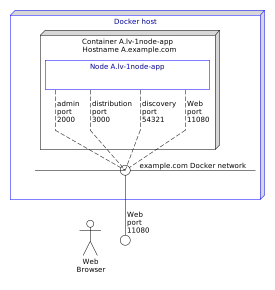
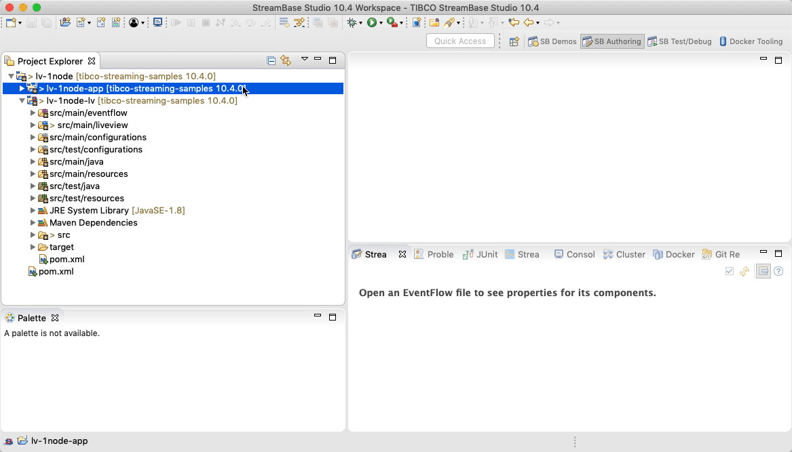
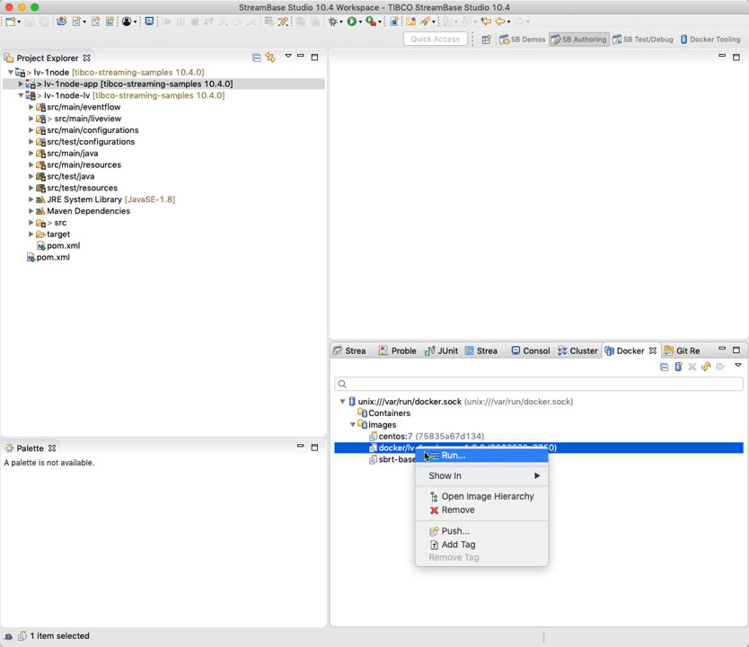
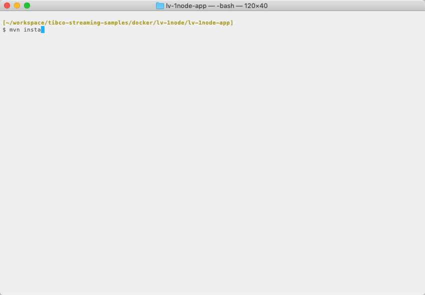
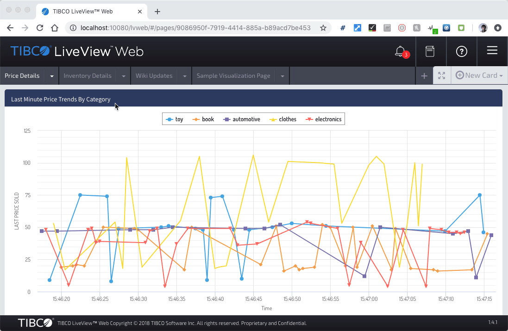

# Docker : TIBCO LiveView&trade; Web

This sample describes how to deploy an application archive containing a TIBCO LiveView&trade; Web fragment to Docker.

* [Prerequisites](#prerequisites)
* [Creating an application archive project for Docker from TIBCO StreamBase Studio&trade;](#creating-an-application-archive-project-for-docker-from-tibco-streambase-studio-trade)
* [Containers and nodes](#containers-and-nodes)
* [Changes to the default docker configurations](#changes-to-the-default-docker-configurations)
* [Building and running from TIBCO StreamBase Studio&trade;](#building-and-running-from-tibco-streambase-studio-trade)
* [Building this sample from the command line and running the integration test cases](#building-this-sample-from-the-command-line-and-running-the-integration-test-cases)
* [Example docker commands](#example-docker-commands)

See also [Docker section in TIBCO&reg; Streaming documentation](https://docs.tibco.com/pub/str/10.4.0/doc/html/admin/part-docker.html).

<a name="prerequisites"></a>

## Prerequisites

Docker must first be downloaded and installed - see https://www.docker.com/ for further details.

On MacOS, the resources available to docker may need to be increased beyond the default - see
CPUs and Memory settings on the Advanced tab of Docker preferences.

<a name="creating-an-application-archive-project-for-docker-from-tibco-streambase-studio-trade"></a>

## Creating an application archive project for Docker from TIBCO StreamBase Studio&trade;

TIBCO StreamBase Studio&trade; can generate a project containing the necessary files to build and 
test a Docker image by selecting **Enable Docker support** when creating an application archive project :


Such a project includes :

* A [base Dockerfile](../../main/docker/base/Dockerfile) to build a base image containing Linux, utilities and the TIBCO StreamBase runtime
* A [start-node](../../main/docker/base/start-node) script to start a node
* An [application Dockerfile](../../main/docker/application/Dockerfile) to build an application image containing the application archive - this is based on the base image
* Steps in [pom.xml](../../../pom.xml) that uses [fabric8io/docker-maven-plugin](http://dmp.fabric8.io/) to build the Docker image and start Docker containers for basic testing
* [Trusted hosts HOCON configuration](../../main/configurations/security.conf) so that each container can run epadmin commands on the cluster
* [Application definition configuration](../../main/configurations/app.conf) that defines nodeType docker to use System V shared memory
* [Node deployment configuration](../../main/configurations/defaultnode.conf) that uses the above nodeType

Note that whilst this project will create a simple Docker image, changes to the project may be required for additional behaviours. 

<a name="containers-and-nodes"></a>

## Containers and nodes

In this sample we name the docker container as **A.lv-1node-app**,  which hosts the StreamBase node **A.lv-1node-app**, the TIBCO LiveView&trade; Web port 
10080 is published to the host :



<a name="changes-to-the-default-docker-configurations"></a>

## Changes to the default docker configurations

In this sample we still want to build the application archive if Docker is not
installed, hence the maven [pom.xml](../../../pom.xml) file is updated to detect if docker is installed :

```xml
    <properties>
        <dockerDomain>example.com</dockerDomain>
        <skipApplicationDocker>true</skipApplicationDocker>
        <skipStreamBaseDockerBase>true</skipStreamBaseDockerBase>
        <skipDockerTests>true</skipDockerTests>
    </properties>
    ...
    <!-- if docker is available, build docker projects -->
    <profile>
        <id>Docker in local</id>
        <activation>
            <file>
                <exists>/usr/local/bin/docker</exists>
            </file>
        </activation>
        <properties>
            <skipApplicationDocker>false</skipApplicationDocker>
            <skipStreamBaseDockerBase>false</skipStreamBaseDockerBase>
            <skipDockerTests>${skipTests}</skipDockerTests>
        </properties>
    </profile>
    <profile>
        <id>Docker in bin</id>
        <activation>
            <file>
                <exists>/usr/bin/docker</exists>
            </file>
        </activation>
        <properties>
            <skipApplicationDocker>false</skipApplicationDocker>
            <skipStreamBaseDockerBase>false</skipStreamBaseDockerBase>
            <skipDockerTests>${skipTests}</skipDockerTests>
        </properties>
    </profile>
    <profile>
        <id>Docker in C:</id>
        <activation>
            <file>
                <exists>C:\Program Files\Docker\Docker\resources\bin\docker.exe</exists>
            </file>
        </activation>
        <properties>
            <skipApplicationDocker>false</skipApplicationDocker>
            <skipStreamBaseDockerBase>false</skipStreamBaseDockerBase>
            <skipDockerTests>${skipTests}</skipDockerTests>
        </properties>
    </profile>
```

Since this application starts a Web Server we need to expose the port outside of Docker during
integration testing and wait until the web server is running :

```
    <ports> 
        <port>10080:10080</port>
    </ports>
    ...
    <wait>
        <http>
            <url>http://localhost:10080</url>
            <method>GET</method>
            <status>200..399</status>
        </http>
        <time>500000</time>
    </wait>
```

<a name="building-and-running-from-tibco-streambase-studio-trade"></a>

## Building and running from TIBCO StreamBase Studio&trade;

Use the **Run As -> Maven install** menu option to build from TIBCO StreamBase Studio&trade; or Run As shortcut.  Tests can
be skipped if required by ticking the **Skip tests** :



The [Docker tooling](https://marketplace.eclipse.org/content/eclipse-docker-tooling) eclipse plugin
( requires [TM Terminal](https://marketplace.eclipse.org/content/tm-terminal) ) can be used to start and
manage containers :



<a name="building-this-sample-from-the-command-line-and-running-the-integration-test-cases"></a>

## Building this sample from the command line and running the integration test cases

Use the [maven](https://maven.apache.org) as **mvn install** to build from the command line or Continuous Integration system :



<a name="example-docker-commands"></a>

## Example docker commands

### Create the docker network

Use the [docker network](https://docs.docker.com/engine/reference/commandline/network_create/) command :

```
$ docker network create example.com
03961870a96df30e7e20cf54a3c339b6d7a1e0b344d0833f4c7f88dfaba76138
```

### Start the container

Use the [docker run](https://docs.docker.com/engine/reference/run/) command.  In this case the following options are used :

* **--detach** - run in the background
* **--hostname=A.example.com --network-alias=A.example.com --network=example.com** - set the container hostname and network name. This must match the docker network name and the [Trusted hosts HOCON configuration](../../main/configurations/security.conf)
* **--name=A.lv-1node-app** - container name
* **--env=NODENAME=A.lv-1node-app** - node name
* **--publish 10080:10080** - publish the TIBCO LiveView&trade; Web port to the host
* **docker/lv-1node-app:1.0.0** - Docker image name

```shell
$ docker run --detach --hostname=A.example.com --network-alias=A.example.com --name=A.lv-1node-app --network=example.com --env=NODENAME=A.lv-1node-app --publish 10080:10080 docker/lv-1node-app:1.0.0
ec0aaaa22b92707e74f15b9ada6e6c37c14669856744e88ebc1741b2b099cc0d
```

### Connect to the TIBCO LiveView&trade; Web console

Use a web browser at http://localhost:10080/ :



### Stop and remove the containers

Use the [docker stop](https://docs.docker.com/engine/reference/commandline/stop/) and [docker rm](https://docs.docker.com/engine/reference/commandline/rm/) commands :

```shell
$ docker stop A.lv-1node-app
$ docker rm A.lv-1node-app
```
