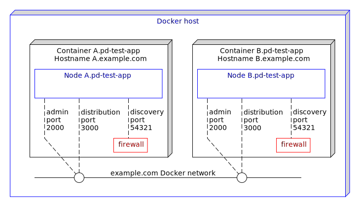

# Docker : 2-node active active with proxy discovery

Testing proxy discovery configurations can be difficult since often in test hardware, networks
do not block the discovery messages.  This sample describes how to use docker to test proxy discovery.

* [Creating an application archive project for Docker from TIBCO StreamBase Studio&trade;](#creating-an-application-archive-project-for-docker-from-tibco-streambase-studio-trade)
* [Machines and nodes](#machines-and-nodes)
* [Changes to the default configurations](#changes-to-the-default-configurations)
* [Building this sample from the command line and running the integration test cases](#building-this-sample-from-the-command-line-and-running-the-integration-test-cases)

See also [Docker section in TIBCO&reg; Streaming documentation](https://docs.tibco.com/pub/str/10.4.0/doc/html/admin/part-docker.html).

<a name="creating-an-application-archive-project-for-docker-from-tibco-streambase-studio-trade"></a>

## Creating an application archive project for Docker from TIBCO StreamBase Studio&trade;

TIBCO StreamBase Studio&trade; can generate a project containing the necessary files to build and 
test a Docker image by selecting **Enable Docker support** when creating an application archive project :


Such a project includes :

* A [base Dockerfile](../../main/docker/base/Dockerfile) to build a base image containing Linux, utilities and the TIBCO StreamBase runtime
* A [start-node](../../main/docker/base/start-node) script to start a node
* An [application Dockerfile](../../main/docker/application/Dockerfile) to build an application image containing the application archive - this is based on the base image
* Steps in [pom.xml](../../../pom.xml) that uses [fabric8io/docker-maven-plugin](http://dmp.fabric8.io/) to build the Docker image and start Docker containers for basic testing
* [Trusted hosts HOCON configuration](../../main/configurations/security.conf) so that each container can run epadmin commands on the cluster
* [Application definition configuration](../../main/configurations/app.conf) that defines nodeType docker to use System V shared memory
* [Node deployment configuration](../../main/configurations/defaultnode.conf) that uses the above nodeType

<a name="machines-and-nodes"></a>

## Machines and nodes

In this sample we name the docker machines as **A.example.com**,  which hosts the StreamBase node **A.pd-test-app**, and **B.example.com**, which hosts the StreamBase node **B.pd-test-app**.



A firewall is configured to block the discovery network packets to test proxy discovery.

<a name="changes-to-the-default-configurations"></a>

## Changes to the default configurations

The [Node deployment configuration](../../main/configurations/defaultnode.conf) is updated to include the 
prodxy discovery configuration :

```
        nodes = {
            "A.pd-test-app" = { 
                nodeType = docker
                communication = {
                    administration = {
                        address = ${A_HOSTNAME:-A.example.com}
                        transportPort = ${A_ADMINPORT:-2000}
                    }
                    distributionListenerInterfaces = [ {
                        address = ${A_HOSTNAME:-A.example.com}
                        dataTransportPort = ${A_DATATRANSPORTPORT:-3000}
                    } ]
                    proxyDiscovery = {
                        remoteNodes = [ ".*" ]
                    }
                }
            }
```

The base image [Dockerfile](../../main/docker/base/Dockerfile) is updated to include the sudo tool and its configuration :

```dockerfile
RUN echo 'fastestmirror=1' >> /etc/dnf/dnf.conf && dnf --assumeyes update && dnf --setopt=install_weak_deps=False --best --assumeyes --exclude=gcc --exclude=binutils install \
    sysstat \
    gdb \
    zip \
    unzip \
    libnsl \
    less \
    java-11-openjdk-headless \
    iproute \
    net-tools \
    iptables \
    sudo \
    && dnf clean all
...
RUN echo "${USER_NAME} ALL=(ALL) NOPASSWD: ALL" >> /etc/sudoers
```

The [start-node](../../main/docker/base/start-node) script is updated to set firewall rules to drop in-bound discovery :

```shell
sudo iptables -I INPUT ! -s ${HOSTNAME} -p udp --dport 54321 -j DROP
```

The maven [pom.xml](../../../pom.xml) file is updated to detect if docker is installed :

```xml
    <properties>
        <dockerDomain>example.com</dockerDomain>
        <skipApplicationDocker>true</skipApplicationDocker>
        <skipStreamBaseDockerBase>true</skipStreamBaseDockerBase>
        <skipDockerTests>true</skipDockerTests>
    </properties>
    ...
    <!-- if docker is available, build docker projects -->
    <profile>
        <id>Docker in local</id>
        <activation>
            <file>
                <exists>/usr/local/bin/docker</exists>
            </file>
        </activation>
        <properties>
            <skipApplicationDocker>false</skipApplicationDocker>
            <skipStreamBaseDockerBase>false</skipStreamBaseDockerBase>
            <skipDockerTests>${skipTests}</skipDockerTests>
        </properties>
    </profile>
    <profile>
        <id>Docker in bin</id>
        <activation>
            <file>
                <exists>/usr/bin/docker</exists>
            </file>
        </activation>
        <properties>
            <skipApplicationDocker>false</skipApplicationDocker>
            <skipStreamBaseDockerBase>false</skipStreamBaseDockerBase>
            <skipDockerTests>${skipTests}</skipDockerTests>
        </properties>
    </profile>
    <profile>
        <id>Docker in C:</id>
        <activation>
            <file>
                <exists>C:\Program Files\Docker\Docker\resources\bin\docker.exe</exists>
            </file>
        </activation>
        <properties>
            <skipApplicationDocker>false</skipApplicationDocker>
            <skipStreamBaseDockerBase>false</skipStreamBaseDockerBase>
            <skipDockerTests>${skipTests}</skipDockerTests>
        </properties>
    </profile>
``` 

and include running **epadmin display cluster** when the nodes are started - this shows if the nodes are connected to each other via the proxy discovery configuration :

```xml
    <exec>
        <postStart>epadmin servicename=B.${project.artifactId} display cluster</postStart>
    </exec>
```

<a name="building-this-sample-from-the-command-line-and-running-the-integration-test-cases"></a>

## Building this sample from the command line and running the integration test cases

Use the [maven](https://maven.apache.org) as **mvn install** to build from the command line or Continuous Integration system :


---
Copyright (c) 2018-2019, TIBCO Software Inc.

Redistribution and use in source and binary forms, with or without
modification, are permitted provided that the following conditions are met:

* Redistributions of source code must retain the above copyright notice, this
  list of conditions and the following disclaimer.

* Redistributions in binary form must reproduce the above copyright notice,
  this list of conditions and the following disclaimer in the documentation
  and/or other materials provided with the distribution.

* Neither the name of the copyright holder nor the names of its
  contributors may be used to endorse or promote products derived from
  this software without specific prior written permission.

THIS SOFTWARE IS PROVIDED BY THE COPYRIGHT HOLDERS AND CONTRIBUTORS "AS IS"
AND ANY EXPRESS OR IMPLIED WARRANTIES, INCLUDING, BUT NOT LIMITED TO, THE
IMPLIED WARRANTIES OF MERCHANTABILITY AND FITNESS FOR A PARTICULAR PURPOSE ARE
DISCLAIMED. IN NO EVENT SHALL THE COPYRIGHT HOLDER OR CONTRIBUTORS BE LIABLE
FOR ANY DIRECT, INDIRECT, INCIDENTAL, SPECIAL, EXEMPLARY, OR CONSEQUENTIAL
DAMAGES (INCLUDING, BUT NOT LIMITED TO, PROCUREMENT OF SUBSTITUTE GOODS OR
SERVICES; LOSS OF USE, DATA, OR PROFITS; OR BUSINESS INTERRUPTION) HOWEVER
CAUSED AND ON ANY THEORY OF LIABILITY, WHETHER IN CONTRACT, STRICT LIABILITY,
OR TORT (INCLUDING NEGLIGENCE OR OTHERWISE) ARISING IN ANY WAY OUT OF THE USE
OF THIS SOFTWARE, EVEN IF ADVISED OF THE POSSIBILITY OF SUCH DAMAGE.
