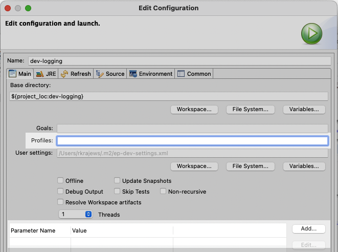

# Using in TIBCO StreamBase Studio&trade;

These samples are kept on-line in GitHub - this allows browsing of the samples on-line,
support of contributions outside of TIBCO engineering and updates outside of the main
product release lifecycle.

The samples can also be imported into TIBCO StreamBase Studio&trade; :

## Using the TIBCO samples menu

* Use **File -> Import Samples And Community Content…**
* Check the **Include community samples and online versions of supported samples** and
  agree to the relevant bits.
* Navigate the combined list of samples or use the filter text field to select a
  sample annotated with _GitHub: Supported Samples Repository_.
* Select **Import Now**.

The local GitHub clone can be updated with **Pull from remote repositories now**.

## Using smart import

* Use **Import -> Git -> Projects from Git ( with smart import )** menu option.  
* Select **Clone URI -> Next**
* Specify the GitHub URL ( https://github.com/TIBCOSoftware/tibco-streaming-samples.git )
* Select the branch that corresponds to the product version you are using
* Choose what sample(s) to import :

## Working with multiple projects

By default, projects are organized in TIBCO StreamBase Studio&trade; in a flat structure :

With multiple projects ( such as importing all the samples ) this can become confusing.  Use
**Projects Presentation -> Hierarchical** for a more structured organization :

## Working with projects with significant requirements

Some of the samples presented here require significant environmental
setup, such as Ansible or AWS access. In that case, those parts of the
samples _do not run_ unless properties or profiles are defined from
a Maven command line.

Sometimes, you can address the requirement by creating a Maven build
launch configuration that specifies some profiles in the **Profiles:**
field, or defines additional parameters (properties) in the parameter
list.

Otherwise, the `pom.xml`s need to be modified in some way to
make a Studio run of the samples actually do what they are meant to
illustrate. The workarounds will be explained in the `pom.xml`s
themselves.

## Other useful Eclipse plugins

* [Markdown Text Editor](https://marketplace.eclipse.org/content/markdown-text-editor)
* [GitHub Flavored Markdown viewer plugin](https://marketplace.eclipse.org/content/github-flavored-markdown-viewer-plugin)
* [Mylyn WikiText](https://marketplace.eclipse.org/content/mylyn-wikitext)
* [Docker tooling](https://marketplace.eclipse.org/content/eclipse-docker-tooling) ( requires [TM Terminal](https://marketplace.eclipse.org/content/tm-terminal) )
* [Eclipse Copyright Generator](https://jmini.github.io/Eclipse-Copyright-Generator/)
