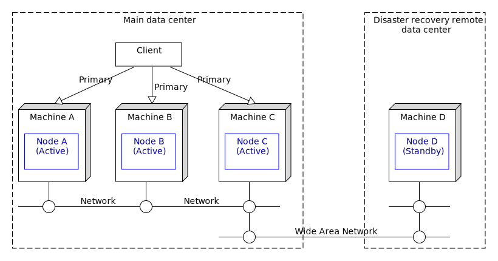
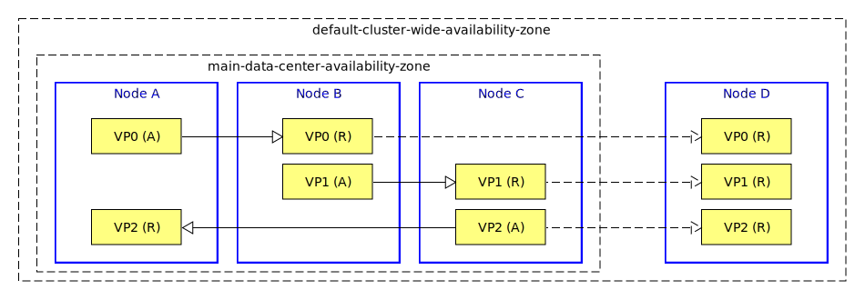

[comment]: # (  Copyright \(C\) 2018-2019, TIBCO Software Inc.                               )

[comment]: # (                                                                               )

[comment]: # (  Redistribution and use in source and binary forms, with or without           )

[comment]: # (  modification, are permitted provided that the following conditions are met:  )

[comment]: # (                                                                               )

[comment]: # (  1. Redistributions of source code must retain the above copyright notice,    )

[comment]: # (     this list of conditions and the following disclaimer.                     )

[comment]: # (                                                                               )

[comment]: # (  2. Redistributions in binary form must reproduce the above copyright notice, )

[comment]: # (     this list of conditions and the following disclaimer in the documentation )

[comment]: # (     and/or other materials provided with the distribution.                    )

[comment]: # (                                                                               )

[comment]: # (  3. Neither the name of the copyright holder nor the names of its contributors)

[comment]: # (     may be used to endorse or promote products derived from this software     )

[comment]: # (     without specific prior written permission.                                )

[comment]: # (                                                                               )

[comment]: # (  THIS SOFTWARE IS PROVIDED BY THE COPYRIGHT HOLDERS AND CONTRIBUTORS "AS IS"  )

[comment]: # (  AND ANY EXPRESS OR IMPLIED WARRANTIES, INCLUDING, BUT NOT LIMITED TO, THE    )

[comment]: # (  IMPLIED WARRANTIES OF MERCHANTABILITY AND FITNESS FOR A PARTICULAR PURPOSE   )

[comment]: # (  ARE DISCLAIMED. IN NO EVENT SHALL THE COPYRIGHT HOLDER OR CONTRIBUTORS BE    )

[comment]: # (  LIABLE FOR ANY DIRECT, INDIRECT, INCIDENTAL, SPECIAL, EXEMPLARY, OR          )

[comment]: # (  CONSEQUENTIAL DAMAGES \(INCLUDING, BUT NOT LIMITED TO, PROCUREMENT OF        )

[comment]: # (  SUBSTITUTE GOODS OR SERVICES; LOSS OF USE, DATA, OR PROFITS; OR BUSINESS     )

[comment]: # (  INTERRUPTION\) HOWEVER CAUSED AND ON ANY THEORY OF LIABILITY, WHETHER IN     )

[comment]: # (  CONTRACT, STRICT LIABILITY, OR TORT \(INCLUDING NEGLIGENCE OR OTHERWISE\)    )

[comment]: # (  ARISING IN ANY WAY OUT OF THE USE OF THIS SOFTWARE, EVEN IF ADVISED OF THE   )

[comment]: # (  POSSIBILITY OF SUCH DAMAGE.                                                  )

# HA : 3-node active active with disaster recovery

This sample describes how to deploy an EventFlow fragment in a 3-node active active configuration with disaster recovery

* [Machines and nodes](#machines-and-nodes)
* [Data partitioning](#data-partitioning)
* [Define the application definition configuration](#define-the-application-definition-configuration)
* [Define the node deployment configuration](#define-the-node-deployment-configuration)
* [Design notes](#design-notes)
* [Failure scenarios](#failure-scenarios)
* [Building this sample from the command line and running the integration test cases](#building-this-sample-from-the-command-line-and-running-the-integration-test-cases)

<a name="machines-and-nodes"></a>

## Machines and nodes

In this sample we name the machines as **A**,  which hosts the StreamBase node **A**, 
**B**, which hosts the StreamBase node **B** and **C** which hosts StreamBase node **C**.
We also have disaster recovery machine **D** which hosts the StreamBase node **D** - this
can be situated offsite and connected to the main machines via a wide area network :



A client that uses the service can connect to any of the main data center machines.

( service names are omitted in descriptions for clarity )

<a name="data-partitioning"></a>

## Data partitioning

In this sample the default **default-cluster-wide-availability-zone** is used to distribute the data across
all the nodes - a number of virtual partitions are created to evenly balance and replicate data around the cluster.  The disaster
recovery node **D** is configured as a **BACKUP** type so that it is a replica for all data - asynchronous replication 
is used across the wide are network to avoid impacts due to network latency :



( only 3 virtual partitions are shown - the default is 64 )

<a name="define-the-application-definition-configuration"></a>

## Define the application definition configuration

In this sample we want to use **asynchronous** replication for the disaster recovery machine, so we need
to specify this in the application definition :


```scala
name = "aa-3node-dr-app"
version = "1.0.0"
type = "com.tibco.ep.dtm.configuration.application"

configuration = {
    ApplicationDefinition = {
        execution {
            nodeTypes {
                docker {
                    sharedMemory = {
                        memoryType = SYSTEM_V_SHARED_MEMORY
                    }
                }
            }
        }     
        dataDistributionPolicies = {
            default-dynamic-data-distribution-policy = {
                type = "DYNAMIC"                
                dynamicDataDistributionPolicy = {
                    primaryDataRedundancy = {
                        replicationType = "SYNCHRONOUS"
                    }
                    backupDataRedundancy = {
                        replicationType = "ASYNCHRONOUS"
                    }
                }                                       
            }
            main-data-center-policy = {
                type = "STATIC"                                                      
            }      
        }
    }
}
```

<a name="define-the-node-deployment-configuration"></a>

## Define the node deployment configuration

For this sample we set the dynamic partition binding type of node **D** to **BACKUP** and the main
data center nodes to **PRIMARY**.  Also,  we need to override the default value of **primaryMemberPattern**.  The **minimumNumberOfVotes** 
configuration enables quorums for the main data center, so the node deployment configuration is :

```scala
name = "aa-3node-dr-app"
version = "1.0.0"
type = "com.tibco.ep.dtm.configuration.node"

configuration = {
    NodeDeploy = {
        nodes = {
            "A.aa-3node-dr-app" = {
                availabilityZoneMemberships = {
                    default-cluster-wide-availability-zone = {
                        dynamicPartitionBinding = {
                            type = "PRIMARY"                                                                           
                        }
                    }
                    main-data-center-availability-zone = {                                                              
                    }
                }
            }
            "B.aa-3node-dr-app" = {
                availabilityZoneMemberships = {
                    default-cluster-wide-availability-zone = {
                        dynamicPartitionBinding = {
                            type = "PRIMARY"                                                                           
                        }
                    }
                    main-data-center-availability-zone = {                                                              
                    }
                }
            }
            "C.aa-3node-dr-app" = {
                availabilityZoneMemberships = {
                    default-cluster-wide-availability-zone = {
                        dynamicPartitionBinding = {
                            type = "PRIMARY"                                                                           
                        }
                    }
                    main-data-center-availability-zone = {                                                              
                    }
                }
            }
            "D.aa-3node-dr-app" = {
                availabilityZoneMemberships = {
                    default-cluster-wide-availability-zone = {
                        dynamicPartitionBinding = {
                            type = "BACKUP"                                                                           
                        }
                    }
                }
            }      
        }
        availabilityZones = {
            main-data-center-availability-zone = {
                dataDistributionPolicy = "main-data-center-policy"
                // enable quorums - each node must be able to see itself plus 1 other node
                //
                minimumNumberOfVotes = 2
            }
            default-cluster-wide-availability-zone = {
                dataDistributionPolicy = "default-dynamic-data-distribution-policy"
                // disable auto adding all nodes as primary
                //
                dynamicPartitionPolicy = {
                    primaryMemberPattern = ""                                                  
                }
            }
        }
    }
}
```

Note that **percentageOfVotes** could be used instead.  An alternative configuration for quorums could
use **quorumMemberPattern**.

<a name="design-notes"></a>

## Design notes

* The default dynamic data distribution policy is chosen to distribute the data across the cluster
* An addition data distribution policy and availability zone is used to hold the quorum configuration for the main data center
* Most of the data distribution policy and the availability zone configuration values are not set since defaults work well

<a name="failure-scenarios"></a>

## Failure scenarios

The main failure cases for this deployment are outlined below :

Failure case   | Behavior on failure | Steps to resolve | Notes
--- | --- | --- | ---
Machine A fails | 1 Client is disconnected<br/>2 Virtual partitions become active on B & C<br/>3 Client may connect to B or C and continue  | 1 Fix machine A<br/>2 Use **epadmin install node** and **epadmin start node** | 1 No data loss<br/>2 No service loss
Machine B fails | 1 Client is disconnected<br/>2 Virtual partitions become active on A & C<br/>3 Client may connect to A or C and continue  | 1 Fix machine B<br/>2 Use **epadmin install node** and **epadmin start node** | 1 No data loss<br/>2 No service loss
Machine C fails | 1 Client is disconnected<br/>2 Virtual partitions become active on A & B<br/>3 Client may connect to A or B and continue  | 1 Fix machine C<br/>2 Use **epadmin install node** and **epadmin start node** | 1 No data loss<br/>2 No service loss<br/>
Machine D fails | 1 Disaster recover facility is lost | 1 Fix machine D<br/>2 Use **epadmin install node** and **epadmin start node** | 1 No data loss<br/>2 No service loss
Main data center loss | 1 All clients are disconnected<br/>2 Virtual partitions become active on D | 1 Fix data center<br/>2 Use **epadmin install node** and **epadmin start node** | 1 No data loss<br/>2 **Temporary service loss**
Network fails to A | 1 Quorum on A fails and takes itself offline to avoid multi-master | 1 Fix network<br/>2 Use **epadmin restore availabilityzone** | 1 No data loss<br/>2 No service loss
Network fails to B | 1 Quorum on B fails and takes itself offline to avoid multi-master | 1 Fix network<br/>2 Use **epadmin restore availabilityzone** | 1 No data loss<br/>2 No service loss
Network fails to C | 1 Quorum on C fails and takes itself offline to avoid multi-master | 1 Fix network<br/>2 Use **epadmin restore availabilityzone** | 1 No data loss<br/>2 No service loss


With a 3 node configuration node quorums can be applied to avoid a multi-master scenario.

<a name="building-this-sample-from-the-command-line-and-running-the-integration-test-cases"></a>

## Building this sample from the command line and running the integration test cases

In this sample, some HA integration test cases are defined in the pom.xml that :

* start nodes A, B, C & D
* use **epadmin start playback** to inject tuples to node A
* use **epadmin read querytable** on node A to verify query table contents
* stop nodes A, B & C
* use **epadmin read querytable** on node D to verify no data loss
* stop node D

:warning: This does not constitute an exhaustive non-functional test plan

Use the [maven](https://maven.apache.org) as **mvn install** to build from the command line or Continuous Integration system :


