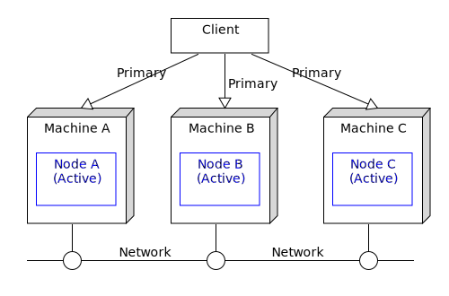
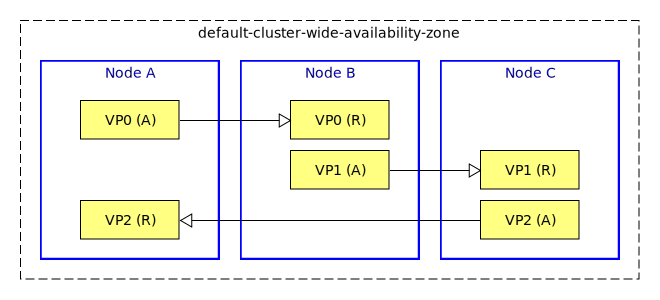

# HA : 3-node active active

This sample describes how to deploy an EventFlow fragment in a 3-node active active configuration.

* [Machines and nodes](#machines-and-nodes)
* [Data partitioning](#data-partitioning)
* [Define the node deployment configuration](#define-the-node-deployment-configuration)
* [Design notes](#design-notes)
* [Failure scenarios](#failure-scenarios)
* [Building this sample from the command line and running the integration test cases](#building-this-sample-from-the-command-line-and-running-the-integration-test-cases)

<a name="machines-and-nodes"></a>

## Machines and nodes

In this sample we name the machines as **A**,  which hosts the StreamBase node **A**, 
**B**, which hosts the StreamBase node **B** and **C** which hosts StreamBase node **C**.



A client that uses the service can connect to any machine.

( service names are omitted in descriptions for clarity )

<a name="data-partitioning"></a>

## Data partitioning

To support an active active configuration, the query table data must be replicated between the nodes.  
In this sample the default **default-cluster-wide-availability-zone** is used - a number of virtual
partitions are created to evenly balance and replicate data around the cluster :



( only 3 virtual partitions are shown - the default is 64 )

<a name="define-the-node-deployment-configuration"></a>

## Define the node deployment configuration

The **minimumNumberOfVotes** configuration enables quorums, so the node deployment
configuration is :

```scala
name = "aa-3node-app"
version = "1.0.0"
type = "com.tibco.ep.dtm.configuration.node"

configuration = {
    NodeDeploy = {
        nodes = {
            "${EP_NODE_NAME}" = {
                availabilityZoneMemberships = {
                    default-cluster-wide-availability-zone = {
                    }
                }
            }          
        }
        availabilityZones = {
            default-cluster-wide-availability-zone = {
                dataDistributionPolicy = "default-dynamic-data-distribution-policy"
                // enable quorums - each node must be able to see itself plus 1 other node
                //
                minimumNumberOfVotes = 2
            }
        }
    }
}
```

Note that **percentageOfVotes** could be used instead.  An alternative configuration for quorums could
use **quorumMemberPattern**.

<a name="design-notes"></a>

## Design notes

* The default dynamic data distribution policy is chosen to distribute the data across the cluster
* Most of the data distribution policy and the availability zone configuration values are not set since defaults work well

<a name="failure-scenarios"></a>

## Failure scenarios

The main failure cases for this deployment are outlined below :

Failure case   | Behavior on failure | Steps to resolve | Notes
--- | --- | --- | ---
Machine A fails | 1 Client is disconnected<br/>2 Virtual partitions become active on B & C<br/>3 Client may connect to B or C and continue  | 1 Fix machine A<br/>2 Use **epadmin install node** and **epadmin start node** | 1 No data loss<br/>2 No service loss
Machine B fails | 1 Client is disconnected<br/>2 Virtual partitions become active on A & C<br/>3 Client may connect to A or C and continue  | 1 Fix machine B<br/>2 Use **epadmin install node** and **epadmin start node** | 1 No data loss<br/>2 No service loss
Machine C fails | 1 Client is disconnected<br/>2 Virtual partitions become active on A & B<br/>3 Client may connect to A or B and continue  | 1 Fix machine C<br/>2 Use **epadmin install node** and **epadmin start node** | 1 No data loss<br/>2 No service loss
Network fails to A | 1 Quorum on A fails and takes itself offline to avoid multi-master | 1 Fix network<br/>2 Use **epadmin restore availabilityzone** | 1 No data loss<br/>2 No service loss
Network fails to B | 1 Quorum on B fails and takes itself offline to avoid multi-master | 1 Fix network<br/>2 Use **epadmin restore availabilityzone** | 1 No data loss<br/>2 No service loss
Network fails to C | 1 Quorum on C fails and takes itself offline to avoid multi-master | 1 Fix network<br/>2 Use **epadmin restore availabilityzone** | 1 No data loss<br/>2 No service loss

With a 3 node configuration node quorums can be applied to avoid a multi-master scenario.

<a name="building-this-sample-from-the-command-line-and-running-the-integration-test-cases"></a>

## Building this sample from the command line and running the integration test cases

In this sample, some HA integration test cases are defined in the pom.xml that :

* start nodes A, B & C
* use **epadmin start playback** to inject tuples to node A
* use **epadmin read querytable** on node A to verify query table contents
* stop node A
* use **epadmin read querytable** on node B to verify no data loss
* stop node B

**Warning:** This does not constitute an exhaustive non-functional test plan

Use the [maven](https://maven.apache.org) as **mvn install** to build from the command line or Continuous Integration system :


---
Copyright (c) 2018-2019, TIBCO Software Inc.

Redistribution and use in source and binary forms, with or without
modification, are permitted provided that the following conditions are met:

* Redistributions of source code must retain the above copyright notice, this
  list of conditions and the following disclaimer.

* Redistributions in binary form must reproduce the above copyright notice,
  this list of conditions and the following disclaimer in the documentation
  and/or other materials provided with the distribution.

* Neither the name of the copyright holder nor the names of its
  contributors may be used to endorse or promote products derived from
  this software without specific prior written permission.

THIS SOFTWARE IS PROVIDED BY THE COPYRIGHT HOLDERS AND CONTRIBUTORS "AS IS"
AND ANY EXPRESS OR IMPLIED WARRANTIES, INCLUDING, BUT NOT LIMITED TO, THE
IMPLIED WARRANTIES OF MERCHANTABILITY AND FITNESS FOR A PARTICULAR PURPOSE ARE
DISCLAIMED. IN NO EVENT SHALL THE COPYRIGHT HOLDER OR CONTRIBUTORS BE LIABLE
FOR ANY DIRECT, INDIRECT, INCIDENTAL, SPECIAL, EXEMPLARY, OR CONSEQUENTIAL
DAMAGES (INCLUDING, BUT NOT LIMITED TO, PROCUREMENT OF SUBSTITUTE GOODS OR
SERVICES; LOSS OF USE, DATA, OR PROFITS; OR BUSINESS INTERRUPTION) HOWEVER
CAUSED AND ON ANY THEORY OF LIABILITY, WHETHER IN CONTRACT, STRICT LIABILITY,
OR TORT (INCLUDING NEGLIGENCE OR OTHERWISE) ARISING IN ANY WAY OUT OF THE USE
OF THIS SOFTWARE, EVEN IF ADVISED OF THE POSSIBILITY OF SUCH DAMAGE.
