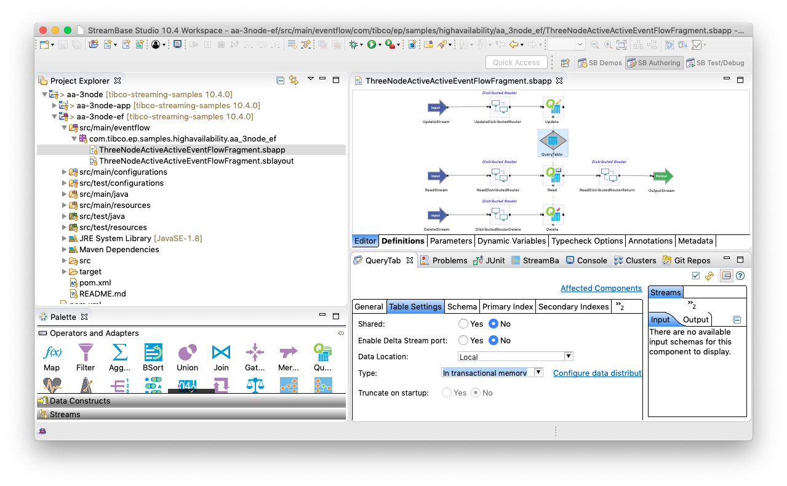
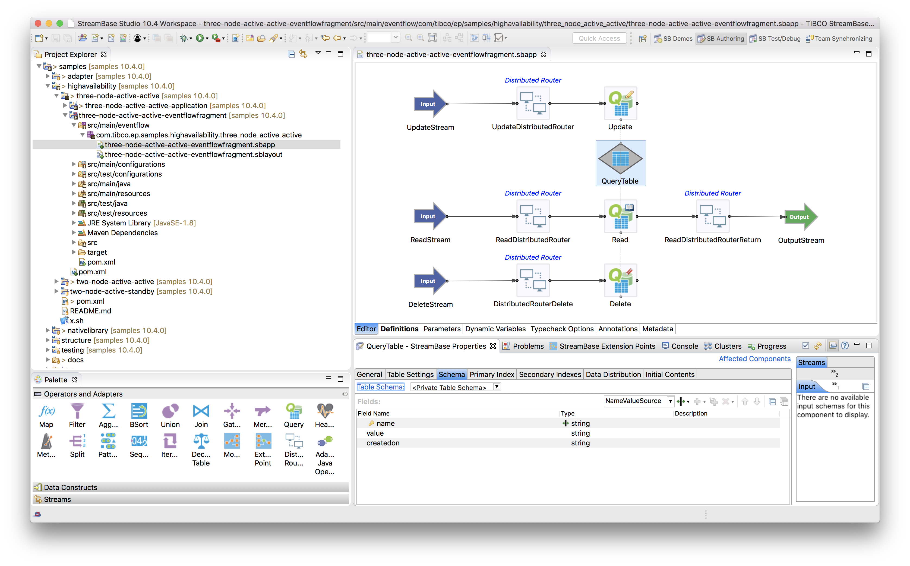
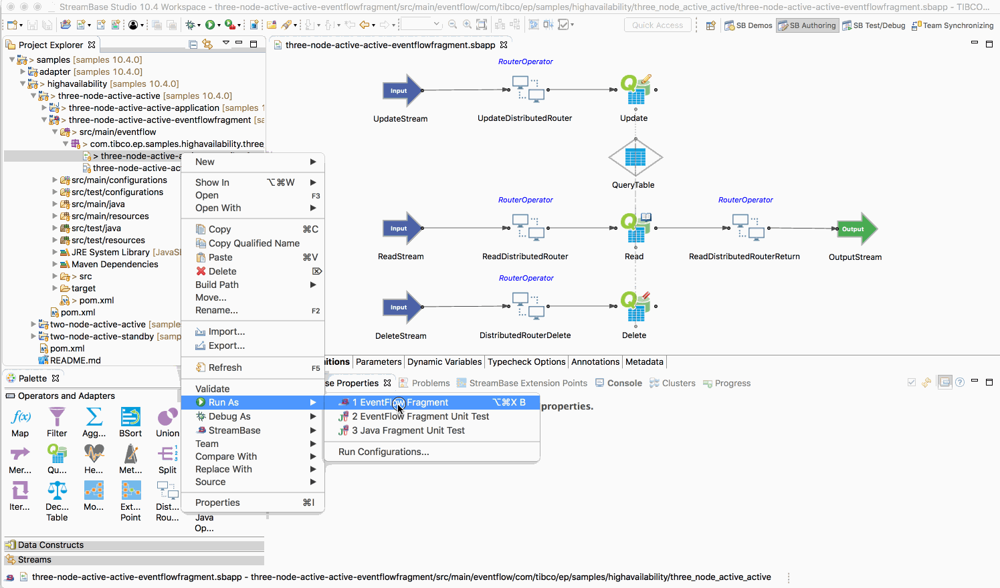
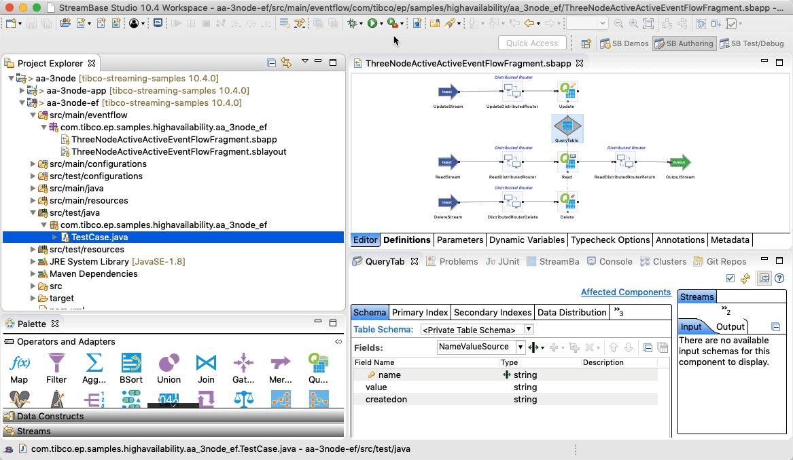
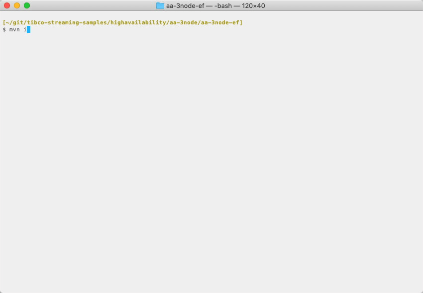

# HA : 3-node active active

This sample describes how to build an EventFlow fragment suitable for 3-node active active deployment.

* [Store tuples in a query table backed by transactional memory](#store-tuples-in-a-query-table-backed-by-transactional-memory)
* [Design notes](#design-notes)
* [Running this sample from TIBCO StreamBase Studio&trade;](#running-this-sample-from-tibco-streambase-studio-trade)
* [Building this sample from TIBCO StreamBase Studio&trade; and running the unit test cases](#building-this-sample-from-tibco-streambase-studio-trade-and-running-the-unit-test-cases)
* [Building this sample from the command line and running the unit test cases](#building-this-sample-from-the-command-line-and-running-the-unit-test-cases)

## Store tuples in a query table backed by transactional memory

In this sample, a query table is used to update, read and delete tuples, so :

* Query table is key'ed by **name** field
* A tuple injected on the **UpdateStream** stream containing **name** & **value** will be routed to target node and insert or update the **name** entry in the table with the new **value**
* A tuple injected on the **ReadStream** stream containing **name** will be routed to target node, read the current value from the table and routed back to the source node
* A tuple injected on the **DeleteStream** stream containing **name** will be routed to target node and delete the name from the table

The query table is configured with transactional memory :

The default data distribution policy **default-dynamic-data-distribution-policy** is used :

Finally, the tuples stored in the query table are partitioned by the **name** field :

## Design notes

* Tuples are routed to the target node
* In the case of read, the return tuple is routed back to the source node - the source node is recorded in sourcenode field to support this
* Query scope is local ( ie not cluster wide )

## Running this sample from TIBCO StreamBase Studio&trade;

Use the **Run As -> EventFlow Fragment** menu option to run in TIBCO StreamBase Studio&trade;, and then enqueue tuples :

Note that here we are unit testing the business logic rather than high availability - in this sample we test high availability in
the application archive integration test cases.  The unit test cases can test high availability by loading an activating test versions 
of the application definition and node deployment configuration files.

## Building this sample from TIBCO StreamBase Studio&trade; and running the unit test cases

Use the **Run As -> EventFlow Fragment Unit Test** menu option to build from TIBCO StreamBase Studio&trade; :

## Building this sample from the command line and running the unit test cases

Use the [maven](https://maven.apache.org) as **mvn install** to build from the command line or Continuous Integration system :

