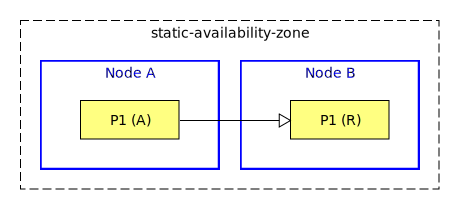
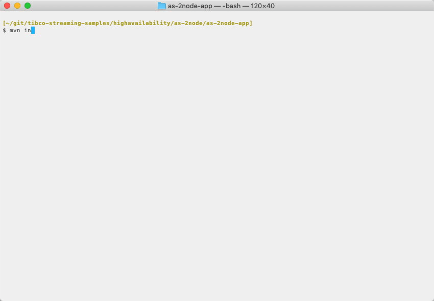

[comment]: # (  Copyright \(C\) 2018-2019, TIBCO Software Inc.                               )

[comment]: # (                                                                               )

[comment]: # (  Redistribution and use in source and binary forms, with or without           )

[comment]: # (  modification, are permitted provided that the following conditions are met:  )

[comment]: # (                                                                               )

[comment]: # (  1. Redistributions of source code must retain the above copyright notice,    )

[comment]: # (     this list of conditions and the following disclaimer.                     )

[comment]: # (                                                                               )

[comment]: # (  2. Redistributions in binary form must reproduce the above copyright notice, )

[comment]: # (     this list of conditions and the following disclaimer in the documentation )

[comment]: # (     and/or other materials provided with the distribution.                    )

[comment]: # (                                                                               )

[comment]: # (  3. Neither the name of the copyright holder nor the names of its contributors)

[comment]: # (     may be used to endorse or promote products derived from this software     )

[comment]: # (     without specific prior written permission.                                )

[comment]: # (                                                                               )

[comment]: # (  THIS SOFTWARE IS PROVIDED BY THE COPYRIGHT HOLDERS AND CONTRIBUTORS "AS IS"  )

[comment]: # (  AND ANY EXPRESS OR IMPLIED WARRANTIES, INCLUDING, BUT NOT LIMITED TO, THE    )

[comment]: # (  IMPLIED WARRANTIES OF MERCHANTABILITY AND FITNESS FOR A PARTICULAR PURPOSE   )

[comment]: # (  ARE DISCLAIMED. IN NO EVENT SHALL THE COPYRIGHT HOLDER OR CONTRIBUTORS BE    )

[comment]: # (  LIABLE FOR ANY DIRECT, INDIRECT, INCIDENTAL, SPECIAL, EXEMPLARY, OR          )

[comment]: # (  CONSEQUENTIAL DAMAGES \(INCLUDING, BUT NOT LIMITED TO, PROCUREMENT OF        )

[comment]: # (  SUBSTITUTE GOODS OR SERVICES; LOSS OF USE, DATA, OR PROFITS; OR BUSINESS     )

[comment]: # (  INTERRUPTION\) HOWEVER CAUSED AND ON ANY THEORY OF LIABILITY, WHETHER IN     )

[comment]: # (  CONTRACT, STRICT LIABILITY, OR TORT \(INCLUDING NEGLIGENCE OR OTHERWISE\)    )

[comment]: # (  ARISING IN ANY WAY OUT OF THE USE OF THIS SOFTWARE, EVEN IF ADVISED OF THE   )

[comment]: # (  POSSIBILITY OF SUCH DAMAGE.                                                  )

# HA : 2-node active standby

This sample describes how to deploy an EventFlow fragment in a 2-node active standby configuration.

* [Machines and nodes](#machines-and-nodes)
* [Data partitioning](#data-partitioning)
* [Define the application definition configuration](#define-the-application-definition-configuration)
* [Define the node deployment configuration](#define-the-node-deployment-configuration)
* [Design notes](#design-notes)
* [Failure scenarios](#failure-scenarios)
* [Building this sample from the command line and running the integration test cases](#building-this-sample-from-the-command-line-and-running-the-integration-test-cases)

<a name="machines-and-nodes"></a>

## Machines and nodes

In this sample we name the initially active machine as **A** which hosts the StreamBase node **A**.  
The standby machine is named **B** which hosts the StreamBase node **B**.


A client that uses the service initially connects to machine **A**.

( service names are omitted in descriptions for clarity )

<a name="data-partitioning"></a>

## Data partitioning

To support an active standby configuration, the query table data must be replicated from the active node to the
standby.  In this sample a static partition **P1** is defined that is initially active on node **A**
with a replica defined on node **B** :



<a name="define-the-application-definition-configuration"></a>

## Define the application definition configuration

An application definition configuration defines the data distribution policy referenced in the EventFlow fragment 
data distribution policy :


```scala
name = "as-2node-app"
version = "1.0.0"
type = "com.tibco.ep.dtm.configuration.application"

configuration = {
    ApplicationDefinition = {
        execution {
            nodeTypes {
                docker {
                    sharedMemory = {
                        memoryType = SYSTEM_V_SHARED_MEMORY
                    }
                }
            }
        }
        dataDistributionPolicies = {
            static-data-distribution-policy = {
                type = STATIC
            }
        }
    }
}
```

<a name="define-the-node-deployment-configuration"></a>

## Define the node deployment configuration

A node deployment configuration defines the availability zone :

```scala
name = "as-2node-app"
version = "1.0.0"
type = "com.tibco.ep.dtm.configuration.node"

configuration = {
    NodeDeploy = {
        nodes = {
            "A.as-2node-app" = {
                engines = {
                    as-2node-ef = {
                        fragmentIdentifier = "com.tibco.ep.samples.highavailability.as-2node-ef"                                                                
                    }                                                    
                }
                availabilityZoneMemberships = {
                    static-availability-zone = {
                        staticPartitionBindings = {
                            P1 = {
                                type = ACTIVE
                            }
                        }
                    }
                }
            }
            "B.as-2node-app" = {
                engines = {
                    as-2node-ef = {
                        fragmentIdentifier = "com.tibco.ep.samples.highavailability.as-2node-ef"                                                                
                    }                                                    
                }
                availabilityZoneMemberships = {
                    static-availability-zone = {
                        staticPartitionBindings = {
                            P1 = {
                                type = REPLICA
                            }
                        }
                    }
                }
            }
        }
        availabilityZones = {
            static-availability-zone = {
                dataDistributionPolicy = static-data-distribution-policy
                staticPartitionPolicy = {
                    staticPartitions = {
                        P1 = {
                        }
                    }
                }
            }
        }
    }
}
```

<a name="design-notes"></a>

## Design notes

* A static data distribution policy is chosen ( over the default dynamic data distribution policy ) to specifically set the partition as initially active on A
* Most of the data distribution policy and the availability zone configuration values are not set since defaults work well

<a name="failure-scenarios"></a>

## Failure scenarios

The main failure cases for this deployment are outlined below :

Failure case   | Behavior on failure | Steps to resolve | Notes
--- | --- | --- | ---
Machine A fails | 1 Client is disconnected<br/>2 Partition becomes active on B<br/>3 Client may connect to B and continue  | 1 Fix machine A<br/>2 Use **epadmin install node** and **epadmin start node** | 1 No data loss<br/>2 No service loss
Machine B fails | 1 Data replica is lost<br/>2 Client may continue work on A | 1 Fix machine B<br/>2 Use **epadmin install node** and **epadmin start node** | 1 No data loss<br/>2 No service loss
Network fails  | 1 Partition becomes active on both A and B<br/>**multi-master** scenario | 1 Fix network<br/>2 Use **epadmin restore availabilityzone** | 1 **Possible data loss**<br/>2 No service loss

With a 2 node configuration node quorums don't apply hence a multi-master scenario is possible on network failure.  
To avoid the risk of data loss when restoring the availability zone, multiple network paths ( such as network bonding )
is recommended.

<a name="building-this-sample-from-the-command-line-and-running-the-integration-test-cases"></a>

## Building this sample from the command line and running the integration test cases

In this sample, some HA integration test cases are defined in the pom.xml that :

* start nodes A & B
* use **epadmin start playback** to inject tuples to node A
* use **epadmin read querytable** on node A to verify query table contents
* stop node A
* use **epadmin read querytable** on node B to verify no data loss
* stop node B

:warning: This does not constitute an exhaustive non-functional test plan

Use the [maven](https://maven.apache.org) as **mvn install** to build from the command line or Continuous Integration system :


