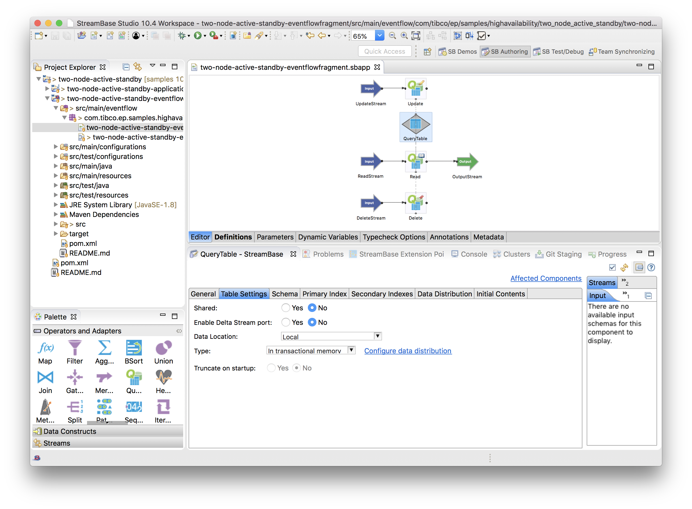
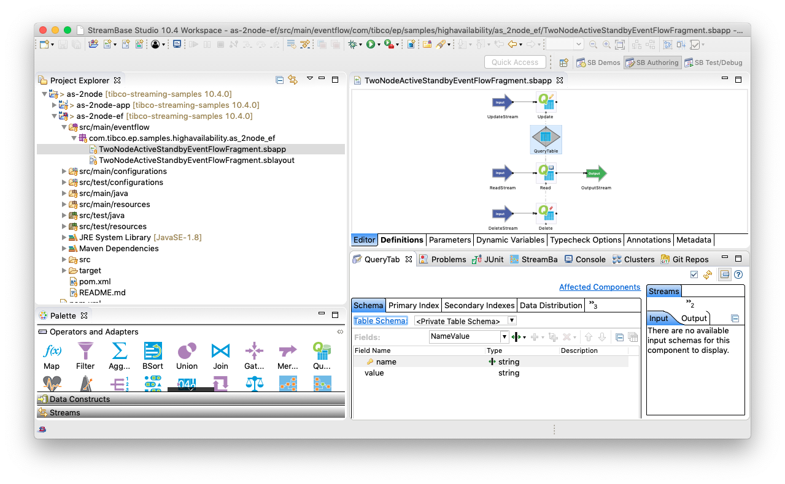
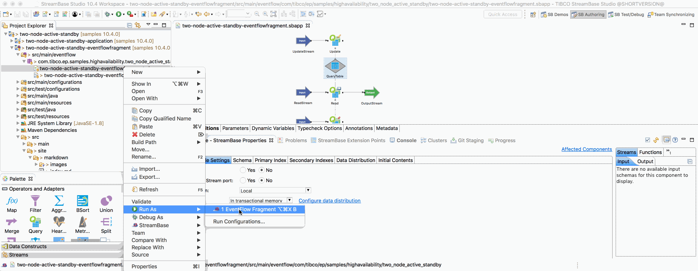
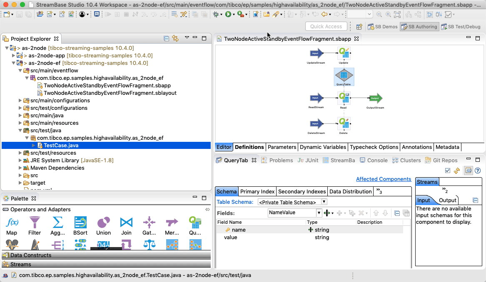
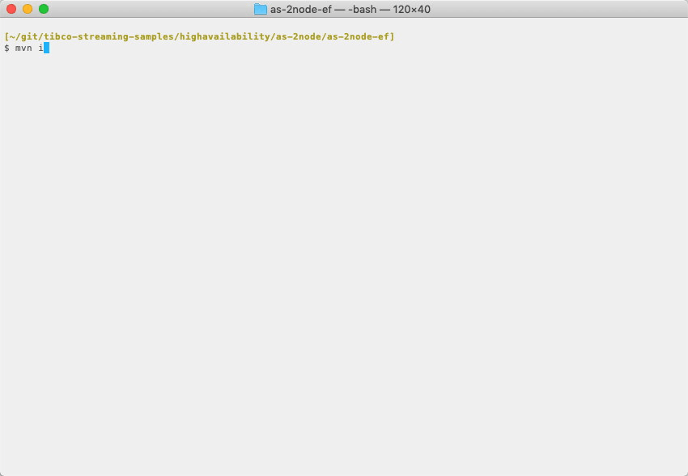

[comment]: # (  Copyright \(C\) 2018-2019, TIBCO Software Inc.                               )

[comment]: # (                                                                               )

[comment]: # (  Redistribution and use in source and binary forms, with or without           )

[comment]: # (  modification, are permitted provided that the following conditions are met:  )

[comment]: # (                                                                               )

[comment]: # (  1. Redistributions of source code must retain the above copyright notice,    )

[comment]: # (     this list of conditions and the following disclaimer.                     )

[comment]: # (                                                                               )

[comment]: # (  2. Redistributions in binary form must reproduce the above copyright notice, )

[comment]: # (     this list of conditions and the following disclaimer in the documentation )

[comment]: # (     and/or other materials provided with the distribution.                    )

[comment]: # (                                                                               )

[comment]: # (  3. Neither the name of the copyright holder nor the names of its contributors)

[comment]: # (     may be used to endorse or promote products derived from this software     )

[comment]: # (     without specific prior written permission.                                )

[comment]: # (                                                                               )

[comment]: # (  THIS SOFTWARE IS PROVIDED BY THE COPYRIGHT HOLDERS AND CONTRIBUTORS "AS IS"  )

[comment]: # (  AND ANY EXPRESS OR IMPLIED WARRANTIES, INCLUDING, BUT NOT LIMITED TO, THE    )

[comment]: # (  IMPLIED WARRANTIES OF MERCHANTABILITY AND FITNESS FOR A PARTICULAR PURPOSE   )

[comment]: # (  ARE DISCLAIMED. IN NO EVENT SHALL THE COPYRIGHT HOLDER OR CONTRIBUTORS BE    )

[comment]: # (  LIABLE FOR ANY DIRECT, INDIRECT, INCIDENTAL, SPECIAL, EXEMPLARY, OR          )

[comment]: # (  CONSEQUENTIAL DAMAGES \(INCLUDING, BUT NOT LIMITED TO, PROCUREMENT OF        )

[comment]: # (  SUBSTITUTE GOODS OR SERVICES; LOSS OF USE, DATA, OR PROFITS; OR BUSINESS     )

[comment]: # (  INTERRUPTION\) HOWEVER CAUSED AND ON ANY THEORY OF LIABILITY, WHETHER IN     )

[comment]: # (  CONTRACT, STRICT LIABILITY, OR TORT \(INCLUDING NEGLIGENCE OR OTHERWISE\)    )

[comment]: # (  ARISING IN ANY WAY OUT OF THE USE OF THIS SOFTWARE, EVEN IF ADVISED OF THE   )

[comment]: # (  POSSIBILITY OF SUCH DAMAGE.                                                  )

# HA : 2-node active standby

This sample describes how to build an EventFlow fragment suitable for 2-node active standby deployment.

* [Store tuples in a query table backed by transactional memory](#store-tuples-in-a-query-table-backed-by-transactional-memory)
* [Design notes](#design-notes)
* [Running this sample from TIBCO StreamBase Studio&trade;](#running-this-sample-from-tibco-streambase-studio-trade)
* [Building this sample from TIBCO StreamBase Studio&trade; and running the unit test cases](#building-this-sample-from-tibco-streambase-studio-trade-and-running-the-unit-test-cases)
* [Building this sample from the command line and running the unit test cases](#building-this-sample-from-the-command-line-and-running-the-unit-test-cases)

## Store tuples in a query table backed by transactional memory

In this sample, a query table is used to update, read and delete tuples, so :

* Query table is key'ed by **name** field
* A tuple injected on the **UpdateStream** stream containing **name** & **value** will insert or update the **name** entry in the table with the new **value**
* A tuple injected on the **ReadStream** stream containing **name** will read the current value from the table
* A tuple injected on the **DeleteStream** stream containing **name** will delete the name from the table

The query table is configured with transactional memory :

A data distribution policy **static-data-distribution-policy** is set ( to be later defined in the application definition configuration file ) :

Finally, the tuples stored in the query table are partitioned by the **name** field :

## Design notes

Processing is always on the local node, hence :

* Routing to a remote node is not required
* Query scope is local ( ie not cluster wide )

## Running this sample from TIBCO StreamBase Studio&trade;

Use the **Run As -> EventFlow Fragment** menu option to run in TIBCO StreamBase Studio&trade;, and then enqueue tuples :

Note that here we are unit testing the business logic rather than high availability - in this sample we test high availability in
the application archive integration test cases.  The unit test cases can test high availability by loading an activating test versions 
of the application definition and node deployment configuration files.

## Building this sample from TIBCO StreamBase Studio&trade; and running the unit test cases

Use the **Run As -> EventFlow Fragment Unit Test** menu option to build from TIBCO StreamBase Studio&trade; :

## Building this sample from the command line and running the unit test cases

Use the [maven](https://maven.apache.org) as **mvn install** to build from the command line or Continuous Integration system :

