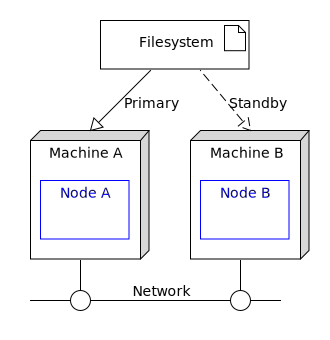

[comment]: # (  Copyright \(C\) 2018-2019, TIBCO Software Inc.                               )

[comment]: # (                                                                               )

[comment]: # (  Redistribution and use in source and binary forms, with or without           )

[comment]: # (  modification, are permitted provided that the following conditions are met:  )

[comment]: # (                                                                               )

[comment]: # (  1. Redistributions of source code must retain the above copyright notice,    )

[comment]: # (     this list of conditions and the following disclaimer.                     )

[comment]: # (                                                                               )

[comment]: # (  2. Redistributions in binary form must reproduce the above copyright notice, )

[comment]: # (     this list of conditions and the following disclaimer in the documentation )

[comment]: # (     and/or other materials provided with the distribution.                    )

[comment]: # (                                                                               )

[comment]: # (  3. Neither the name of the copyright holder nor the names of its contributors)

[comment]: # (     may be used to endorse or promote products derived from this software     )

[comment]: # (     without specific prior written permission.                                )

[comment]: # (                                                                               )

[comment]: # (  THIS SOFTWARE IS PROVIDED BY THE COPYRIGHT HOLDERS AND CONTRIBUTORS "AS IS"  )

[comment]: # (  AND ANY EXPRESS OR IMPLIED WARRANTIES, INCLUDING, BUT NOT LIMITED TO, THE    )

[comment]: # (  IMPLIED WARRANTIES OF MERCHANTABILITY AND FITNESS FOR A PARTICULAR PURPOSE   )

[comment]: # (  ARE DISCLAIMED. IN NO EVENT SHALL THE COPYRIGHT HOLDER OR CONTRIBUTORS BE    )

[comment]: # (  LIABLE FOR ANY DIRECT, INDIRECT, INCIDENTAL, SPECIAL, EXEMPLARY, OR          )

[comment]: # (  CONSEQUENTIAL DAMAGES \(INCLUDING, BUT NOT LIMITED TO, PROCUREMENT OF        )

[comment]: # (  SUBSTITUTE GOODS OR SERVICES; LOSS OF USE, DATA, OR PROFITS; OR BUSINESS     )

[comment]: # (  INTERRUPTION\) HOWEVER CAUSED AND ON ANY THEORY OF LIABILITY, WHETHER IN     )

[comment]: # (  CONTRACT, STRICT LIABILITY, OR TORT \(INCLUDING NEGLIGENCE OR OTHERWISE\)    )

[comment]: # (  ARISING IN ANY WAY OUT OF THE USE OF THIS SOFTWARE, EVEN IF ADVISED OF THE   )

[comment]: # (  POSSIBILITY OF SUCH DAMAGE.                                                  )
 
# HA : Cluster aware polling

This sample describes how to deploy an EventFlow fragment in a 2-node cluster aware configuration.

* [Machines and nodes](#machines-and-nodes)
* [Define the node deployment configuration](#define-the-node-deployment-configuration)
* [Design notes](#design-notes)
* [Failure scenarios](#failure-scenarios)
* [Building this sample from the command line and running the integration test cases](#building-this-sample-from-the-command-line-and-running-the-integration-test-cases)

<a name="machines-and-nodes"></a>

## Machines and nodes

In this sample we name the machines as **A**,  which hosts the StreamBase node **A**, 
and **B**, which hosts the StreamBase node **B**.



Both nodes access the common filesystem.

<a name="define-the-node-deployment-configuration"></a>

## Define the node deployment configuration

This sample uses no special node deployment configuration, so we have : :

```scala
name = "ca-polling-node"
version = "1.0.0"
type = "com.tibco.ep.dtm.configuration.node"

configuration = {
    NodeDeploy = {
        nodes = {
            "${EP_NODE_NAME}" = {
                engines = {
                    ca-polling-app = {
                        fragmentIdentifier = "com.tibco.ep.samples.highavailability.ca-polling-ef"
                    }
                }
            }
        }
    }
}
```

<a name="design-notes"></a>

## Design notes

* The event flow fragment defines that only one file monitor adapter is running in the cluster

<a name="failure-scenarios"></a>

## Failure scenarios

The main failure cases for this deployment are outlined below :

Failure case   | Behavior on failure | Steps to resolve | Notes
--- | --- | --- | ---
Machine A fails | File monitor adapter on node B is automatically started  | 1 Fix machine A<br/>2 Use **epadmin install node** and **epadmin start node**<br/>3 Note that adapter remains running on node B | 1 No data loss<br/>2 No service loss
Machine B fails | No impact to reading filesystem | 1 Fix machine B<br/>2 Use **epadmin install node** and **epadmin start node** | 1 No data loss<br/>2 No service loss

With a 2 node configuration node quorums don't apply hence a multi-master scenario is possible on network failure.
Multiple network paths ( such as network bonding ) is recommended.

<a name="building-this-sample-from-the-command-line-and-running-the-integration-test-cases"></a>

## Building this sample from the command line and running the integration test cases

In this sample, some HA integration test cases are defined in the pom.xml that :

* start nodes A & B
* use **epadmin display adapter** to check the adapter status on both nodes ( file monitor adapter is started on node A only )
* stop node A
* use **epadmin display adapter** to check the adapter status on both nodes ( file monitor adapter is now started on node B )
* stop node B

:warning: This does not constitute an exhaustive non-functional test plan

Use [maven](https://maven.apache.org) as **mvn install** to build from the command line or Continuous Integration system :


