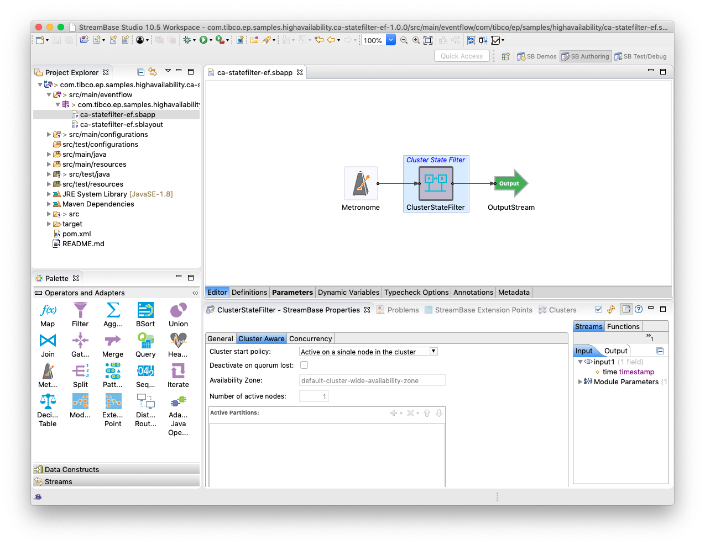
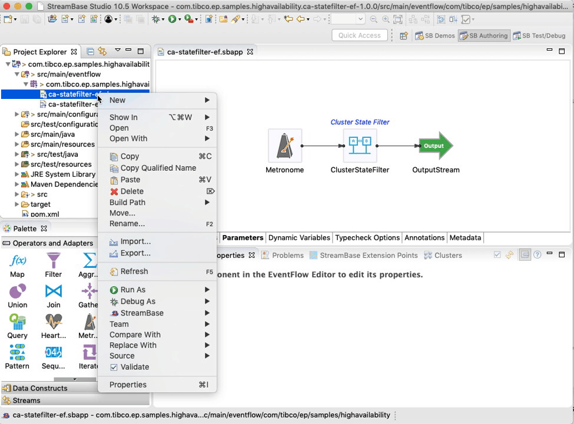
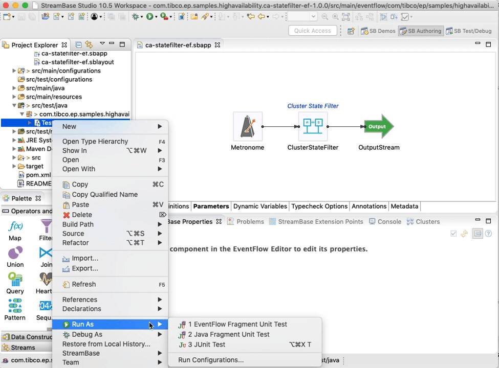
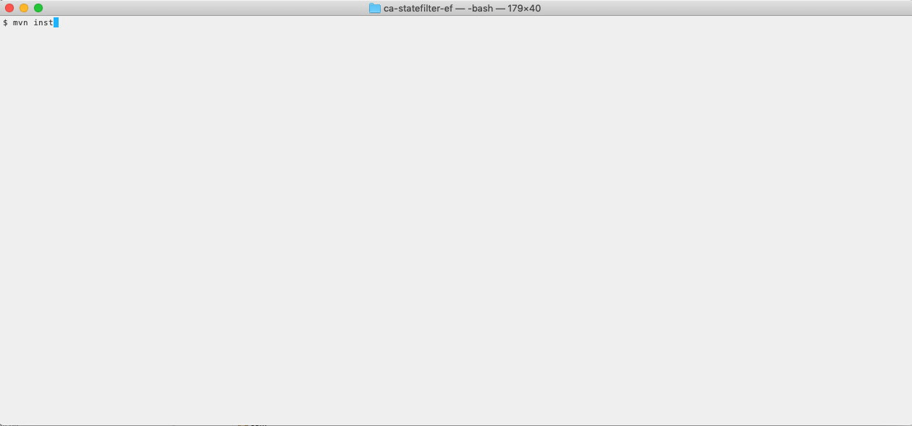

# HA : Cluster aware state filter

This sample describes how to build an EventFlow fragment with a cluster-aware state filter.

* [Enable cluster aware settings in operator](#enable-cluster-aware-settings-in-operator)
* [Design notes](#design-notes)
* [Running this sample from TIBCO StreamBase&reg; Studio](#running-this-sample-from-tibco-streambase-studio-trade)
* [Building this sample from TIBCO StreamBase&reg; Studio and running the unit test cases](#building-this-sample-from-tibco-streambase-studio-trade-and-running-the-unit-test-cases)
* [Building this sample from the command line and running the unit test cases](#building-this-sample-from-the-command-line-and-running-the-unit-test-cases)

## Enable cluster aware settings in operator

A metronome adapter is used to emit tuples with a state filter.  The state filter is configured
to be **cluster aware** - that is, the operator is started and stopped depending on the state of the cluster.

## Design notes

The cluster aware option **Active on a single node in the cluster** was selected, hence :

* Only one node in the cluster will process the metronome tuples regardless of the number of nodes
* Should the node processing the metronome tuples fail, another node in the cluster will start processing the tuples

## Running this sample from TIBCO StreamBase&reg; Studio

Use the **Run As -> EventFlow Fragment** menu option to run in TIBCO StreamBase&reg; Studio.

Note that here we are unit testing the business logic rather than cluster aware - in this sample we test cluster aware in
the application archive integration test cases.

## Building this sample from TIBCO StreamBase&reg; Studio and running the unit test cases

Use the **Run As -> EventFlow Fragment Unit Test** menu option to build from TIBCO StreamBase&reg; Studio :

## Building this sample from the command line and running the unit test cases

Use the [maven](https://maven.apache.org) as **mvn install** to build from the command line or Continuous Integration system :

---
Copyright (c) 2018-2023 Cloud Software Group, Inc.

Redistribution and use in source and binary forms, with or without
modification, are permitted provided that the following conditions are met:

* Redistributions of source code must retain the above copyright notice, this
  list of conditions and the following disclaimer.

* Redistributions in binary form must reproduce the above copyright notice,
  this list of conditions and the following disclaimer in the documentation
  and/or other materials provided with the distribution.

* Neither the name of the copyright holder nor the names of its
  contributors may be used to endorse or promote products derived from
  this software without specific prior written permission.

THIS SOFTWARE IS PROVIDED BY THE COPYRIGHT HOLDERS AND CONTRIBUTORS "AS IS"
AND ANY EXPRESS OR IMPLIED WARRANTIES, INCLUDING, BUT NOT LIMITED TO, THE
IMPLIED WARRANTIES OF MERCHANTABILITY AND FITNESS FOR A PARTICULAR PURPOSE ARE
DISCLAIMED. IN NO EVENT SHALL THE COPYRIGHT HOLDER OR CONTRIBUTORS BE LIABLE
FOR ANY DIRECT, INDIRECT, INCIDENTAL, SPECIAL, EXEMPLARY, OR CONSEQUENTIAL
DAMAGES (INCLUDING, BUT NOT LIMITED TO, PROCUREMENT OF SUBSTITUTE GOODS OR
SERVICES; LOSS OF USE, DATA, OR PROFITS; OR BUSINESS INTERRUPTION) HOWEVER
CAUSED AND ON ANY THEORY OF LIABILITY, WHETHER IN CONTRACT, STRICT LIABILITY,
OR TORT (INCLUDING NEGLIGENCE OR OTHERWISE) ARISING IN ANY WAY OUT OF THE USE
OF THIS SOFTWARE, EVEN IF ADVISED OF THE POSSIBILITY OF SUCH DAMAGE.
