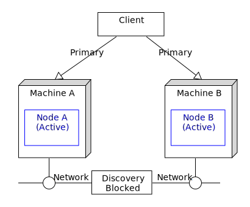
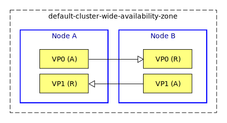

# HA : 2-node active active with proxy discovery

This sample describes how to deploy an EventFlow fragment in a 2-node active active configuration with proxy discovery.

* [Machines and nodes](#machines-and-nodes)
* [Data partitioning](#data-partitioning)
* [Define the node deployment configuration](#define-the-node-deployment-configuration)
* [Design notes](#design-notes)
* [Failure scenarios](#failure-scenarios)
* [Building this sample from the command line and running the integration test cases](#building-this-sample-from-the-command-line-and-running-the-integration-test-cases)

## Machines and nodes

In this sample we name the machines as **A**,  which hosts the StreamBase node **A**, 
and **B**, which hosts the StreamBase node **B**.



A client that uses the service can connect to either machine **A** or **B**.

Note that UDP discovery is blocked between the machines, this might be due to :

* Running the machines on different subnets - for example different data centres
* Firewall between the machines
* UDP not supported by the network - for example cloud virtual networks


( service names are omitted in descriptions for clarity )

## Data partitioning

To support an active active configuration, the query table data must be replicated between the nodes.  
In this sample the default **default-cluster-wide-availability-zone** is used - a number of virtual
partitions are created to evenly balance and replicate data around the cluster :



( only 2 virtual partitions are shown - the default is 64 )


## Define the node deployment configuration

In this sample we include the proxyDiscovery setting and specify hostnames and ports so that the nodes can be made 
aware of each other.

```scala
name = "aa-2node-app"
version = "1.0.0"
type = "com.tibco.ep.dtm.configuration.node"

configuration = {
    NodeDeploy = {
        nodes = {
            "A.pd-2node-app" = { 
                engines = {
                    pd-2node-ef = {
                        fragmentIdentifier = "com.tibco.ep.samples.highavailability.pd-2node-ef"                                                                
                    }                                                    
                }
                communication = {
                    numberSearchPorts = 5
                    administration = {
                        address = ${A_HOSTNAME:-localhost}
                        transportPort = ${A_ADMINPORT:-2000}
                    }
                    distributionListenerInterfaces = [ {
                        address = ${A_HOSTNAME:-localhost}
                        dataTransportPort = ${A_DATATRANSPORTPORT:-2001}
                        secure = false
                    } ]
                    proxyDiscovery = {
                        remoteNodes = [ ".*" ]
                    }
                }
            }
            "B.pd-2node-app" = { 
                engines = {
                    pd-2node-ef = {
                        fragmentIdentifier = "com.tibco.ep.samples.highavailability.pd-2node-ef"                                                                
                    }                                                    
                }
                communication = {
                    numberSearchPorts = 5
                    administration = {
                        address = ${B_HOSTNAME:-localhost}
                        transportPort = ${B_ADMINPORT:-3000}
                    }
                    distributionListenerInterfaces = [ {
                        address = ${B_HOSTNAME:-localhost}
                        dataTransportPort = ${B_DATATRANSPORTPORT:-3001}
                        secure = false
                    } ]
                    proxyDiscovery = {
                        remoteNodes = [ ".*" ]
                    }
                }
            }
        }
    }
}
```

## Design notes

* The default dynamic data distribution policy is chosen to distribute the data across the cluster
* Most of the data distribution policy and the availability zone configuration values are not set since defaults work well
* Proxy discovery is used

## Failure scenarios

The main failure cases for this deployment are outlined below :

Failure case   | Behaviour on failure | Steps to resolve | Notes
--- | --- | --- | ---
Machine A fails | 1 Client is disconnected<br/>2 Virtual partitions become active on B<br/>3 Client may connect to B and continue  | 1 Fix machine A<br/>2 Use **epadmin install node** and **epadmin start node** | 1 No data loss<br/>2 No service loss
Machine B fails | 1 Client is disconnected<br/>2 Virtual partitions become active on A<br/>3 Client may connect to A and continue  | 1 Fix machine B<br/>2 Use **epadmin install node** and **epadmin start node** | 1 No data loss<br/>2 No service loss
Network fails  | 1 irtual partitions become active on both A and B<br/>**multi-master** scenario | 1 Fix network<br/>2 Use **epadmin restore availabilityzone** | 1 **Possible data loss**<br/>2 No service loss

With a 2 node configuration node quorums don't apply hence a multi-master scenario is possible on network failure.  
To avoid the risk of data loss when restoring the availability zone, multiple network paths ( such as network bonding )
is recommended.

## Building this sample from the command line and running the integration test cases

In this sample, some HA integration test cases are defined in the pom.xml that :

* start nodes A & B
* use **epadmin start playback** to inject tuples to node A
* use **epadmin read querytable** on node A to verify query table contents
* stop node A
* use **epadmin read querytable** on node B to verify no data loss
* stop node B

:warning: This does not constitute an exhaustive non-functional test plan

Use the [maven](https://maven.apache.org) as **mvn install** to build from the command line or Continuous Integration system :


