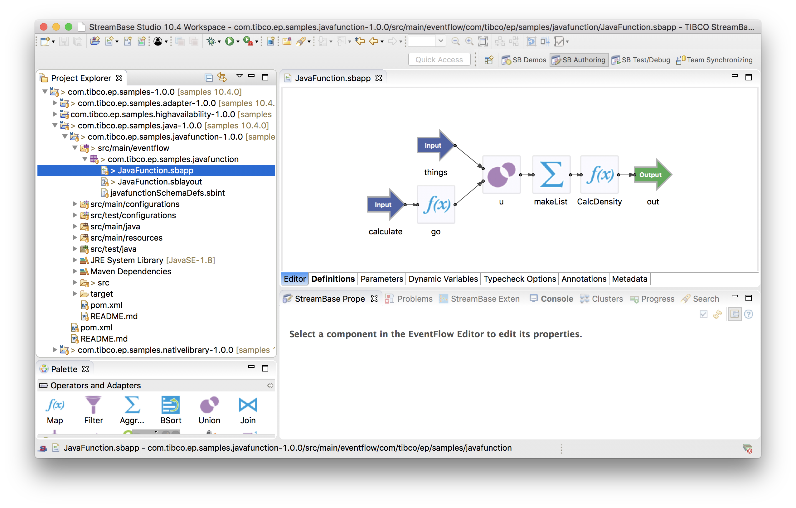
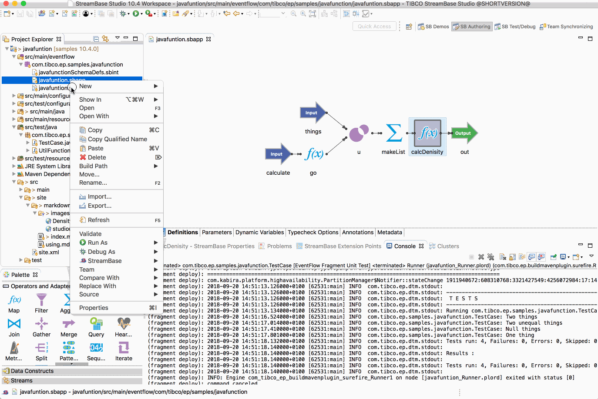
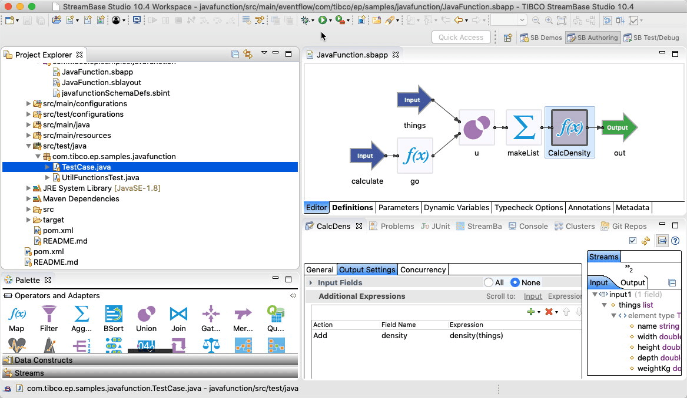
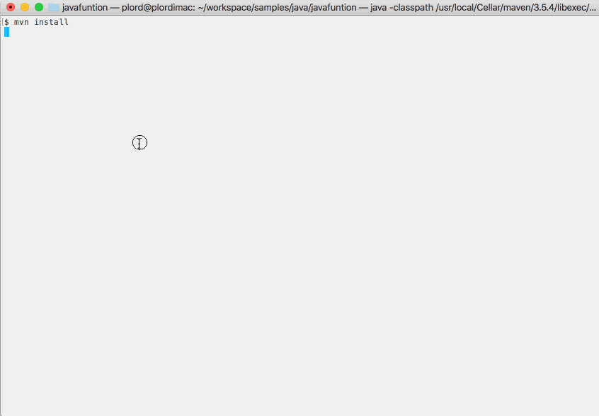

# Java : Java Function

This sample describes how to use java functions in EventFlow.

## EventFlow under test

In this sample the following simple EventFlow fragment is used :



## Declare the java function

See [UtilFunctions.java](../../main/java/com/tibco/ep/samples/javafunction/UtilFunctions.java).


## Provide a engine configuration for EventFlow use

A engine configuration is required to declare the functions available :

```scala
name = "javafunction-engine"
version = "1.0.0"
type = "com.tibco.ep.streambase.configuration.sbengine"

configuration = {
    StreamBaseEngine = {
        streamBase = {
            pluginFunctions = {
                java = {
                    Density = {
                        type = "simple"
                        alias = "density"
                        className = "com.tibco.ep.samples.javafunction.UtilFunctions"
                        autoArguments = true
                    }
                }
            }
        }
    }
}

```

## Running this sample from TIBCO StreamBase Studio&trade;

Use the **Run As -> EventFlow Fragment** menu option to run in TIBCO StreamBase Studio&trade;, and then enqueue tuples :



## Building this sample from TIBCO StreamBase Studio&trade; and running the unit test cases

Use the **Run As -> EventFlow Fragment Unit Test** menu option to build from TIBCO StreamBase Studio&trade; :



## Building this sample from the command line and running the unit test cases

Use the [maven](https://maven.apache.org) as **mvn install** to build from the command line or Continuous Integration system :


