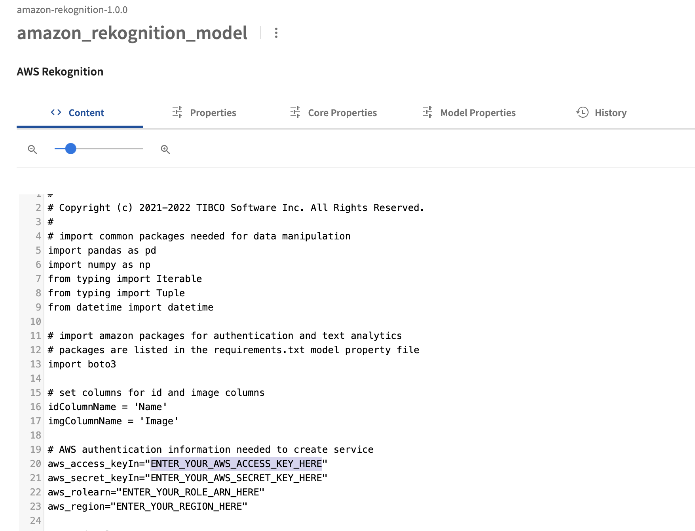
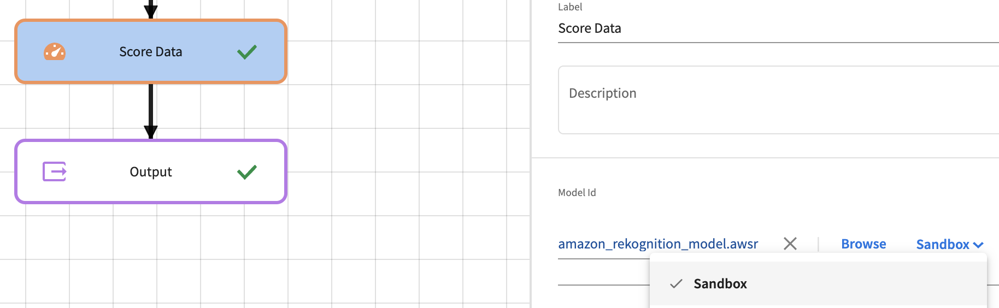
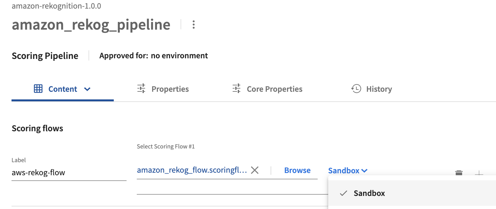

# MLaaS - Amazon Rekognition Image Analysis

## Introduction

This sample project demonstrates calling [Amazon Rekognition for image analysis](https://docs.aws.amazon.com/rekognition/latest/dg/what-is.html) from TIBCO ModelOps.  This GitHub repository contains the artifacts of a TIBCO ModelOps Project that can be imported into TIBCO ModelOps to allow you to analyze image data.  The input takes a name and an image file name for image labeling analysis. 

NOTE: Use of Amazon Comprehend may incur costs in your Amazon account.

The basic steps for using this sample are:

1. Clone this GitHub repository locally and Import the project into TIBCO ModelOps.
1. Obtain the needed authentication keys from Amazon.
1. Modify the amazon_rekognition_model with the authentication keys.
1. Update the scoring flow and pipeline to use the modified script.
1. Approve and deploy the amazon_rekog_pipeline in your ModelOps environment to deploy a REST service.
1. Run the example Python script on your machine to test the deployed REST pipeline.

## Clone this Project and Import into TIBCO ModelOps

You will want to clone this GitHub project locally.  Once you have the files locally, you can either:
* Build a project zip file using maven with the pom.xml and amazon-rekognition.xml files provided.

OR
* Create a project in ModelOps and upload the artifacts from the amazon-rekognition directory.

### Creating zip file

The zip file can be built by running maven in the repository directory:
```
mvn install
```
This will create a zip file in the ```target``` folder called amazon-rekognition-1.0.0.zip.  This zip file can be imported into TIBCO ModelOps using the **Import a Project** option on the Projects menu.  See [Managing Projects and Artifacts](https://docs.tibco.com/emp/modelops/1.2.0/doc/html/user/managing-projects-and-artificats.html).

Once you have selected the archive and created the project, you should see the project view with the listed project artifacts in TIBCO ModelOps.

### Upload project artifacts

You can create a project in TIBCO ModelOps and upload all the artifacts from the local amazon-rekognition directory into that created project.  In TIBCO ModelOps, **Create a new project** and then add the artifacts to the newly created project.

You will next need to select the amazon_rekognition_model and set the **Model Properties**:
1. Set the Input Schema to the input_image.avsc file.
1. Set the Output Schema to the output_amazon_rekog.avsc file.
1. Set the Model Dependency to requirements.txt.
1. Save the model.

## Obtain Authentication Information from Amazon

After getting the project created in TIBCO ModelOps, now you need to get the authentication information from Amazon to call the Comprehend service.  The sample uses federated user access in which a user access and secret key are provided in addition to the role ARN to assume in order to access the Amazon Comprehend service. The [Authentication and access control for Amazon Comprehend](https://docs.aws.amazon.com/comprehend/latest/dg/auth-and-access-control.html) article can help you find the authentication method that will work for your environment.  The exact steps for you may vary based on what privileges you have in Amazon and how your account is configured.  

These instructions do not provide information for all Amazon authentication scenarios.  The important piece is to get a session from Amazon using the boto3 python library.  Some useful links from the Amazon Boto3 documentation are [Boto3 Credentials](https://boto3.amazonaws.com/v1/documentation/api/latest/guide/credentials.html) and [Boto3 Session reference](https://boto3.amazonaws.com/v1/documentation/api/latest/reference/core/session.html).  

## Modify the Python script with authentication keys

Back in TIBCO ModelOps, select the amazon_rekognition_model for editing (click or select it).  Modify the aws_access_keyIn, aws_secret_keyIn, aws_rolearn (role to assume) and aws_region variables with the values obtained in the step above:

```python
aws_access_keyIn="ENTER_YOUR_AWS_ACCESS_KEY_HERE"  
aws_secret_keyIn="ENTER_YOUR_AWS_SECRET_KEY_HERE"
aws_rolearn="ENTER_YOUR_ROLE_ARN_HERE"
aws_region="ENTER_YOUR_REGION_HERE"
```

Scroll down to the lines in the python model for these variables to edit them as seen in this screen shot:



After entering your key and endpoint, click the **Save** button to save the model.  The amazon_rekognition_model script may need additional modifications depending on your method of authenticating to AWS.  

## Update Scoring Flow and Pipeline

Before deploying the pipeline, you need to modify the scoring flow to use the latest revised script from the Sandbox environment which is where the modified script exists.  After that, you will then modify the pipeline to use the updated flow.  Return to the project view and select the amazon_rekog_flow object.  In the flow editor, select the **Score Data** step and select the **Sandbox** revision in the revision selector next to the model selection:



Click **Save** to save the updated amazon_rekog_flow.  Back in the project view, select amazon_rekog_pipeline.  In the revision dropdown for the scoring flow, select **Sandbox** revision:



Click **Save** to save the updated amazon_rekog_pipeline.  Now you are ready to deploy the pipeline and test.

## Approve and Deploy the Amazon Image Analysis Pipeline

After making the modifications in the last step, the next step is to **Approve** and **Deploy** the updated pipeline.  If you are still in the edit view of the amazon_rekog_pipeline, you can select **Approve** and then **Deploy**.  You can also select **Scoring Pipelines** in the Navigation Bar.  

1. Find the amazon_rekog_pipeline and **Approve** it using the pipeline menu. See [Promoting a Scoring Pipeline](https://docs.tibco.com/emp/modelops/1.2.0/doc/html/user/working-with-scoring-flows-and-pipelines.html#promoting-pipeline)
1. After selecting **Approve**, the pop-up for approving the pipeline for an environment appears.  
1. Select the **Development** environment or another appropriate environment.  
1. Close the approval pop-up dialog.
1. Select **Deploy** and the deployment dialog appears.  See [Pipeline Deployment](https://docs.tibco.com/emp/modelops/1.2.0/doc/html/user/working-with-scoring-flows-and-pipelines.html#pipeline-deployment)
1. In the Deploy dialog, click **Deploy** and the pipeline will be deployed to the environment selected in the approval process.  

After a few seconds, the user interface will switch to the Deployments view where you can see the pipeline is just deployed and starting up. 

## Test the deployed pipeline

An example Python script, tmo_rest_imagelabel.py, is included in this repository and can be used to test out the image analysis by connecting to the REST Request Response pipeline that is deployed.  The script takes parameters which you can see by running the script with the "-h" parameter.
```
python tmo_rest_imagelabel.py -h

usage: tmo_rest_imagelabel.py [-h] [--url URL] [--imagefile IMAGEFILE] [--username [USERNAME]] [--password [PASSWORD]]

This script will authenticate and send JSON input to the given URL for a TIBCO ModelOps REST Pipeline endpoint.

optional arguments:
  -h, --help            show this help message and exit
  --url URL             (required) Complete URL to REST pipeline. Example: https://amazonrekogflow.modelops_domain/amazonrekogflow
  --imagefile IMAGEFILE
                        Image file to send to image analysis.
  --username [USERNAME]
                        Username if needed.
  --password [PASSWORD]
                        Password if needed.
```

The URL for the REST Request-Response endpoint will be https://\<subdomains\>.\<modelops-kubernetes-hostname\>/\<endpoint-path-prefix\>.  See [Data Channels-Public Addresses](https://docs.tibco.com/emp/modelops/1.2.0/doc/html/user/data-channels.html#rest-addresses).  If nothing is changed in the pipeline, then the domain_prefix and path_prefix are "amazonrekogflow," such that the URL becomes:
```
https://amazonrekogflow.modelops_hostname/amazonrekogflow
 ```


The following shows an example of using the python script with example parameters.  You may need to include a username and password for your TIBCO ModelOps environment.

```
python tmo_rest_imagelabel.py --url https://amazonrekogflow.modelops.domain/amazonrekogflow --imagefile 'mountainpic.jpg'

Login URL: https://amazonrekogflow.modelops.domain/amazonrekogflow/login
Successfully received API Token
{ "comments": "This was a lovely little place walking distance from downtown. Lisa was very responsive. My best Airbnb experience yet!", "id": "683278" }
<Response [200]>
('[{"LabelScores":[{"Confidence":99.90057373046875,"Label":"Person"},{"Confidence":99.90057373046875,"Label":"Human"},{"Confidence":99.14952850341797,"Label":"Nature"},{"Confidence":99.10362243652344,"Label":"Outdoors"},{"Confidence":97.82372283935547,"Label":"Cliff"},{"Confidence":94.8874740600586,"Label":"Adventure"},{"Confidence":94.8874740600586,"Label":"Leisure '
 'Activities"},{"Confidence":74.14285278320312,"Label":"Mountain"},{"Confidence":72.57720947265625,"Label":"Water"},{"Confidence":71.74688720703125,"Label":"River"},{"Confidence":69.25418853759766,"Label":"Rock"},{"Confidence":66.43350219726562,"Label":"Clothing"},{"Confidence":66.43350219726562,"Label":"Apparel"},{"Confidence":62.991031646728516,"Label":"Road"},{"Confidence":61.541500091552734,"Label":"Promontory"},{"Confidence":60.42869186401367,"Label":"Slate"},{"Confidence":56.03702926635742,"Label":"Piste"},{"Confidence":56.03702926635742,"Label":"Snow"},{"Confidence":56.03702926635742,"Label":"Sport"},{"Confidence":56.03702926635742,"Label":"Sports"},{"Confidence":55.77503967285156,"Label":"Hiking"},{"Confidence":55.48444366455078,"Label":"Painting"},{"Confidence":55.48444366455078,"Label":"Art"},{"Confidence":55.00431442260742,"Label":"Archaeology"}],"Name":"mountainpic.jpg"}]')
```

You have successfully deployed the Amazon Rekognition example to TIBCO ModelOps.  You can include it in other more complex scoring flows.

---
Copyright (c) 2022-2023 Cloud Software Group, Inc.

Redistribution and use in source and binary forms, with or without
modification, are permitted provided that the following conditions are met:

* Redistributions of source code must retain the above copyright notice, this
  list of conditions and the following disclaimer.

* Redistributions in binary form must reproduce the above copyright notice,
  this list of conditions and the following disclaimer in the documentation
  and/or other materials provided with the distribution.

* Neither the name of the copyright holder nor the names of its
  contributors may be used to endorse or promote products derived from
  this software without specific prior written permission.

THIS SOFTWARE IS PROVIDED BY THE COPYRIGHT HOLDERS AND CONTRIBUTORS "AS IS"
AND ANY EXPRESS OR IMPLIED WARRANTIES, INCLUDING, BUT NOT LIMITED TO, THE
IMPLIED WARRANTIES OF MERCHANTABILITY AND FITNESS FOR A PARTICULAR PURPOSE ARE
DISCLAIMED. IN NO EVENT SHALL THE COPYRIGHT HOLDER OR CONTRIBUTORS BE LIABLE
FOR ANY DIRECT, INDIRECT, INCIDENTAL, SPECIAL, EXEMPLARY, OR CONSEQUENTIAL
DAMAGES (INCLUDING, BUT NOT LIMITED TO, PROCUREMENT OF SUBSTITUTE GOODS OR
SERVICES; LOSS OF USE, DATA, OR PROFITS; OR BUSINESS INTERRUPTION) HOWEVER
CAUSED AND ON ANY THEORY OF LIABILITY, WHETHER IN CONTRACT, STRICT LIABILITY,
OR TORT (INCLUDING NEGLIGENCE OR OTHERWISE) ARISING IN ANY WAY OUT OF THE USE
OF THIS SOFTWARE, EVEN IF ADVISED OF THE POSSIBILITY OF SUCH DAMAGE.
