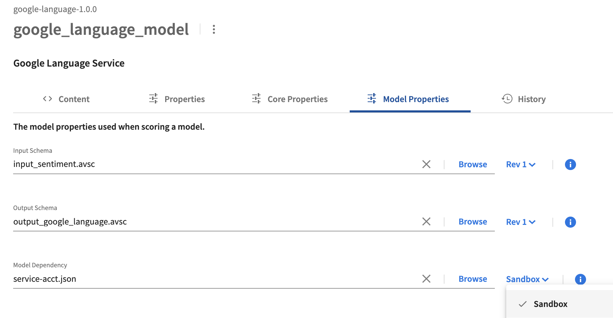
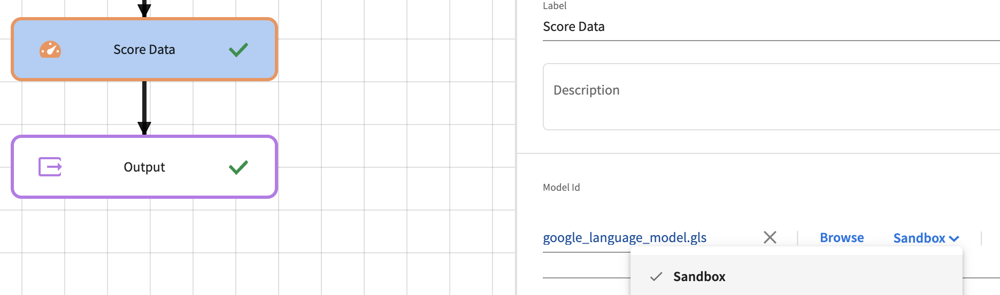
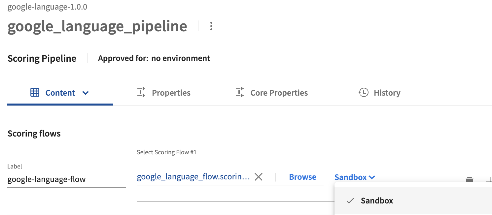

# MLaaS - Google Language Service Sentiment Analysis

## Introduction

This sample project demonstrates calling the [Google Natural Language API](https://cloud.google.com/natural-language) for [Analyzing Sentiment](https://cloud.google.com/natural-language/docs/analyzing-sentiment) from Spotfire ModelOps.  This GitHub repository contains the artifacts of a Spotfire ModelOps Project that can be imported into Spotfire ModelOps to allow you to analyze text data for sentiment using the Google Natural Language API.  The input takes an id and a comment for sentiment analysis. 

NOTE: Use of the Google Natural Language API may incur costs in your Google account.

The basic steps for using this sample are:

1. Clone this GitHub repository locally and Import the project into Spotfire ModelOps.
1. Obtain a Google service account json file and enable Google Language Services.
1. Modify the service-acct artifact with your service account information.
1. Modify the google_language_model to use the updated service-acct version.
1. Update the scoring flow and pipeline to use the modified script.
1. Approve and deploy the google_language_pipeline in your ModelOps environment to deploy a REST service.
1. Run example Python script on your machine to test the deployed REST pipeline.

## Clone this Project and Import into Spotfire ModelOps

You will want to clone this GitHub project locally.  Once you have the files locally, you can either:
* Build a project zip file using maven with the pom.xml and google-language.xml files provided.

OR
* Create a project in ModelOps and upload the artifacts from the google-language directory.

### Creating zip file

The zip file can be built by running maven in the repository directory:
```
mvn install
```
This will create a zip file in the ```target``` folder called google-language-1.0.0.zip.  This zip file can be imported into Spotfire ModelOps using the **Import a Project** option on the Projects menu.  See [Managing Projects and Artifacts](https://docs.tibco.com/emp/modelops/1.2.0/doc/html/user/managing-projects-and-artificats.html).

Once you have selected the archive and created the project, you should see the project view with the listed project artifacts in Spotfire ModelOps.

### Upload project artifacts

You can create a project in Spotfire ModelOps and upload all the artifacts from the local google-language directory into that created project.  In Spotfire ModelOps, **Create a new project** and then add the artifacts to the newly created project.

You will next need to select the google_language_model and set the **Model Properties**:
1. Set the Input Schema to the input_sentiment.avsc file.
1. Set the Output Schema to the output_google_language.avsc file.
1. Set the Model Dependency to requirements.txt.
1. Add another Model Dependency property using the **Add Property** selection.
1. Set the second Model Dependency to the service-acct json file.
1. Save the model.

## Obtain Information and Configure Google Natural Language API

After getting the project created in Spotfire ModelOps, now you need to get authentication information from Google in order to call the Google Language Services.  You will need to obtain a service account json file that will be used for authenticating, and you will need to enable Google Language API for the account.

The specific way you enable the API and get the service account JSON file may vary.  Google provides useful instructions at [Quickstart: Setup the Natural Language API](https://cloud.google.com/natural-language/docs/setup).   Once the API is enabled and you have the json file downloaded, you are ready to go to the next step.

## Modify the service-acct json artifact

Back in Spotfire ModelOps, select the service-acct artifact for editing.  Open your service account json file that you downloaded, select the entire text, copy the text and paste it over the service-acct text in Spotfire ModelOps, effectively replacing the placeholder text with your service account values.  **Save** the updated service-acct artifact.

## Modify the Model Properties

Select the google_language_model for editing.  Select the **Model Properties**, and, for the Model Dependency that lists the service-acct.json, change the revision from "Rev 1" to "Sandbox."



After the modification, click the **Save** button to save the model.  

## Update Scoring Flow and Pipeline

Before deploying the pipeline, you need to modify the scoring flow to use the latest revised script from the Sandbox environment which is where the modified script exists.  After that, you will then modify the pipeline to use the updated flow.  Return to the project view and select the google_language_flow object.  In the flow editor, select the **Score Data** step and select the **Sandbox** revision in the revision selector next to the model selection:



Click **Save** to save the updated google_language_flow.  Back in the project view, select goole_language_pipeline.  In the revision dropdown for the scoring flow, select **Sandbox** revision:



Click **Save** to save the updates to google_language_pipeline.  Now you are ready to deploy the pipeline and test.

## Approve and Deploy the Google Language API Sentiment Pipeline

After making the modifications in the last step, the next step is to **Approve** and **Deploy** the updated pipeline.  If you are still in the edit view of the google_language_pipeline, you can select **Approve** and then **Deploy**.  You can also select **Scoring Pipelines** in the Navigation Bar.  

1. Find the google_language_pipeline and **Approve** it using the pipeline menu. See [Promoting a Scoring Pipeline](https://docs.tibco.com/emp/modelops/1.2.0/doc/html/user/working-with-scoring-flows-and-pipelines.html#promoting-pipeline)
1. After selecting **Approve**, the pop-up for approving the pipeline for an environment appears.  
1. Select the **Development** environment or another appropriate environment.  
1. Close the approval pop-up dialog.
1. Select **Deploy** and the deployment dialog appears.  See [Pipeline Deployment](https://docs.tibco.com/emp/modelops/1.2.0/doc/html/user/working-with-scoring-flows-and-pipelines.html#pipeline-deployment)
1. In the Deploy dialog, click **Deploy** and the pipeline will be deployed to the environment selected in the approval process.  

After a few seconds, the user interface will switch to the Deployments view where you can see the pipeline is just deployed and starting up. 

## Test the deployed pipeline

An example Python script, tmo_rest_sentiment.py, is included in this repository and can be used to test out the sentiment analysis by connecting to the REST Request Response pipeline that is deployed.  The script takes parameters which you can see by running the script with the "-h" parameter.
```
python tmo_rest_sentiment.py -h

usage: tmo_rest_sentiment.py [-h] [--url URL] [--input INPUT] [--username [USERNAME]] [--password [PASSWORD]]

This script will authenticate and send JSON input to the given URL for a Spotfire ModelOps REST Pipeline endpoint.

optional arguments:
  -h, --help            show this help message and exit
  --url URL             (required) Complete URL to REST pipeline. Example: https://googlelangflow.modelops_domain/googlelangflow
  --input INPUT         (required) JSON input to pipeline, e.g. { "comments": "This was a lovely little place", "id": "683278" }
  --username [USERNAME]
                        Username if needed.
  --password [PASSWORD]
                        Password if needed.
```

The URL for the REST Request-Response endpoint will be https://\<subdomains\>.\<modelops-kubernetes-hostname\>/\<endpoint-path-prefix\>.  See [Data Channels-Public Addresses](https://docs.tibco.com/emp/modelops/1.2.0/doc/html/user/data-channels.html#rest-addresses).  If nothing is changed in the pipeline, then the domain_prefix and path_prefix are "googlelangflow," such that the URL becomes:
```
https://googlelangflow.modelops_hostname/googlelangflow
 ```

The following shows an example of using the python script with example parameters.  You may need to include a username and password for your Spotfire ModelOps environment.

```
python tmo_rest_sentiment.py --url https://googlelangflow.modelops.domain/googlelangflow --input "{ 'comments': 'This was a lovely little place walking distance from downtown. Lisa was very responsive. My best Airbnb experience yet!', 'id': '683278' }"

Login URL: https://googlelangflow.modelops.domain/googlelangflow/login
Successfully received API Token
{ "comments": "This was a lovely little place walking distance from downtown. Lisa was very responsive. My best Airbnb experience yet!", "id": "683278" }
<Response [200]>
'[{"Language":"en","id":"683278","Magnitude":2.700000047683716,"Sentiment":0.8999999761581421,"Sentiment_Category":"positive"}]'
```

Now you can modify the text input and see how the sentiment changes:
```
python tmo_rest_sentiment.py --url https://googlelangflow.modelops.domain/googlelangflow --input "{ 'comments': 'This place was awful.', 'id': '683278' }"

Login URL: https://googlelangflow.modelops.domain/googlelangflow/login
Successfully received API Token
{ "comments": "This was an awful place", "id": "683278" }
<Response [200]>
'[{"Language":"en","id":"683278","Magnitude":0.800000011920929,"Sentiment":-0.800000011920929,"Sentiment_Category":"negative"}]'
```

You have successfully deployed the Google Language Service Sentiment example to Spotfire ModelOps.  You can include it in other more complex scoring flows.

---
Copyright (c) 2022-2023 Cloud Software Group, Inc.

Redistribution and use in source and binary forms, with or without
modification, are permitted provided that the following conditions are met:

* Redistributions of source code must retain the above copyright notice, this
  list of conditions and the following disclaimer.

* Redistributions in binary form must reproduce the above copyright notice,
  this list of conditions and the following disclaimer in the documentation
  and/or other materials provided with the distribution.

* Neither the name of the copyright holder nor the names of its
  contributors may be used to endorse or promote products derived from
  this software without specific prior written permission.

THIS SOFTWARE IS PROVIDED BY THE COPYRIGHT HOLDERS AND CONTRIBUTORS "AS IS"
AND ANY EXPRESS OR IMPLIED WARRANTIES, INCLUDING, BUT NOT LIMITED TO, THE
IMPLIED WARRANTIES OF MERCHANTABILITY AND FITNESS FOR A PARTICULAR PURPOSE ARE
DISCLAIMED. IN NO EVENT SHALL THE COPYRIGHT HOLDER OR CONTRIBUTORS BE LIABLE
FOR ANY DIRECT, INDIRECT, INCIDENTAL, SPECIAL, EXEMPLARY, OR CONSEQUENTIAL
DAMAGES (INCLUDING, BUT NOT LIMITED TO, PROCUREMENT OF SUBSTITUTE GOODS OR
SERVICES; LOSS OF USE, DATA, OR PROFITS; OR BUSINESS INTERRUPTION) HOWEVER
CAUSED AND ON ANY THEORY OF LIABILITY, WHETHER IN CONTRACT, STRICT LIABILITY,
OR TORT (INCLUDING NEGLIGENCE OR OTHERWISE) ARISING IN ANY WAY OUT OF THE USE
OF THIS SOFTWARE, EVEN IF ADVISED OF THE POSSIBILITY OF SUCH DAMAGE.
