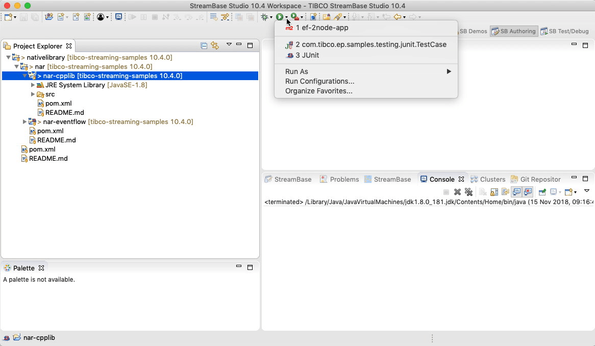
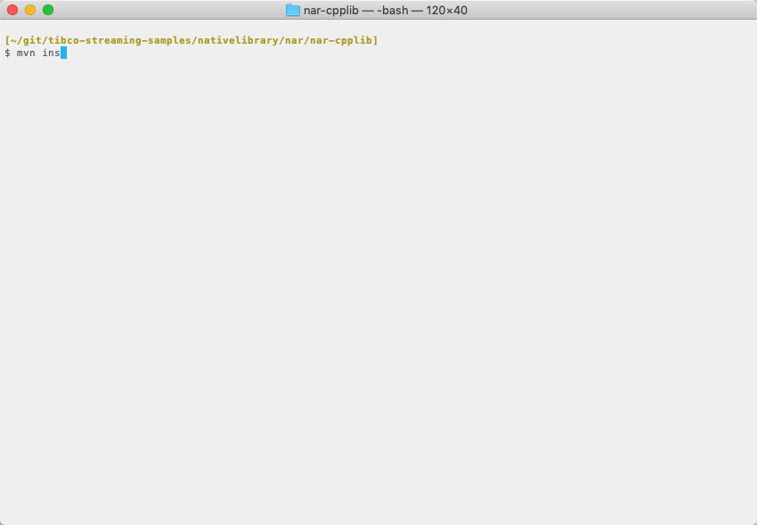

# Native : NAR

This sample describes how to build a maven Native ARchive files (.nar) from C++ source.  The
resulting archive can then be used in a downstream EventFlow fragment.

* [C++ Source](#c-source)
* [Compilation to native library and generate NAR archive](#compilation-to-native-library-and-generate-nar-archive)
* [Environmental requirements](#environmental-requirements)
* [Building this sample from TIBCO StreamBase&reg; Studio and running the unit test cases](#building-this-sample-from-tibco-streambase-studio-trade-and-running-the-unit-test-cases)
* [Building this sample from the command line and running the unit test cases](#building-this-sample-from-the-command-line-and-running-the-unit-test-cases)

<a name="c-source"></a>

## C++ Source

The sample C++ source code provides functions to manipulate a static int :


```C++
#include "jni.h"
#include "com_tibco_ep_samples_nativelibrary_narcpplib_NarSystem.h"

extern "C" {

static int ivalue = 0;

JNIEXPORT jint JNICALL Java_com_tibco_ep_samples_nativelibrary_narcpplib_CallCpp_setCppInt(JNIEnv *env, jclass clazz, jint i)
{
  int oldval = ivalue;
  
  ivalue = i;
  
  return oldval;
}

JNIEXPORT jint JNICALL Java_com_tibco_ep_samples_nativelibrary_narcpplib_CallCpp_incrementCppInt(JNIEnv *env, jclass clazz, jint i)
{
  ivalue += i;
  return ivalue;
}


}
```

<a name="compilation-to-native-library-and-generate-nar-archive"></a>

## Compilation to native library and generate NAR archive

The [maven nar plugin](http://maven-nar.github.io/) is used to invoke the native complier and build the Native ARchive file (.nar).  
The following maven build rule is used :

```xml
            <plugin>
                <groupId>com.github.maven-nar</groupId>
                <artifactId>nar-maven-plugin</artifactId>
                <extensions>true</extensions>
                <configuration>
                    <libraries>
                        <library>
                            <type>jni</type>
                            <narSystemPackage>com.tibco.ep.samples.nativelibrary.narcpplib</narSystemPackage>
                        </library>
                    </libraries>
                </configuration>
            </plugin>
```

When using java versions beyond 1.8, javah is no-longer available.  The plugin recommends the following -

```xml
    <!-- see https://github.com/maven-nar/nar-maven-plugin/issues/313 -->
    <profiles>
        <profile>
            <id>JDK 9+</id>
            <activation>
                <jdk>(1.8,)</jdk>
            </activation>
            <build>
                <pluginManagement>
                    <plugins>
                        <plugin>
                            <artifactId>maven-compiler-plugin</artifactId>
                            <configuration>
                                <compilerArgs>
                                    <arg>-h</arg>
                                    <arg>${project.build.directory}/nar/javah-include</arg>
                                </compilerArgs>
                            </configuration>
                        </plugin>
                        <plugin>
                            <groupId>com.github.maven-nar</groupId>
                            <artifactId>nar-maven-plugin</artifactId>
                            <executions> 
                                <execution>
                                    <id>default-nar-javah</id>
                                    <phase>none</phase>
                                </execution>
                            </executions>
                        </plugin>
                    </plugins>
                </pluginManagement>
            </build>
        </profile>
    </profiles>
```

<a name="environmental-requirements"></a>

## Environmental requirements

To build a shared library from source, native compilers must be correctly installed - see [maven nar plugin](http://maven-nar.github.io/)
for full details.  However, this sample has been tested with :

* MacOS - [Xcode](https://developer.apple.com/xcode/)
* Linux - [the GNU Compiler Collection](https://www.gnu.org/software/gcc/)
* Windows - [Visual Studio](https://visualstudio.microsoft.com/)

For windows, ensure the COMNTOOLS environment variable is set, for example :

```
VS120COMNTOOLS=C:\\Program Files\ (x86)\\Microsoft\ Visual\ Studio\ 12.0\\Common7\\Tools\\
```

<a name="building-this-sample-from-tibco-streambase-studio-trade-and-running-the-unit-test-cases"></a>

## Building this sample from TIBCO StreamBase&reg; Studio and running the unit test cases

Use the **Run As -> Maven install** menu option to build from TIBCO StreamBase&reg; Studio :



<a name="building-this-sample-from-the-command-line-and-running-the-unit-test-cases"></a>

## Building this sample from the command line and running the unit test cases

Use the [maven](https://maven.apache.org) as **mvn install** to build from the command line or Continuous Integration system :



---
Copyright (c) 2018-2023 Cloud Software Group, Inc.

Redistribution and use in source and binary forms, with or without
modification, are permitted provided that the following conditions are met:

* Redistributions of source code must retain the above copyright notice, this
  list of conditions and the following disclaimer.

* Redistributions in binary form must reproduce the above copyright notice,
  this list of conditions and the following disclaimer in the documentation
  and/or other materials provided with the distribution.

* Neither the name of the copyright holder nor the names of its
  contributors may be used to endorse or promote products derived from
  this software without specific prior written permission.

THIS SOFTWARE IS PROVIDED BY THE COPYRIGHT HOLDERS AND CONTRIBUTORS "AS IS"
AND ANY EXPRESS OR IMPLIED WARRANTIES, INCLUDING, BUT NOT LIMITED TO, THE
IMPLIED WARRANTIES OF MERCHANTABILITY AND FITNESS FOR A PARTICULAR PURPOSE ARE
DISCLAIMED. IN NO EVENT SHALL THE COPYRIGHT HOLDER OR CONTRIBUTORS BE LIABLE
FOR ANY DIRECT, INDIRECT, INCIDENTAL, SPECIAL, EXEMPLARY, OR CONSEQUENTIAL
DAMAGES (INCLUDING, BUT NOT LIMITED TO, PROCUREMENT OF SUBSTITUTE GOODS OR
SERVICES; LOSS OF USE, DATA, OR PROFITS; OR BUSINESS INTERRUPTION) HOWEVER
CAUSED AND ON ANY THEORY OF LIABILITY, WHETHER IN CONTRACT, STRICT LIABILITY,
OR TORT (INCLUDING NEGLIGENCE OR OTHERWISE) ARISING IN ANY WAY OUT OF THE USE
OF THIS SOFTWARE, EVEN IF ADVISED OF THE POSSIBILITY OF SUCH DAMAGE.
