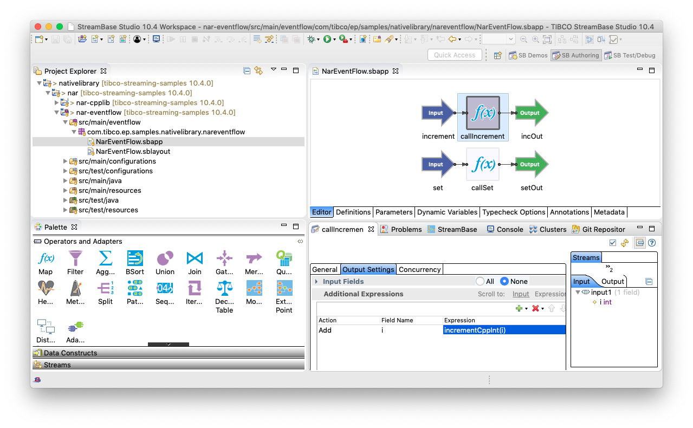
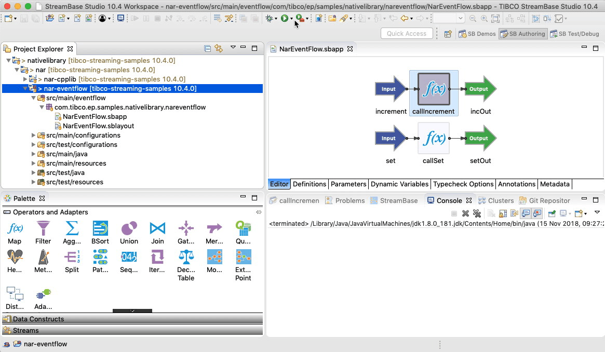
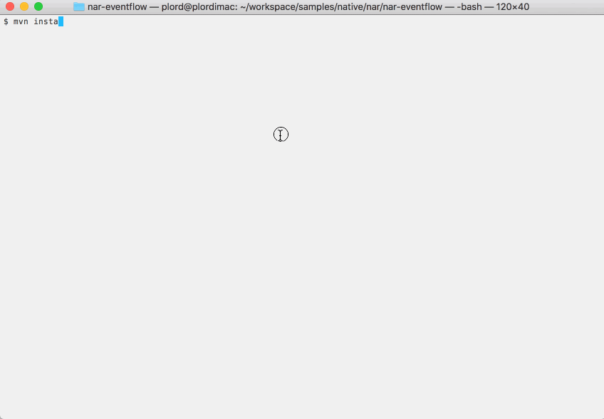

# Native : NAR - EventFlow calling C++

This sample describes how to use a Native ARchive (.nar) dependency in an EventFlow project.

* [Declare the NAR as a dependency](#declare-the-nar-as-a-dependency)
* [Declare a java wrapper class](#declare-a-java-wrapper-class)
* [Provide a engine configuration for EventFlow use](#provide-a-engine-configuration-for-eventflow-use)
* [Using in EventFlow](#using-in-eventflow)
* [Building this sample from TIBCO StreamBase Studio&trade; and running the unit test cases](#building-this-sample-from-tibco-streambase-studio-trade-and-running-the-unit-test-cases)
* [Building this sample from the command line and running the unit test cases](#building-this-sample-from-the-command-line-and-running-the-unit-test-cases)

<a name="declare-the-nar-as-a-dependency"></a>

## Declare the NAR as a dependency

A NAR can be used in the same way as any other maven dependency, except that a platform-specific
classifier should be specified :

```xml
                <dependency>
                    <groupId>com.tibco.ep.samples.nativelibrary</groupId>
                    <artifactId>nar-cpplib</artifactId>
                    <version>1.0.0</version>
                    <type>nar</type>
                    <classifier>amd64-Linux-gpp-jni</classifier>
                </dependency>
``` 

In many situations, cross-platform development is required ( for example develop on desktop OS/X but 
test on Linux servers ) - this can be achieved with maven profiles :

```xml
    <!-- Import platform specific NAR dependency -->
    <profiles>
        <profile>
            <id>linux profile</id>
            <activation>
                <os><name>linux</name></os>
            </activation>
            <dependencies>
                <dependency>
                    <groupId>com.tibco.ep.samples.nativelibrary</groupId>
                    <artifactId>nar-cpplib</artifactId>
                    <version>1.0.0</version>
                    <type>nar</type>
                    <classifier>amd64-Linux-gpp-jni</classifier>
                </dependency>
            </dependencies>
        </profile>
        <profile>
            <id>mac profile</id>
            <activation>
                <os><name>mac os x</name></os>
            </activation>
            <dependencies>
                <dependency>
                    <groupId>com.tibco.ep.samples.nativelibrary</groupId>
                    <artifactId>nar-cpplib</artifactId>
                    <version>1.0.0</version>
                    <type>nar</type>
                    <classifier>x86_64-MacOSX-gpp-jni</classifier>
                </dependency>
            </dependencies>
        </profile>
        <profile>
            <id>windows profile</id>
            <activation>
                <property>
                    <name>path.separator</name>
                    <value>;</value>
                </property>
            </activation>
            <dependencies>
                <dependency>
                    <groupId>com.tibco.ep.samples.nativelibrary</groupId>
                    <artifactId>nar-cpplib</artifactId>
                    <version>1.0.0</version>
                    <type>nar</type>
                    <classifier>amd64-Windows-msvc-jni</classifier>
                </dependency>
            </dependencies>
        </profile>
    </profiles>

```

<a name="declare-a-java-wrapper-class"></a>

## Declare a java wrapper class

A java wrapper class is required to load the native shared library and provide JNI access :

```java
package com.tibco.ep.samples.nativelibrary.narcpplib;

/**
 * c++ utility functions
 */
public class CallCpp {

    static {
        //
        // Don't need the native part when we're typechecking in studio
        //
        if (System.getProperty("streambase.ide.is-running") == null) {
            System.loadLibrary("nar-cpplib-1.0.0");
            System.out.println("loaded shared lib");
        }
    }


    /**
     * Set the static int in C++ land to some value
     * @param val Value
     * 
     * @return the old value
     */
    public native static int setCppInt(int val);

    /**
     * Increment the int in C++ by the arg.
     * @param val Value
     * 
     * @return the new value
     */
    public native static int incrementCppInt(int val);

}
```

<a name="provide-a-engine-configuration-for-eventflow-use"></a>

## Provide a engine configuration for EventFlow use

A engine configuration is required to declare the functions available :

```scala
name = "sbapp-calls-cpp-engine"
version = "1.0.0"
type = "com.tibco.ep.streambase.configuration.sbengine"
configuration =
{
    StreamBaseEngine =
    {
        streamBase =
        {
            pluginFunctions =
            {
                java =
                {
                    setCppInt =
                    {
                        type = "simple"
                        alias = "setCppInt"
                        className = "com.tibco.ep.samples.nativelibrary.narcpplib.CallCpp"
                        autoArguments = true
                    }

                    incrementCppInt =
                    {
                        type = "simple"
                        alias = "incrementCppInt"
                        className = "com.tibco.ep.samples.nativelibrary.narcpplib.CallCpp"
                        autoArguments = true
                    }
                }
            }
        }
    }
}
```

<a name="using-in-eventflow"></a>

## Using in EventFlow

These functions can now be used in EventFlow :



<a name="building-this-sample-from-tibco-streambase-studio-trade-and-running-the-unit-test-cases"></a>

## Building this sample from TIBCO StreamBase Studio&trade; and running the unit test cases

Use the **Run As -> Maven install** menu option to build from TIBCO StreamBase Studio&trade; :



<a name="building-this-sample-from-the-command-line-and-running-the-unit-test-cases"></a>

## Building this sample from the command line and running the unit test cases

Use the [maven](https://maven.apache.org) as **mvn install** to build from the command line or Continuous Integration system :


