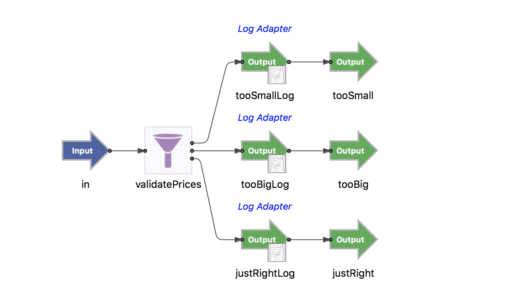
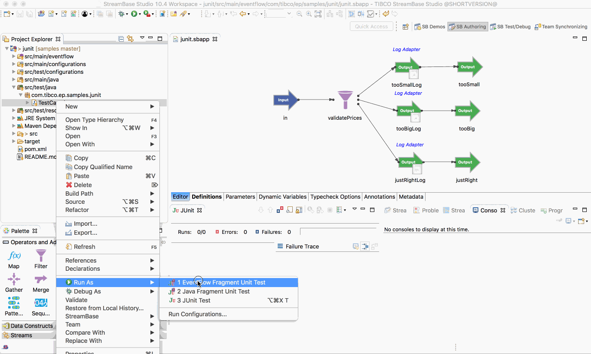
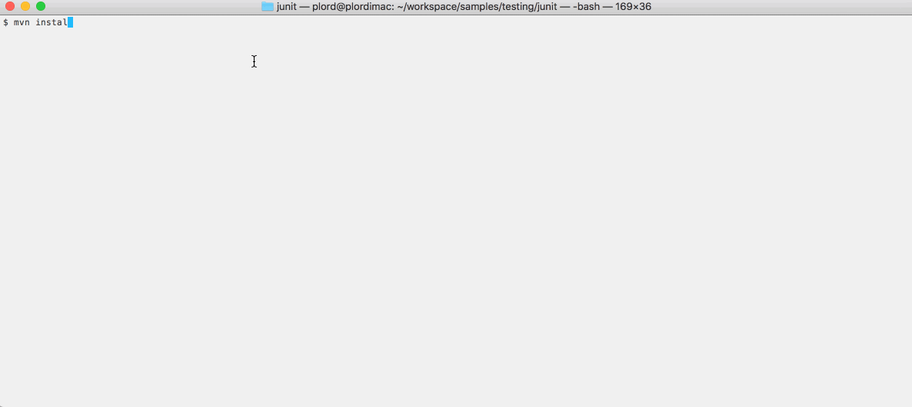

# Testing : Junit

This sample describes how to write junit unit tests for EventFlow fragments.

* [EventFlow under test](#eventflow-under-test)
* [Using the test framework](#using-the-test-framework)
* [Starting, stopping and loading configuration](#starting-stopping-and-loading-configuration)
* [Test cases](#test-cases)
* [Building this sample from TIBCO StreamBase Studio&trade; and running the unit test cases](#building-this-sample-from-tibco-streambase-studio-trade-and-running-the-unit-test-cases)
* [Building this sample from the command line and running the unit test cases](#building-this-sample-from-the-command-line-and-running-the-unit-test-cases)

<a name="eventflow-under-test"></a>

## EventFlow under test

In this sample the following simple EventFlow fragment is used :



<a name="using-the-test-framework"></a>

## Using the test framework

Test cases can use the [test framework](http://devzone.tibco.com/sites/streambase/latest/sb/sb-product/documentation/reference/dtm/com/tibco/ep/testing/framework/package-frame.html) 
by inheriting from the [UnitTest](http://devzone.tibco.com/sites/streambase/latest/sb/sb-product/documentation/reference/dtm/com/tibco/ep/testing/framework/UnitTest.html) base class :

``` java
import com.tibco.ep.testing.framework.UnitTest;

public class TestCase extends UnitTest {
	...
}
```

This allows access to :

* [Running administration commands](http://devzone.tibco.com/sites/streambase/latest/sb/sb-product/documentation/reference/dtm/com/tibco/ep/testing/framework/Administration.html)
* [Loading configurations](http://devzone.tibco.com/sites/streambase/latest/sb/sb-product/documentation/reference/dtm/com/tibco/ep/testing/framework/Configuration.html)
* [Co-ordinating across multiple test node](http://devzone.tibco.com/sites/streambase/latest/sb/sb-product/documentation/reference/dtm/com/tibco/ep/testing/framework/MultiNodeCoordinator.html)
* [Transactional deadlock detection](http://devzone.tibco.com/sites/streambase/latest/sb/sb-product/documentation/reference/dtm/com/tibco/ep/testing/framework/UnitTest.html#initialize--)
* [Transactional memory detection](http://devzone.tibco.com/sites/streambase/latest/sb/sb-product/documentation/reference/dtm/com/tibco/ep/testing/framework/UnitTest.html#initialize--)
* [Test case timeout handling](http://devzone.tibco.com/sites/streambase/latest/sb/sb-product/documentation/reference/dtm/com/tibco/ep/testing/framework/UnitTest.html#initialize--)
* [transactional abort mode](http://devzone.tibco.com/sites/streambase/latest/sb/sb-product/documentation/reference/dtm/com/tibco/ep/testing/framework/UnitTest.html#initialize--)

<a name="starting-stopping-and-loading-configuration"></a>

## Starting, stopping and loading configuration

Junit @beforeClass and @AfterClass functions can be used to start and stop the embedded server.  Likewise,
Junit @Before and @After functions can be used to start and stop the containers.

Any configuration required by the unit test case should be loaded and activated prior to starting the embedded server :

``` java
    @BeforeClass
    public static void setupServer() throws StreamBaseException, ConfigurationException, InterruptedException {
        // Example configuration load
        // Configuration.forFile("engine.conf").load().activate();
        Configuration.forFile("engine.conf").load().activate();
    	
        // create a StreamBase server and load applications once for all tests in this class
        server = ServerManagerFactory.getEmbeddedServer();
        server.startServer();
        server.loadApp("com.tibco.ep.samples.junit.JUnit");
    }

    /**
     * Stop the server
     *
     * @throws StreamBaseException on shutdown failure
     * @throws InterruptedException on shutdown failure
     */
    @AfterClass
    public static void stopServer() throws InterruptedException, StreamBaseException {
        try {
            assertNotNull(server);
            server.shutdownServer();
            server = null;
        } finally {
            Configuration.deactiveAndRemoveAll();
        }
    }

    /**
     * Start the containers
     *
     * @throws StreamBaseException on start container error
     */
    @Before
    public void startContainers() throws StreamBaseException {
        // before each test, startup fresh container instances
        server.startContainers();

        // Setup test framework before running tests
        this.initialize();
    }
    
    /**
     * Stop containers
     *
     * @throws StreamBaseException on stop container error
     * @throws TransactionalMemoryLeakException Leak detected
     * @throws TransactionalDeadlockDetectedException Deadlock detected
     */
    @After
    public void stopContainers() throws StreamBaseException, TransactionalMemoryLeakException, TransactionalDeadlockDetectedException {
        // Complete test framework and check for any errors
        this.complete();

        // after each test, dispose of the container instances
        server.stopContainers();
    }
```

<a name="test-cases"></a>

## Test cases

Junit test cases can use the [unittest](http://devzone.tibco.com/sites/streambase/latest/sb/sb-product/documentation/reference/sb/com/streambase/sb/unittest/package-frame.html)
API to enqueue tubles and verify the results :

```java
    /**
     * Too small test case
     * 
     * @throws StreamBaseException Test failure
     */
    @Test
    public void tooSmall() throws StreamBaseException {
    	LOGGER.info("Too small");
    	
        server.getEnqueuer("in").enqueue(JSONSingleQuotesTupleMaker.MAKER,
                "{'name':'a','price':-52.0,'quantity':100}");
        
        new Expecter(server.getDequeuer("tooSmall")).expect(
                JSONSingleQuotesTupleMaker.MAKER,
                "{'name':'a','price':-52.0,'quantity':100}");  
        new Expecter(server.getDequeuer("tooSmall")).expectNothing();
        new Expecter(server.getDequeuer("tooBig")).expectNothing();
        new Expecter(server.getDequeuer("justRight")).expectNothing();
    }
```

<a name="building-this-sample-from-tibco-streambase-studio-trade-and-running-the-unit-test-cases"></a>

## Building this sample from TIBCO StreamBase Studio&trade; and running the unit test cases

Use the **Run As -> EventFlow Fragment Unit Test** menu option to build from TIBCO StreamBase Studio&trade; :



Results are displayed in the console and junit windows.

<a name="building-this-sample-from-the-command-line-and-running-the-unit-test-cases"></a>

## Building this sample from the command line and running the unit test cases

Use the [maven](https://maven.apache.org) as **mvn install** to build from the command line or Continuous Integration system :



---
Copyright (c) 2018-2019, TIBCO Software Inc.

Redistribution and use in source and binary forms, with or without
modification, are permitted provided that the following conditions are met:

* Redistributions of source code must retain the above copyright notice, this
  list of conditions and the following disclaimer.

* Redistributions in binary form must reproduce the above copyright notice,
  this list of conditions and the following disclaimer in the documentation
  and/or other materials provided with the distribution.

* Neither the name of the copyright holder nor the names of its
  contributors may be used to endorse or promote products derived from
  this software without specific prior written permission.

THIS SOFTWARE IS PROVIDED BY THE COPYRIGHT HOLDERS AND CONTRIBUTORS "AS IS"
AND ANY EXPRESS OR IMPLIED WARRANTIES, INCLUDING, BUT NOT LIMITED TO, THE
IMPLIED WARRANTIES OF MERCHANTABILITY AND FITNESS FOR A PARTICULAR PURPOSE ARE
DISCLAIMED. IN NO EVENT SHALL THE COPYRIGHT HOLDER OR CONTRIBUTORS BE LIABLE
FOR ANY DIRECT, INDIRECT, INCIDENTAL, SPECIAL, EXEMPLARY, OR CONSEQUENTIAL
DAMAGES (INCLUDING, BUT NOT LIMITED TO, PROCUREMENT OF SUBSTITUTE GOODS OR
SERVICES; LOSS OF USE, DATA, OR PROFITS; OR BUSINESS INTERRUPTION) HOWEVER
CAUSED AND ON ANY THEORY OF LIABILITY, WHETHER IN CONTRACT, STRICT LIABILITY,
OR TORT (INCLUDING NEGLIGENCE OR OTHERWISE) ARISING IN ANY WAY OUT OF THE USE
OF THIS SOFTWARE, EVEN IF ADVISED OF THE POSSIBILITY OF SUCH DAMAGE.
