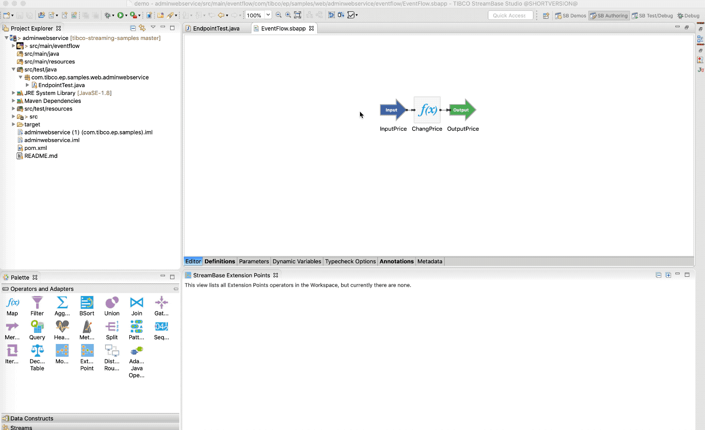
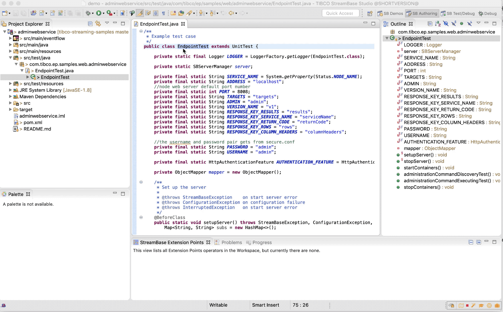
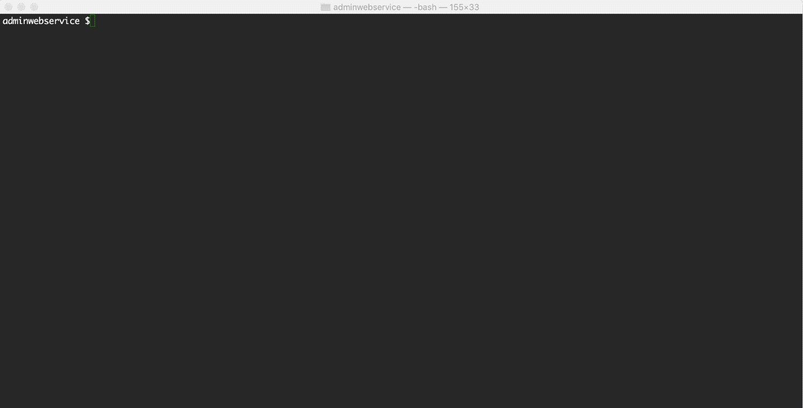

# Web : Administration Web Service

This sample describes how to use administration web service. Administration web service provides a GET 
endpoint for discovering all supported administration targets and commands. And it also provides a POST
endpoint for executing all supported administration commands. This web service is integrated with the 
authentication services provided by the node web server, which means a valid username:password pair 
must to be provided for requesting the endpoints.

* [Start an EventFlow Fragment](#start-eventflow-fragment)
* [Building this sample from TIBCO StreamBase&reg; Studio and running the unit test cases](#building-this-sample-from-tibco-streambase-studio-trade-and-running-the-unit-test-cases)
* [Building this sample from the command line and running the unit test cases](#building-this-sample-from-the-command-line-and-running-the-unit-test-cases)

## Start the EventFlow fragment sample

In this sample, since the aim is demonstrating how to use administration web service, we have a blank sbapp, 
which is not related with our demo. After Use the **Run As -> EventFlow Fragment** menu option to run in TIBCO StreamBase&reg; Studio, 
the **Administration web service** is automatically deployed on the node web server.
Since we use **default-realm** in this sample, which does NOT require password when a connection originates from a trusted address, 
just enter computer username as the username, and no password is needed,

## Building this sample from TIBCO StreamBase&reg; Studio and running the unit test cases

Use the **Run As -> EventFlow Fragment Unit Test** menu option to build from TIBCO StreamBase&reg; Studio :

Results are displayed in the console and junit windows.

## Building this sample from the command line and running the unit test cases

Use the [maven](https://maven.apache.org) as **mvn install** to build from the command line or Continuous Integration system:

Copyright (c) 2019-2023 Cloud Software Group, Inc.

Redistribution and use in source and binary forms, with or without
modification, are permitted provided that the following conditions are met:

* Redistributions of source code must retain the above copyright notice, this
  list of conditions and the following disclaimer.

* Redistributions in binary form must reproduce the above copyright notice,
  this list of conditions and the following disclaimer in the documentation
  and/or other materials provided with the distribution.

* Neither the name of the copyright holder nor the names of its
  contributors may be used to endorse or promote products derived from
  this software without specific prior written permission.

THIS SOFTWARE IS PROVIDED BY THE COPYRIGHT HOLDERS AND CONTRIBUTORS "AS IS"
AND ANY EXPRESS OR IMPLIED WARRANTIES, INCLUDING, BUT NOT LIMITED TO, THE
IMPLIED WARRANTIES OF MERCHANTABILITY AND FITNESS FOR A PARTICULAR PURPOSE ARE
DISCLAIMED. IN NO EVENT SHALL THE COPYRIGHT HOLDER OR CONTRIBUTORS BE LIABLE
FOR ANY DIRECT, INDIRECT, INCIDENTAL, SPECIAL, EXEMPLARY, OR CONSEQUENTIAL
DAMAGES (INCLUDING, BUT NOT LIMITED TO, PROCUREMENT OF SUBSTITUTE GOODS OR
SERVICES; LOSS OF USE, DATA, OR PROFITS; OR BUSINESS INTERRUPTION) HOWEVER
CAUSED AND ON ANY THEORY OF LIABILITY, WHETHER IN CONTRACT, STRICT LIABILITY,
OR TORT (INCLUDING NEGLIGENCE OR OTHERWISE) ARISING IN ANY WAY OUT OF THE USE
OF THIS SOFTWARE, EVEN IF ADVISED OF THE POSSIBILITY OF SUCH DAMAGE.
