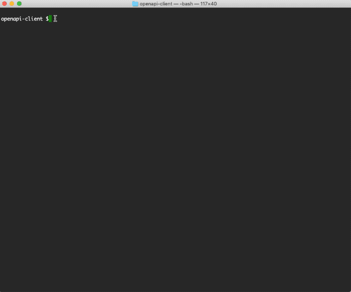

# Web : web client generation with OpenAPI Code Generation tool

This sample describes how to use the OpenAPI Code Generation tool to generate a Health check web client 
from OpenAPI specification yaml file by using OpenAPI Code Generation tool.  The generated web client 
is in Java and supported by Jersey framework.  It can be used for building requests or accessing the 
response from the Streaming node server Health check web service. 

* [Add Health check web service OpenAPI specification YAML file](#add-healthcheck-openapi-specification)
* [Add the required maven plugin and dependencies](#add-maven-plugin-and-dependecies)
* [Build this jar from the command line](#build-this-war-from-the-command-line)

<a name="add-healthcheck-openapi-specification"></a>

## Add Health check web service OpenAPI specification YAML file 

Add Health check web service OpenAPI specification YAML file 

A web service OpenAPI specification YAML file need to be provided and used as the template to
generate web client. In this example, we uses the Streaming node server [Health check web service
OpenAPI specification YAML file](../../main/resources/HealthCheck-REST-API-Definition.yaml) 


<a name="add-maven-plugin-and-dependecies"></a>

## Add the required maven plugin and dependencies

The [openapi-generator-maven-plugin](https://mvnrepository.com/artifact/org.openapitools/openapi-generator-maven-plugin) 
is used to support this OpenAPI generator project. The following maven build rule is used:
```xml
    <plugin>
        <groupId>org.openapitools</groupId>
        <artifactId>openapi-generator-maven-plugin</artifactId>
        <version>4.3.0</version>
        <executions>
            <execution>
                <goals>
                    <goal>generate</goal>
                </goals>
                <configuration>
                    <!-- specify the OpenAPI yaml -->
                    <inputSpec>${project.basedir}/src/main/resources/HealthCheck-REST-API-Definition.yaml</inputSpec>
                    <!-- target to generate java client code -->
                    <generatorName>java</generatorName>
                    <!-- override the default library to jersey2 -->
                    <library>jersey2</library>
                    <output>${project.build.directory}/generated-sources</output>
                    <apiPackage>${default.package}.handler</apiPackage>
                    <modelPackage>${default.package}.model</modelPackage>
                    <invokerPackage>${default.package}.handler</invokerPackage>
                    <generateApiTests>false</generateApiTests>
                    <generateModelTests>false</generateModelTests>
                    <!-- pass any necessary config options -->
                    <configOptions>
                        <dateLibrary>java11</dateLibrary>
                    </configOptions>
                </configuration>
            </execution>
        </executions>
    </plugin>    
```

Add the required maven dependencies for the client being generated.  
see details in [pom.xml](../../../pom.xml)

<a name="build-this-war-from-the-command-line"></a>

## Building this sample from the command line

Use the [maven](https://maven.apache.org) as **mvn install** to build from the command line or Continuous Integration system:



---
Copyright (c) 2020, TIBCO Software Inc.

Redistribution and use in source and binary forms, with or without
modification, are permitted provided that the following conditions are met:

* Redistributions of source code must retain the above copyright notice, this
  list of conditions and the following disclaimer.

* Redistributions in binary form must reproduce the above copyright notice,
  this list of conditions and the following disclaimer in the documentation
  and/or other materials provided with the distribution.

* Neither the name of the copyright holder nor the names of its
  contributors may be used to endorse or promote products derived from
  this software without specific prior written permission.

THIS SOFTWARE IS PROVIDED BY THE COPYRIGHT HOLDERS AND CONTRIBUTORS "AS IS"
AND ANY EXPRESS OR IMPLIED WARRANTIES, INCLUDING, BUT NOT LIMITED TO, THE
IMPLIED WARRANTIES OF MERCHANTABILITY AND FITNESS FOR A PARTICULAR PURPOSE ARE
DISCLAIMED. IN NO EVENT SHALL THE COPYRIGHT HOLDER OR CONTRIBUTORS BE LIABLE
FOR ANY DIRECT, INDIRECT, INCIDENTAL, SPECIAL, EXEMPLARY, OR CONSEQUENTIAL
DAMAGES (INCLUDING, BUT NOT LIMITED TO, PROCUREMENT OF SUBSTITUTE GOODS OR
SERVICES; LOSS OF USE, DATA, OR PROFITS; OR BUSINESS INTERRUPTION) HOWEVER
CAUSED AND ON ANY THEORY OF LIABILITY, WHETHER IN CONTRACT, STRICT LIABILITY,
OR TORT (INCLUDING NEGLIGENCE OR OTHERWISE) ARISING IN ANY WAY OUT OF THE USE
OF THIS SOFTWARE, EVEN IF ADVISED OF THE POSSIBILITY OF SUCH DAMAGE.
