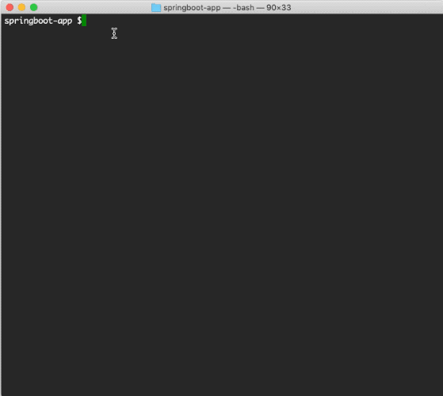
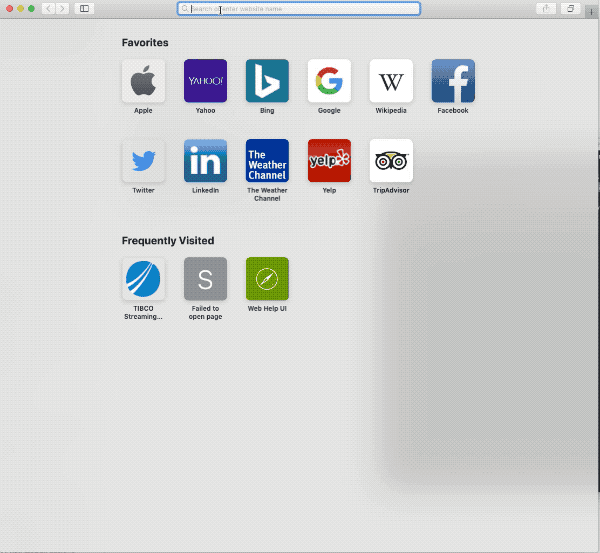

# Web: Using Spring Boot WAR in an EventFlow project

This sample describes how to use a Spring Boot WAR in an EventFlow project.

* [Using Spring Boot to create a WAR file](#create-springboot-war)
* [Create a no-op EventFlow fragment and declare the WAR as a dependency](#declare-the-war-as-a-dependency)
* [Running this sample from Spotfire StreamBase Studio&trade;](#running-this-sample-from-tibco-streambase-studiotrade)
* [Using "epadmin display web" command to retrieve information about web server](#using-epadmin-display-web-command-to-retrieve-information)
* [Using HelpUI to send request to test endpoint](#send-request-to-test-endpoint)
* [Building this sample from the command line and running the integration test cases](#building-this-sample-from-the-command-line-and-running-the-integration-test-cases)


<a name="create-springboot-war"></a>

## Using Spring Boot to create a WAR file
See [springboot-war](../../../../springboot-war/src/site/markdown/index.md).
The WAR provides a GET endpoint which path is **"/springboot-war/test"**.


<a name="declare-the-war-as-a-dependency"></a>

## Create an EventFlow fragment and declare the WAR as a dependency
In this sample, since the aim is demonstrating how to use a Spring Boot WAR, we use 
a [no-op EventFlow](../../main/eventflow/com/tibco/ep/samples/web/springboot/eventflow/SpringBoot.sbapp), 
which is not related to our demo. Add the WAR into fragment's pom.xml in the same 
way as any other maven dependency:

```xml
    <dependency>
        <groupId>com.tibco.ep.samples.web</groupId>
        <artifactId>springboot-war</artifactId>
        <version>1.0.0</version>
        <type>war</type>
    </dependency>
``` 


<a name="running-this-sample-from-tibco-streambase-studiotrade"></a>

## Running this sample from Spotfire StreamBase Studio&trade;
Use the **Run As -> EventFlow Fragment** menu option to run in Spotfire StreamBase Studio&trade;:


<a name="using-epadmin-display-web-command-to-retrieve-information"></a>

## Using "epadmin display web" command to retrieve Web Help UI Address
The information we need is **Web Help UI Address**



<a name="send-request-to-test-endpoint"></a>

## Send request to the /test endpoint provided by the WAR
Open a web browser, enter **Web Help UI Address**, select **springboot-war** from 
the **Select a Web Service** drop-down list, choose the **GET /test** endpoint and click 
**Try it out**. Then click **Execute** button, a popping up window will ask for user name and password. 
Since we use **default-realm** in this sample, which does NOT require password when a 
connection originates from a trusted address, just enter computer username as the username, and no password is needed, 
then "Hello, TIBCO!" shows up in the **Responses** section with Code 200.



<a name="building-this-sample-from-the-command-line-and-running-the-integration-test-cases"></a>

## Building this sample from the command line and running the integration test cases

In this sample, an integration test is defined in the **pom.xml** file. The test will:

* Start node A
* Trigger [SpringBootTest](../../test/java/com/tibco/ep/samples/web/springboot/SpringBootTest.java): it has a Jersey web client which sends a request to the **/springboot-war/test** endpoint of Spring Boot WAR,
  and validates the response is **200_OK** with a message **Hello, TIBCO!**.
* Stop node A

Use the [maven](https://maven.apache.org) as **mvn install** to build from the command line or Continuous Integration system:


