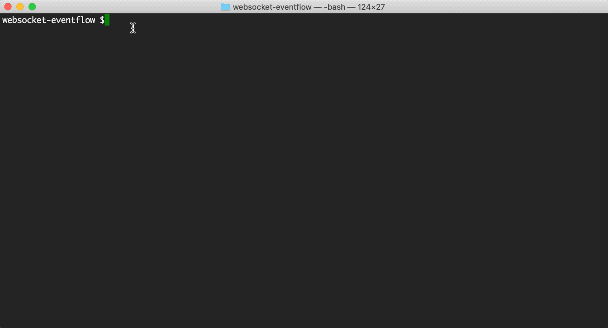
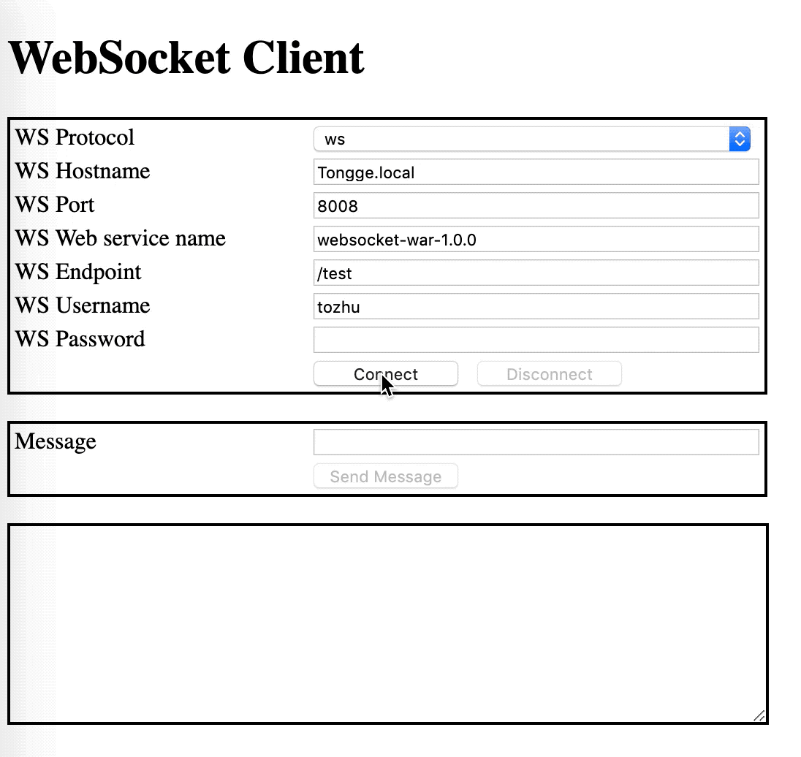

# Web: Using WebSocket WAR in EventFlow project

This sample describes how to use a WAR which has a WebSocket endpoint in an EventFlow project.

* [Create a WAR file which has a web socket endpoint](#create-websocket-endpoint)
* [Create a blank EventFlow fragment and declare the WAR as a dependency](#declare-the-war-as-a-dependency)
* [Running this sample from TIBCO StreamBase Studio&trade;](#running-this-sample-from-tibco-streambase-studiotrade)
* [Using "epadmin display web" command to retrieve information about web server](#using-epadmin-display-web-command-to-retrieve-information)
* [Using "WebSocketClient"  to to connect to the WebSocket endpoint](#using-websocketclient-to-connect-to-the-websocket-endpoint)


<a name="create-websocket-endpoint"></a>

## Create a WAR file which has web socket endpoint
See [websocket-war](../../../../websocket-war/src/site/markdown/index.md).
The WAR provides a GET endpoint which path is **/test**.


<a name="declare-the-war-as-a-dependency"></a>

## Create an EventFlow fragment and declare the WAR as a dependency
In this sample, since the aim is demonstrating how to use , we have a blank sbapp, 
which is not related with our demo. Add the WAR into fragment's pom.xml in the same 
way as any other maven dependency:

```xml
    <dependency>
        <groupId>com.tibco.ep.samples.web</groupId>
        <artifactId>websocket-war</artifactId>
        <version>1.0.0</version>
        <type>war</type>
    </dependency>
``` 

<a name="running-this-sample-from-tibco-streambase-studiotrade"></a>

## Running this sample from TIBCO StreamBase Studio&trade;
Use the **Run As -> EventFlow Fragment** menu option to run in TIBCO StreamBase Studio&trade;:


<a name="using-epadmin-display-web-command-to-retrieve-information"></a>

## Using "epadmin display web" command to retrieve web information.
The information we need is **hostname**, **port number**, **web service name**


<a name="using-websocketclient-to-connect-to-the-websocket-endpoint"></a>

## Using [WebSocketClient](../../test/resources/WebSocketClient.html) to connect to the WebSocket endpoint
Open [WebSocketClient](../../test/resources/WebSocketClient.html) file in a web browser which supports WebSocket, 
fill the tables with the information got in last step, since we use **default-realm** in this sample, which does NOT 
require password when a connection originates from a trusted address, no password is entered. 
Then click **connect** button. After connection is built, type message in Message table 
and click **Send Message** button. Click **disconnect** for disconnecting from the WebSocket endpoint.


