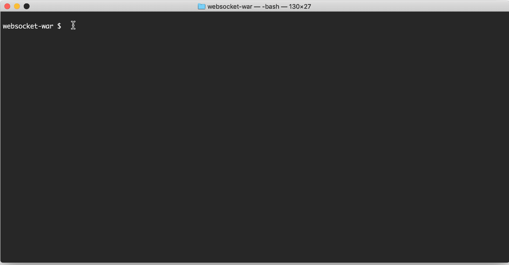

# Web : WebSocket WAR

This sample describes how to build a WAR (.war) which contains a WebSocket endpoint (/test).  After the 
WebSocket connection is built, this endpoint returns the same string as what it receives.
The resulting archive can then be used in a downstream EventFlow fragment.

* [Create a WebSocket endpoint](#create-websocket-endpoint)
* [Generate WAR archive](#generate-war-archive)
* [Building this WAR from the command line](#building-this-war-from-the-command-line)

<a name="create-websocket-endpoint"></a>

## Create a WebSocket endpoint

Add the following maven dependency into the pom.xml, the scope should be provided

```xml

    <dependency>
        <groupId>jakarta.websocket</groupId>
        <artifactId>jakarta.websocket-api</artifactId>
        <version>1.1.1</version>
        <scope>provided</scope>
    </dependency>
```

The [sample java code](../../main/java/com/tibco/ep/samples/web/websocket/websocketwar/WebSocketEndpoint.java)([html](https://github.com/TIBCOSoftware/tibco-streaming-samples/tree/master/web/websocket/websocket-war/src//main/java/com/tibco/ep/samples/web/websocket/websocketwar/WebSocketEndpoint.java))  provides a WebSocket endpoint to intercept the received message as a string and send a response message with "Received messages:" prefix.


<a name="generate-war-archive"></a>

## Generate WAR archive

The project's packaging type is **war**.
```xml
    <groupId>com.tibco.ep.samples.web</groupId>
    <artifactId>websocket-war</artifactId>
    <packaging>war</packaging>
    <version>1.0.0</version>

```
The [maven war plugin](https://maven.apache.org/plugins/maven-war-plugin/) is used to build the WAR (.war).  The following maven build rule is used :

```xml
    <plugins>
        <plugin>
            <groupId>org.apache.maven.plugins</groupId>
            <artifactId>maven-war-plugin</artifactId>
            <configuration>
                <failOnMissingWebXml>false</failOnMissingWebXml>
            </configuration>
            <version>3.2.3</version>
        </plugin>
    </plugins>
```

<a name="building-this-war-from-the-command-line"></a>

## Building this sample from the command line

Use the [maven](https://maven.apache.org) as **mvn install** to build from the command line or Continuous Integration system :



---
Copyright (c) 2019, TIBCO Software Inc.

Redistribution and use in source and binary forms, with or without
modification, are permitted provided that the following conditions are met:

* Redistributions of source code must retain the above copyright notice, this
  list of conditions and the following disclaimer.

* Redistributions in binary form must reproduce the above copyright notice,
  this list of conditions and the following disclaimer in the documentation
  and/or other materials provided with the distribution.

* Neither the name of the copyright holder nor the names of its
  contributors may be used to endorse or promote products derived from
  this software without specific prior written permission.

THIS SOFTWARE IS PROVIDED BY THE COPYRIGHT HOLDERS AND CONTRIBUTORS "AS IS"
AND ANY EXPRESS OR IMPLIED WARRANTIES, INCLUDING, BUT NOT LIMITED TO, THE
IMPLIED WARRANTIES OF MERCHANTABILITY AND FITNESS FOR A PARTICULAR PURPOSE ARE
DISCLAIMED. IN NO EVENT SHALL THE COPYRIGHT HOLDER OR CONTRIBUTORS BE LIABLE
FOR ANY DIRECT, INDIRECT, INCIDENTAL, SPECIAL, EXEMPLARY, OR CONSEQUENTIAL
DAMAGES (INCLUDING, BUT NOT LIMITED TO, PROCUREMENT OF SUBSTITUTE GOODS OR
SERVICES; LOSS OF USE, DATA, OR PROFITS; OR BUSINESS INTERRUPTION) HOWEVER
CAUSED AND ON ANY THEORY OF LIABILITY, WHETHER IN CONTRACT, STRICT LIABILITY,
OR TORT (INCLUDING NEGLIGENCE OR OTHERWISE) ARISING IN ANY WAY OUT OF THE USE
OF THIS SOFTWARE, EVEN IF ADVISED OF THE POSSIBILITY OF SUCH DAMAGE.
